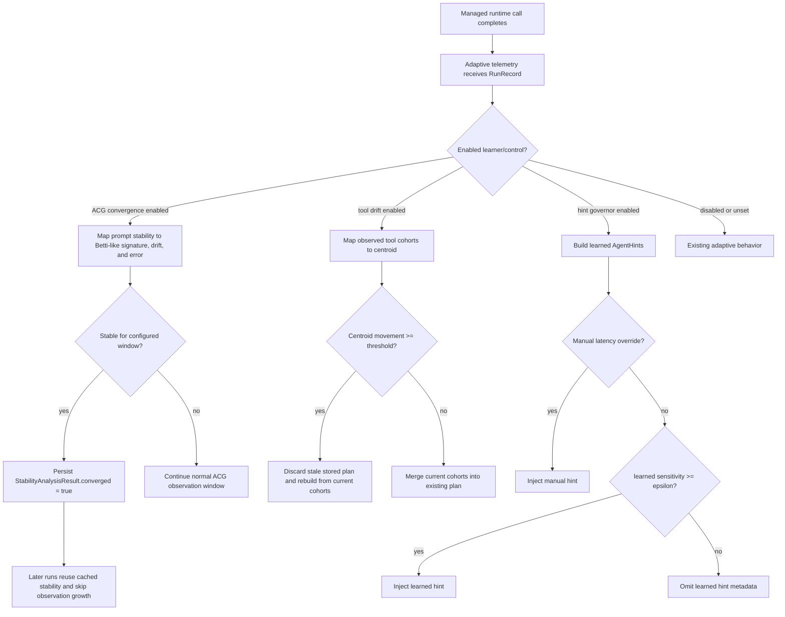

<!--
SPDX-FileCopyrightText: Copyright (c) 2026, NVIDIA CORPORATION & AFFILIATES. All rights reserved.
SPDX-License-Identifier: Apache-2.0
-->

# Topology-Aware Adaptive Controls Design

This is a reviewer-facing design note for PR #282. It is intentionally kept out
of the published Fern documentation because it records internal implementation
tradeoffs, benefit gates, and validation samples rather than user-facing usage
instructions.

## Evidence Boundaries

The samples in this note are deterministic fixtures and targeted tests. They
prove control behavior at specific decision points, not general production
frequency or end-to-end performance. Claims in this note use these meanings:

- Proven by test: executable tests assert the before/after state.
- Shown by fixture: deterministic samples or benchmarks show a bounded result.
- Plausible but unproven: the mechanism follows from the implementation, but
  this PR does not provide representative workload data.
- Not claimed: outside this PR's evidence.

## Problem

The Adaptive plugin learns from repeated runtime observations. Before this
change, the relevant paths had three avoidable failure modes:

- ACG learning kept consuming observations for a stable prompt profile until
  the observation window was exhausted, even when the profile had already been
  stable for multiple epochs.
- Tool parallelism could retain stale fan-out groups after the observed tool
  cohort shape changed sharply.
- Learned adaptive hints were injected whenever defaults existed, even when the
  learned latency-sensitivity signal was below the configured value needed to
  justify request metadata.

The proposed controls are useful only if they make one of those states
observable and measurably better. If a representative workload does not show
one of the benefit gates below, the control should remain disabled.

## Goals

- Stop ACG learning after repeated stable prompt structure has been observed.
- Discard stale tool-parallelism plans when observed tool cohort shape changes
  sharply.
- Shed learned adaptive hints below a configurable sensitivity threshold while
  preserving manual latency-sensitivity overrides.
- Keep every control disabled by default and observable through existing
  adaptive state, request metadata, and validation reports.

## Non-Goals

- Exact persistent homology or a general-purpose topology library.
- New public Rust, Python, Node.js, Go, WebAssembly, or C FFI topology
  primitives.
- Changes to NeMo Relay scope semantics, event shape, callback execution, or
  user callback return values.
- Public documentation of internal topology algorithms.

## Internal Design

The adaptive crate owns a small internal module, `crate::topology`, with three
bounded primitives:

- `ConvergenceDetector` tracks a fixed history of Betti-like stability
  signatures, drift, and error.
- `DriftDetector` tracks centroid motion for tool cohort feature vectors.
- `GeometricGovernor` adapts a sensitivity threshold for learned hint
  injection.

ACG maps each stability analysis result to:

```text
beta_0 = stable_prefix_length
beta_1 = total_spans - stable_prefix_length
drift  = 1 - stable_prefix_length / total_spans
error  = 1 - average_stability_score
```

The tool-parallelism learner maps observed tool cohorts to a four-value
centroid:

```text
[cohort_count, unique_tool_count, duplicate_reference_ratio, max_cohort_size]
```

Adaptive hints use the governor only for learned hints. A manual
`set_latency_sensitivity()` override still forces hint injection for the current
request.

## Architecture Flow



## Benefit Gates

Each control must satisfy a concrete benefit gate before it is enabled for a
workload:

| Control | Benefit Gate | Observable Signal | Validation |
|---|---|---|---|
| ACG convergence | Stable profiles use fewer observations before decision than the configured observation window while preserving stored stability. | Persisted `StabilityAnalysisResult.converged = true`; later runs reuse cached stability and skip observation repair only after the observations are stored. | `crates/adaptive/tests/integration/topology_convergence_tests.rs` and `crates/adaptive/benches/convergence_bench.rs`. |
| Tool drift | A plan that was learned from an old tool-cohort shape is removed when the next observed cohort shape crosses the configured drift threshold. | The stored `ExecutionPlan` no longer contains stale fan-out groups after drift. | `crates/adaptive/tests/unit/tool_parallelism_learner_tests.rs`. |
| Hint governor | Low-sensitivity learned hints are omitted when below `adaptive_hints.governor.epsilon`, while manual overrides still emit hints. | `nvext.agent_hints` is absent from request headers/body for shed learned hints; manual overrides still add the field. | `crates/adaptive/tests/unit/adaptive_hints_intercept_tests.rs`. |
| Config safety | Invalid thresholds fail before activation. | Plugin validation diagnostics name invalid topology-aware fields. | `crates/adaptive/tests/unit/runtime_tests.rs` and `crates/adaptive/tests/unit/plugin_component_tests.rs`. |

## Sample Evidence

These samples use deterministic fixtures from this change set. They are not
general performance guarantees; they show the expected decision points and the
state a reviewer or operator can inspect.

| Control | Sample Workload | Baseline | With Control | Observable Result |
|---|---|---|---|---|
| ACG convergence | `50` repeated stable prompt observations, `observation_window = 100`, `stability_window = 3`, and `epsilon = 0.001`. | The benchmark fixture processes all 50 observations before the decision path ends. | Convergence is declared after the third stable epoch. | Shown by deterministic fixture: `cargo bench -p nemo-relay-adaptive --bench convergence_bench -- --sample-size 10` prints `observations-to-decision: without=50, with=3`. This does not claim provider token savings, real workload latency gains, or cache-hit economics. |
| Tool drift | First run observes overlapping `search` and `fetch`; next run observes overlapping `compile`, `test`, and `lint`. | The no-drift fixture retains the old `fanout:existing` group while merging newly observed groups. | The drift-enabled fixture starts from an empty plan when centroid movement crosses the test threshold, then stores only current observed groups. | Proven by targeted tests: `process_run_merges_new_cohorts_into_existing_plan` shows retained `fanout:existing`; `process_run_invalidates_existing_plan_when_tool_cohort_topology_drifts` shows `fanout:existing` removed. This does not quantify how often stale plans occur in production. |
| Hint governor | Learned default hints have `latency_sensitivity = 2.0`; governor `epsilon = 10.0`. | Without a governor, learned defaults are injected whenever defaults exist. | The low-sensitivity learned hint is omitted from both header and body; a manual `set_latency_sensitivity(11)` override still forces injection. | Proven by targeted test: `test_adaptive_hints_governor_sheds_low_sensitivity_hints_but_keeps_manual_override`. This claims request metadata hygiene, not measured model latency improvement. |

## Rollout

All topology-aware fields default to disabled. A rollout should enable one
control at a time, validate representative workloads, and use existing adaptive
state inspection to confirm the observable signals above before enabling the
next control.

Recommended rollout order:

1. Enable ACG convergence only for profiles with stable prompts and compare
   observations-to-decision against the observation window.
2. Enable tool drift only for agents where stale fan-out plans have been seen or
   where tool cohorts are expected to change between phases.
3. Enable hint governor only after learned hints are present and request
   metadata volume matters.

If any gate does not show a benefit on the target workload, leave that control
disabled.
