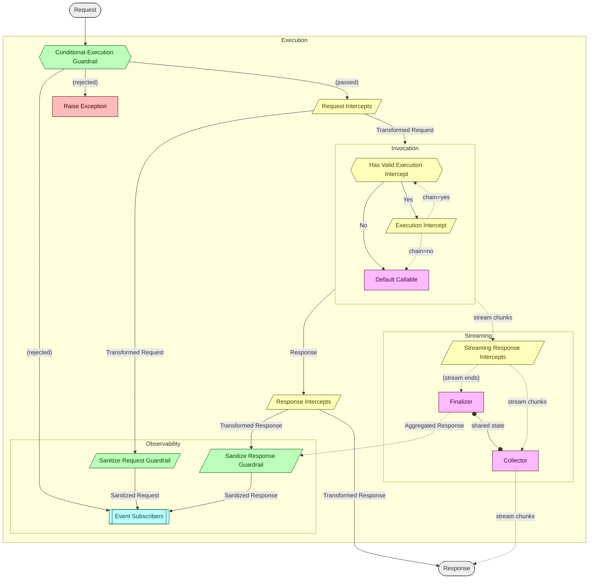

<!--
SPDX-FileCopyrightText: Copyright (c) 2026, NVIDIA CORPORATION & AFFILIATES. All rights reserved.
SPDX-License-Identifier: Apache-2.0
-->

# NVAgentRT

Multi-language agent runtime for execution scope management, lifecycle events, and middleware (guardrails/intercepts) on tool and LLM calls. Rust core with Python, Go, Node.js, and WASM bindings.

## Repository Structure

```
crates/
  core/       # Core runtime library (nvagentrt-core)
  python/     # PyO3 Python bindings (_native C extension)
  ffi/        # C FFI layer (used by Go, generates header via cbindgen)
  node/       # NAPI Node.js bindings
  wasm/       # wasm-bindgen WebAssembly bindings
python/       # Python wrapper module (nvagentrt/)
go/           # Go CGo bindings
```

## Prerequisites

| Dependency | Version | Notes |
|---|---|---|
| Rust | stable toolchain | Install via [rustup](https://rustup.rs/). Also install `cargo-deny` (`cargo install cargo-deny`) for license/dependency auditing. |
| Python | >= 3.11 | Uses [uv](https://docs.astral.sh/uv/) for venv, deps, and builds. Maturin is installed automatically via uv. |
| Go | >= 1.21 | Required for the Go bindings. |
| Node.js | LTS | Required for napi-rs Node.js bindings. |
| wasm-pack | latest | Required for WASM builds (`cargo install wasm-pack`). |
| pre-commit | via uv | Installed as a dev dependency; activate with `uv run pre-commit install` after `uv sync`. |

## Building

### Rust (core + all crates)

```bash
cargo build --workspace
cargo build -p nvagentrt-core          # Core only
```

### Python

```bash
uv sync                                # Create venv, install deps, build native extension
```

### Go

The Go bindings link against the FFI shared library, so build it first:

```bash
cargo build --release -p nvagentrt-ffi
```

### Node.js

```bash
cd crates/node && npm install && npm run build
```

### WASM

```bash
wasm-pack build crates/wasm
```

## Testing

### Rust

```bash
cargo test --workspace                 # All Rust tests
cargo test -p nvagentrt-core           # Core tests only
```

### Python

```bash
uv run pytest                          # Runs tests in python/tests/
```

### Go

```bash
cd go/nvagentrt && CGO_LDFLAGS="-L../../target/release" go test -v ./...
```

## Dev Tooling

Pre-commit hooks run automatically on `git commit` after setup (`uv run pre-commit install`). The hooks enforce:

**General** — trailing whitespace, EOF fixup, YAML/TOML/JSON validity, merge conflict markers, large file check (500 KB max).

**Python** — [Ruff](https://docs.astral.sh/ruff/) for linting (`E`, `F`, `W`, `I` rules) and formatting (line length 120, double quotes). [ty](https://github.com/astral-sh/ty) for type checking.

**Rust** — `cargo fmt` for formatting, `cargo clippy` with `-D warnings` for lints, `cargo deny` for license/advisory auditing (configured in `deny.toml`).

**Go** — `gofmt` for formatting, `go vet` for static analysis.

## Architecture Overview

NVAgentRT manages a **scope stack** of hierarchical execution scopes (identified by UUID handles) with a root scope always present. Scopes carry registered tools, LLM providers, guardrails, intercepts, and event subscribers.

The tool/LLM call lifecycle pipeline:



Key mechanisms:

- **Intercept chains** — priority-ordered middleware that can transform requests/responses; supports `break_chain` for short-circuit.
- **Guardrails** — sanitize (modify) or gate (allow/reject) at request and response boundaries.
- **Stream wrapping** — `LlmStreamWrapper` buffers and parses SSE events, applying intercepts mid-stream.
- **Event subscribers** — observer pattern with named subscribers for lifecycle events. Events carry typed lifecycle fields (`input`, `output`, `model_name`, `tool_call_id`, `root_uuid`) in addition to custom `data`/`metadata`.
- **Context propagation** — `tokio::task_local` for async, thread-local for sync paths.
- **ATIF trajectory export** — `AtifExporter` registers as an event subscriber and exports [ATIF v1.6](https://github.com/nvidia/ATIF) trajectories from collected lifecycle events. LLM calls map to user/agent steps; tool calls map to tool_calls/observations. Filter by `root_uuid` to isolate concurrent agents. Available in all bindings.
