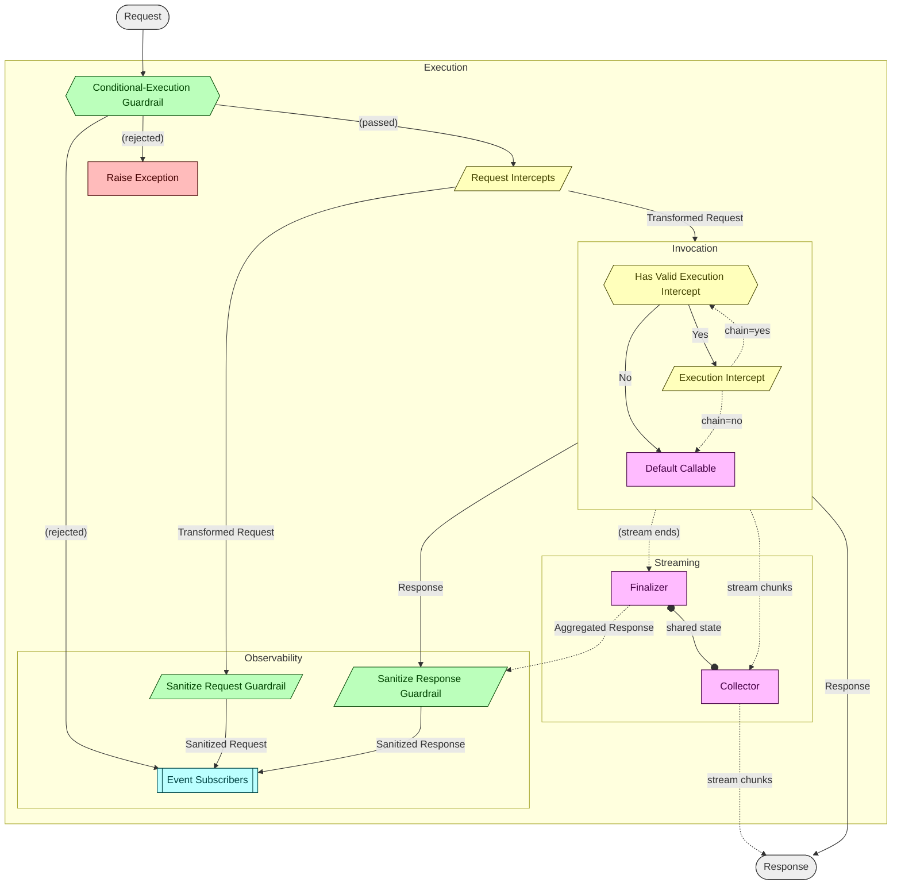

<!--
SPDX-FileCopyrightText: Copyright (c) 2026, NVIDIA CORPORATION & AFFILIATES. All rights reserved.
SPDX-License-Identifier: Apache-2.0
-->

# NeMo Agent Toolkit Nexus

## What is Nexus?

Nexus is a multi-language agent runtime framework that gives AI agent developers a unified way to manage execution scopes, lifecycle events, and middleware pipelines across tool and LLM calls. Built as a high-performance Rust core with native bindings for Python, Go, Node.js, and WebAssembly, Nexus provides:

- **Hierarchical scope management** -- organize agent execution into nested scopes with automatic cleanup, enabling clean multi-tenant and concurrent agent isolation.
- **Middleware pipelines** -- plug in guardrails (sanitize or gate requests/responses) and intercepts (transform requests, wrap execution) with priority-based ordering and short-circuit support.
- **Lifecycle event tracking** -- subscribe to structured events emitted at every stage of the tool/LLM call lifecycle, with typed fields for input, output, model name, tool call ID, and root scope UUID.
- **ATIF trajectory export** -- automatically collect lifecycle events and export them as [ATIF v1.6](https://github.com/nvidia/ATIF) trajectory files for evaluation and debugging.
- **Stream wrapping** -- buffer and parse SSE events from streaming LLM responses, feeding chunks to collectors and calling finalizers on stream end.

Write your agent logic once and instrument it with Nexus middleware and events that work consistently across all supported languages.

All bindings also expose OTLP-backed observability subscribers. Direct Rust
users can depend on the separate workspace crates
`nvidia-nat-nexus-otel` and `nvidia-nat-nexus-openinference`, while Python,
Node.js, Go, and WASM expose binding-native config objects on top of those
implementations. See
[Observability with OpenTelemetry](docs/observability-with-opentelemetry.md)
and [Observability with OpenInference](docs/observability-with-openinference.md)
for the canonical setup guides.

## Getting Started

Install the Python package and run your first instrumented agent call in a few lines:

```python
import nat_nexus

# Subscribe to lifecycle events
nat_nexus.subscribers.register("logger", lambda event: print(f"[{event.kind}] {event.name}"))

# Execute a tool call inside an agent scope (inside an async function)
with nat_nexus.scope.scope("my-agent", nat_nexus.ScopeType.Agent):
    result = await nat_nexus.tools.execute("search", {"query": "hello"}, my_tool_func)
```

For complete quick-start examples in all supported languages, see the [Language Bindings](docs/language-bindings.md) guide. A fully worked example with LangChain integration is available in [examples/](examples/).

## Start Here

- **Python users** -- start with [Getting Started: Python](docs/getting-started-python.md), then read [Language Bindings](docs/language-bindings.md).
- **Node.js users** -- start with [Getting Started: Node.js](docs/getting-started-node.md), then read [Language Bindings](docs/language-bindings.md).
- **Go users** -- start with [Getting Started: Go](docs/getting-started-go.md), then read [Language Bindings](docs/language-bindings.md).
- **WASM users** -- start with [Getting Started: WebAssembly](docs/getting-started-wasm.md), then read [Language Bindings](docs/language-bindings.md).
- **Proxy users** -- start with [Proxy Layer](docs/proxy-layer.md) and [Online Learning Engine](docs/online-learning-engine.md).
- **Contributors** -- start with the canonical [Documentation Index](docs/README.md) and [.github/CONTRIBUTING.md](.github/CONTRIBUTING.md).

## Documentation

Comprehensive documentation lives in the [docs/](docs/) directory. The canonical docs index is [docs/README.md](docs/README.md), which includes guided reading paths by use case.

| Document | Description |
|----------|-------------|
| [Architecture Overview](docs/architecture.md) | High-level system design, binding layers, and data flow |
| [Core Concepts](docs/concepts.md) | Scopes, handles, events, and the middleware pipeline |
| [API Reference](docs/api-reference.md) | Core runtime function signatures shared across bindings |
| [Middleware Pipeline](docs/middleware-pipeline.md) | Detailed pipeline ordering for tool and LLM calls |
| [Typed Wrappers](docs/typed-wrappers.md) | Codec-based typed APIs for Python and Node.js |
| [Context Isolation](docs/context-isolation.md) | Multi-tenant and concurrent scope stack management |
| [ATIF Export](docs/atif-export.md) | Agent Trajectory Interchange Format export |
| [Observability with OpenTelemetry](docs/observability-with-opentelemetry.md) | OTLP subscriber setup, event mapping, and per-language examples |
| [Observability with OpenInference](docs/observability-with-openinference.md) | OpenInference semantic mapping, Phoenix-oriented OTLP setup, and per-language examples |
| [Language Bindings](docs/language-bindings.md) | Per-language usage guides and naming conventions |
| [Recipes](docs/recipes.md) | Task-oriented patterns for logging, ATIF, proxy setup, and context propagation |
| [Proxy Layer](docs/proxy-layer.md) | NexusProxy configuration, DynamoIntercept, declarative and builder APIs |
| [Online Learning Engine](docs/online-learning-engine.md) | Prediction trie, sensitivity scoring, Redis persistence, and learner pipeline |
| [Integration Best Practices](docs/integration-best-practices.md) | Patterns for integrating Nexus into existing agent frameworks |
| [Testing](docs/testing.md) | Testing strategy and how to run tests across all languages |

## Repository Structure

```
crates/
  core/       # Core runtime library (nvidia-nat-nexus-core)
  otel/       # OpenTelemetry OTLP subscriber crate (nvidia-nat-nexus-otel)
  openinference/ # OpenInference OTLP subscriber crate (nvidia-nat-nexus-openinference)
  python/     # PyO3 Python bindings (_native C extension)
  ffi/        # C FFI layer (used by Go, generates header via cbindgen)
  node/       # NAPI Node.js bindings
  wasm/       # wasm-bindgen WebAssembly bindings
  proxy/      # Proxy layer with online learning and scheduling hints
python/       # Python wrapper module (nat_nexus/)
go/           # Go CGo bindings
docs/         # Comprehensive documentation
examples/     # Runnable example scripts
```

## Prerequisites

| Dependency | Version | Notes |
|---|---|---|
| Rust | stable toolchain | Install via [rustup](https://rustup.rs/). Also install `cargo-deny` (`cargo install cargo-deny`) for license/dependency auditing. |
| Python | >= 3.11 | Uses [uv](https://docs.astral.sh/uv/) for venv, deps, and builds. Maturin is installed automatically via uv. |
| Go | >= 1.21 | Required for the Go bindings. |
| Node.js | LTS | Required for napi-rs Node.js bindings. |
| wasm-pack | latest | Required for WASM builds (`cargo install wasm-pack`). |
| pre-commit | via uv | Installed as a dev dependency; activate with `uv run pre-commit install` after `uv sync`. |

## Building

### Rust (core + all crates)

```bash
cargo build --workspace
cargo build -p nvidia-nat-nexus-core          # Core only
cargo build -p nvidia-nat-nexus-otel          # OpenTelemetry OTLP subscriber
cargo build -p nvidia-nat-nexus-openinference # OpenInference OTLP subscriber
```

### Python

```bash
uv sync                                       # Create venv, install deps, build native extension
```

### Go

The Go bindings link against the FFI shared library, so build it first:

```bash
cargo build --release -p nvidia-nat-nexus-ffi
```

### Node.js

```bash
cd crates/node && npm install && npm run build
cd crates/node && npm install && npm test
```

### WASM

```bash
wasm-pack build crates/wasm --scope nvidia
```

## Testing

Use [docs/testing.md](docs/testing.md) for the full matrix. Common entry points:

```bash
cargo test --workspace                                # Core + proxy + Rust bindings
uv run pytest                                         # Python
cd go/nat_nexus && \
CGO_LDFLAGS="-L../../target/release" LD_LIBRARY_PATH="${LD_LIBRARY_PATH:+${LD_LIBRARY_PATH}:}../../target/release" \
go test -race -v ./...
cd crates/node && npm install && npm test             # Node.js
wasm-pack test --node crates/wasm                     # WASM
cargo test -p nvidia-nat-nexus-proxy --features redis-backend redis_tests  # Proxy + Redis
```

## Dev Tooling

Pre-commit hooks run automatically on `git commit` after setup (`uv run pre-commit install`). The hooks enforce:

**General** -- trailing whitespace, EOF fixup, YAML/TOML/JSON validity, merge conflict markers, large file check (500 KB max).

**Python** -- [Ruff](https://docs.astral.sh/ruff/) for linting (`E`, `F`, `W`, `I` rules) and formatting (line length 120, double quotes). [ty](https://github.com/astral-sh/ty) for type checking.

**Rust** -- `cargo fmt` for formatting, `cargo clippy` with `-D warnings` for lints, `cargo deny` for license/advisory auditing (configured in `deny.toml`).

**Go** -- `gofmt` for formatting, `go vet` for static analysis.

## Architecture Overview

Nexus manages a **scope stack** of hierarchical execution scopes (identified by UUID handles) with a root scope always present. Scopes carry registered tools, LLM providers, guardrails, intercepts, and event subscribers.

The tool/LLM call lifecycle pipeline:



Key mechanisms:

- **Intercept chains** -- priority-ordered middleware that can transform requests; supports `break_chain` for short-circuit. Execution intercepts wrap the callable in a middleware chain pattern.
- **Guardrails** -- sanitize (modify) or gate (allow/reject) at request and response boundaries.
- **Stream wrapping** -- `LlmStreamWrapper` buffers and parses SSE events, feeding chunks to the collector and calling the finalizer on stream end.
- **Event subscribers** -- observer pattern with named subscribers for lifecycle events. Events carry typed lifecycle fields (`input`, `output`, `model_name`, `tool_call_id`) in addition to custom `data`/`metadata`.
- **Context propagation** -- `tokio::task_local` for async, thread-local for sync paths.
- **ATIF trajectory export** -- `AtifExporter` registers as an event subscriber and exports [ATIF v1.6](https://github.com/nvidia/ATIF) trajectories from collected lifecycle events. LLM calls map to user/agent steps; tool calls map to tool_calls/observations. Available in all bindings.

## Contributing

See [CONTRIBUTING.md](.github/CONTRIBUTING.md) for development setup, coding standards, and the pull request process.

## License

Nexus is licensed under the [Apache License 2.0](LICENSE). All source files must include SPDX license headers.
