<!--
SPDX-FileCopyrightText: Copyright (c) 2026, NVIDIA CORPORATION & AFFILIATES. All rights reserved.
SPDX-License-Identifier: Apache-2.0
-->

# libsy Contract Assessment

This assessment covers the Relay-native random-router and LLM-classifier
integrations driven through `Algorithm::run_stream`. Relay performs provider
calls and returns each real response, stream, or error through
`CallLlmRequest::respond`.

The initial assessment uses Switchyard revision
`c8ca731adec50c948739a71157ce283ed360ea8a`. Development revisions keep
`switchyard-libsy`, `switchyard-protocol`, and `switchyard-translation` on the
same source revision to preserve their shared type identity. Revision pinning
is dependency maintenance, not a libsy feature gap; compatible Switchyard 0.2
crate releases will replace the source pins. The current Relay draft follows
the focused stream-preservation work in
[NVIDIA-NeMo/Switchyard#192](https://github.com/NVIDIA-NeMo/Switchyard/pull/192).

## Integration Contract Under Assessment

```mermaid
flowchart LR
    Caller["Caller wire request"] --> DecodeRequest["switchyard-translation decode"]
    DecodeRequest --> Run["libsy run_stream"]
    Run --> Decision["Decision"]
    Decision --> Call["CallLlm"]
    Call --> EncodeTarget["switchyard-translation encode target"]
    EncodeTarget --> Dispatch["Relay provider dispatch"]
    Dispatch --> DecodeResponse["switchyard-translation decode response or stream"]
    DecodeResponse --> Respond["CallLlmRequest.respond"]
    Respond --> Final["ReturnToAgent"]
    Final --> EncodeCaller["switchyard-translation encode caller"]
    EncodeCaller --> Caller
```

## Confirmed Baseline

The pinned library supports the required random-router lifecycle:

- client-less semantic targets;
- weighted and optionally seeded random selection;
- `Decision → CallLlm → ReturnToAgent` through `run_stream`;
- Relay-hosted buffered and streaming provider calls;
- concurrent independent runs;
- typed libsy orchestration and common provider-client errors;
- buffered request and response translation with exact same-format
  preservation.

The same driver can serve the classifier's two-call lifecycle: a classifier
consultation followed by the selected weak or strong target. The classifier
prompt-role gap below must be resolved upstream before that integration is
ready for review.

## LIBSY-GAP-003: Exact Raw Stream-Event Preservation

**Description:** A provider stream event must survive the
Relay → libsy → Relay round trip without losing fields that the neutral chunk
model does not understand.

- **Priority:** P0 for same-protocol streaming parity.
- **Affected Relay behavior:** Same-protocol responses must preserve provider
  extensions such as OpenAI Chat `system_fingerprint`.
- **Pinned behavior:** `switchyard-translation` decodes a raw event into
  its normalized `LlmResponseChunk` values and later re-encodes those values.
  Unknown fields disappear in this Switchyard translation round trip and
  generated defaults can appear.
- **Reproducer:** Route an OpenAI Chat chunk containing a text delta and
  `system_fingerprint` through the plugin. The pinned output drops the
  fingerprint and adds `created: 0`.
- **Required behavior:** Carry the complete parsed source JSON beside its
  normalized children. Replay that JSON when source and target formats match;
  use only normalized children for cross-format encoding.
- **Proposed API area:** `switchyard-protocol::LlmResponseChunk` and
  `switchyard-translation` stream decode/encode methods.
- **Upstream work:** `feat/translation-preserve-raw-stream-events`.
- **Switchyard issue/PR:**
  [NVIDIA-NeMo/Switchyard#192](https://github.com/NVIDIA-NeMo/Switchyard/pull/192).
  The Relay draft temporarily pins all three Switchyard crates to that PR's
  commit. Updating the revisions after it lands is dependency maintenance, not
  a separate libsy gap.
- **Acceptance:** JSON-semantically equivalent same-format events for OpenAI
  Chat, OpenAI Responses, and Anthropic Messages; normalized cross-format text
  translation; nested stream errors remain typed.
- **Relay test unblocked:** `same_protocol_stream_round_trip_preserves_raw_provider_event`.

## LIBSY-GAP-004: Complete Provider Error Categories

**Description:** libsy can represent transport, timeout, context-window, HTTP,
translation, and configuration failures, but the pinned protocol has no
dedicated model-unavailable category.

- **Priority:** P2 for algorithms that react differently to model availability.
- **Affected Relay behavior:** Relay already has a typed
  `ModelUnavailable` provider failure and uses the original Relay error for
  retry classification.
- **Pinned behavior:** Relay can return the real failure message to libsy only
  through the general client-error variant.
- **Reproducer:** Return Relay's typed `ModelUnavailable` failure from a
  `CallLlm`. The host can retain that type for its own retry policy, but
  `LlmClientError` can carry it back to the algorithm only as `General`.
- **Required behavior:** Add a typed model-unavailable variant without requiring
  hosts to parse strings or invent an HTTP status.
- **Proposed API area:** `switchyard-protocol::LlmClientError`.
- **Switchyard issue/PR:** None; deferred until an algorithm needs to react to
  this category.
- **Current integration impact:** Not a random-router blocker. The random router
  does not branch on provider error category, and Relay retains the original
  typed error for its retry decision.
- **Acceptance:** libsy receives a typed model-unavailable failure and existing
  algorithms remain source-compatible.
- **Relay test unblocked:** A contract test proving that model-unavailable
  reaches an algorithm as a distinct typed failure.

## LIBSY-GAP-005: Classifier Prompt Instruction Role

**Description:** The LLM classifier's governing prompt must reach the provider
as a system-level instruction, not as ordinary user content.

- **Priority:** P0 for classifier routing correctness.
- **Affected Relay behavior:** Relay dispatches the classifier `CallLlm`
  exactly as libsy constructs it. It must not rewrite neutral message roles
  around the Switchyard translation contract.
- **Pinned behavior:** `CapabilityJudge` inserts its prompt as
  `Message { role: System }`, while the OpenAI Chat encoder maps system roles
  found in the normal message list to `user`. The classifier therefore receives
  its policy prompt at the wrong privilege level.
- **Reproducer:** Start `LlmTaskClassifier::run_stream`, inspect its first
  `CallLlm`, encode that request as OpenAI Chat, and observe
  `messages[0].role == "user"`.
- **Required behavior:** Build the classifier prompt in
  `LlmRequest.instructions` with `Role::System`. Switchyard's protocol encoders
  then map it to the provider's native system-instruction field.
- **Proposed API area:** `switchyard-libsy::algorithms::LlmTaskClassifier`
  request construction; no Relay API or codec change.
- **Upstream work:** `feat/libsy-classifier-system-instruction`.
- **Switchyard issue/PR:** Pending focused upstream review. The Relay
  development pin will include the resolving commit alongside the stream
  preservation commit until compatible Switchyard 0.2 crates are published.
- **Acceptance:** The libsy classifier contract test observes one system
  instruction and one user task message; Relay's focused contract probe
  observes the provider-native system field for both supported classifier
  protocols.
- **Relay test unblocked:**
  `classifier_prompt_is_encoded_as_a_system_instruction` (ignored while Relay
  is pinned to the affected Switchyard revision).

## Deferred Capabilities

Decision-only execution, observe-only routing, stage routing, ensemble-specific
concurrent dispatch, structured decision identity, confidence, baselines, and
optimization contributions are outside this integration. They are not mapped
around locally and do not block the random-router or LLM-classifier
`run_stream` contract.
