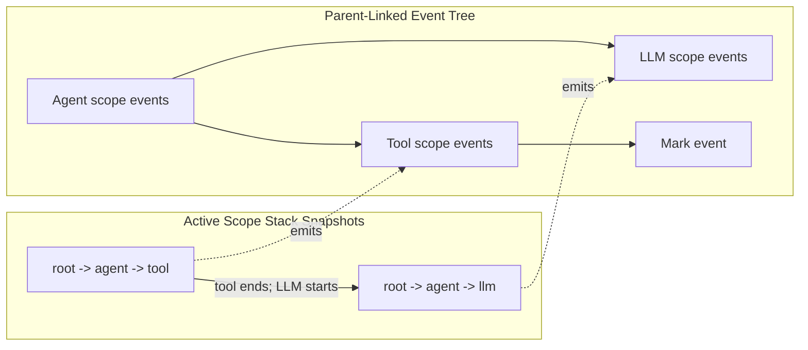

import { MermaidStyles } from "@/components/MermaidStyles";

{/* SPDX-FileCopyrightText: Copyright (c) 2026, NVIDIA CORPORATION & AFFILIATES. All rights reserved.
SPDX-License-Identifier: Apache-2.0 */}

NeMo Relay is a portable runtime layer for agent systems that already have an
application, framework, or model provider. Use this primer when you need to
understand what NeMo Relay adds before choosing an installation, quick-start, or
integration path.

Agent applications usually cross several boundaries in one request: an entry
point starts work, the agent calls a model, the model asks for tools, tools call
services, and tracing or policy systems need to understand the result. Without a
shared runtime layer, each boundary tends to grow its own wrappers, callback
format, trace vocabulary, and cleanup rules.

NeMo Relay gives those boundaries one execution model.

## What NeMo Relay Adds

NeMo Relay does not decide what your agent should do. It describes and manages
what happens when your agent crosses runtime boundaries.

The shared runtime model has five parts:

- **[Scopes](/about-nemo-relay/concepts/scopes)** describe where work belongs.
  They preserve parent-child
  relationships across requests, agent runs, tools, LLM calls, background work,
  and nested functions.
- **[Middleware](/about-nemo-relay/concepts/middleware)** runs around managed
  execution. Intercepts can transform or wrap real calls. Guardrails can block
  execution or sanitize emitted observability payloads.
- **[Plugins](/about-nemo-relay/concepts/plugins)** package reusable runtime
  behavior so teams can install middleware, subscribers, exporters, or adaptive
  behavior from configuration instead of repeating setup code in every
  application.
- **[Events](/about-nemo-relay/concepts/events)** record what happened. NeMo
  Relay emits Agent Trajectory Observability Format (ATOF) lifecycle records
  that subscribers and exporters can consume.
- **[Subscribers and exporters](/about-nemo-relay/concepts/subscribers)**
  consume events in process, write raw ATOF events, or project events into ATIF,
  typed OpenTelemetry output such as the OpenInference projection, or other
  downstream formats.

Managed tool and LLM calls are the main APIs for application-owned execution.
They attach work to the active scope, run middleware in a consistent order, and
emit lifecycle events. The application result is preserved unless registered
intercepts or guardrails intentionally change execution.

Choose a built-in plugin component when Relay already provides the behavior and
you want to enable it from configuration. Choose a discoverable plugin when a
separately distributed plugin package should install internal or third-party
behavior without changing the Relay host.

## One Agent Run, Two Views

Consider an agent that reads a file and then asks an LLM to summarize it:

1. Relay opens an Agent scope under the root scope.
2. The file read runs in a Tool scope under the Agent scope.
3. After the Tool scope ends, the model request runs in an LLM scope under the
   same Agent scope.
4. Relay ends the Agent scope when the run completes.

Scopes are active as a stack. During the file read, the stack is
`root -> agent -> tool`. During the model request, it is
`root -> agent -> llm`. Ending the current Tool or LLM scope pops it from the
stack and restores the Agent scope as the active owner.

Events are recorded separately from the active stack. Relay emits parent-linked
start and end events for the Agent, Tool, and LLM scopes. Those records remain
in an event tree after the active scope has closed. A mark records a
point-in-time fact under the active scope; it does not add another entry to the
scope stack.

<MermaidStyles />

The following diagram contrasts active scope-stack snapshots with the
parent-linked event tree.

Codecs are optional translators. They convert typed application values or
provider-native payloads into consistent data that middleware, events, or
exporters can use. Codecs are not required for every call.

## What NeMo Relay Does Not Replace

NeMo Relay sits below the choices your application already makes.

It does not replace:

- Your agent framework or orchestration logic
- Your model provider or provider SDK
- Your application business logic
- Your production observability backend
- NeMo Agent Toolkit

Instead, it gives those systems shared handling for call lifecycles, policy
hooks, event emission, and export.

For setup routing, start with [Getting Started](/getting-started/about).
