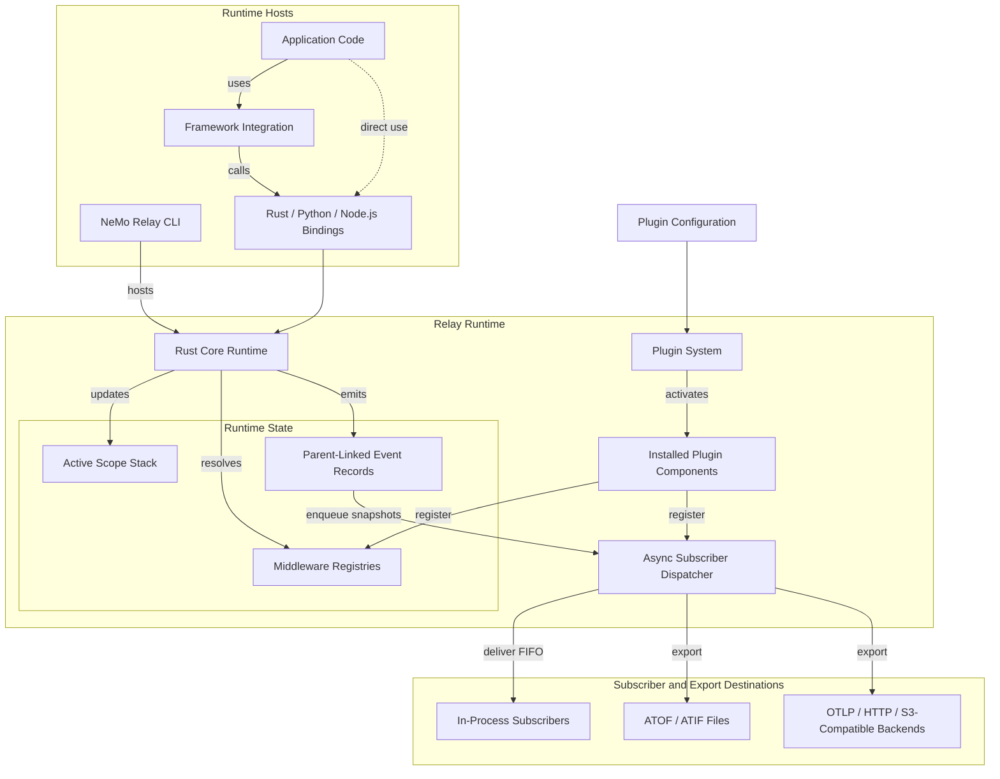

import { MermaidStyles } from "@/components/MermaidStyles";

{/* SPDX-FileCopyrightText: Copyright (c) 2026, NVIDIA CORPORATION & AFFILIATES. All rights reserved.
SPDX-License-Identifier: Apache-2.0 */}

This page explains how NeMo Relay connects [scopes](/about-nemo-relay/concepts/scopes),
[middleware](/about-nemo-relay/concepts/middleware),
[plugins](/about-nemo-relay/concepts/plugins),
[events](/about-nemo-relay/concepts/events), and
[subscribers](/about-nemo-relay/concepts/subscribers).

## Architecture Diagram

This diagram shows the CLI and language bindings hosting the shared Rust
runtime. Plugin components install behavior into that runtime, and subscribers
deliver event snapshots to in-process consumers or external backends.

<MermaidStyles />

Adaptive behavior is one plugin component installed through the same lifecycle
as observability or PII redaction. It is not a separate runtime layer.

## Runtime Model

NeMo Relay combines a small number of runtime pieces into one shared execution
model:

- The [**scope stack**](/about-nemo-relay/concepts/scopes) answers where work
  currently belongs.
- The [**middleware registries**](/about-nemo-relay/concepts/middleware) answer
  what should happen around that work.
- The [**plugin system**](/about-nemo-relay/concepts/plugins) installs reusable
  runtime behavior from configuration.
- The [**event records**](/about-nemo-relay/concepts/events) preserve what
  happened and how work was related.
- The [**async subscriber dispatcher**](/about-nemo-relay/concepts/subscribers#waiting-for-delivery)
  delivers event snapshots after emission.
- [**Subscribers and exporters**](/about-nemo-relay/concepts/subscribers#common-subscriber-roles)
  consume those snapshots.

Every managed tool or LLM call resolves the middleware visible from the active
scope before it executes. When the runtime emits an event, it records the active
scope UUID as parentage. The scope stack changes as work opens and closes; the
parent-linked event records remain available to subscribers.

## Main Runtime Pieces

These components are the primary building blocks that make up the runtime model.

### Scope Stack

The active scope stack defines the current context for runtime work.
It establishes:

- Parent-child relationships between events
- Scope-local visibility for middleware and subscribers
- Cleanup boundaries for scope-owned registrations
- Isolation across concurrent requests or workers

### Middleware Registries

The middleware registries hold the active intercepts and guardrails for tool and
LLM execution. Request intercepts can rewrite real requests, conditional
guardrails can reject execution, and sanitize guardrails can change emitted
observability payloads. Managed helpers read those registries before invoking
the real callback.

Async middleware callbacks are awaited as part of managed execution. The
managed call does not advance past that middleware callback until the callback
returns.

### Plugin System

The plugin system installs reusable runtime components from configuration. A
plugin can register middleware, subscribers, or related behavior without
requiring each application call site to repeat the setup.

### Event Emission

The runtime emits structured events for scopes, tools, LLMs, and named marks.
Those parent-linked records are the canonical history of runtime behavior.
Native Rust, Python, Node.js, and FFI event-producing APIs enqueue subscriber
work and return without waiting for subscriber callbacks or exporter work.

### Subscribers and Exporters

Subscribers consume event snapshots through the background dispatcher. Some
stay in process. Exporter subscribers can write
[ATOF JSONL](/configure-plugins/observability/atof), project events into
[ATIF trajectories](/configure-plugins/observability/atif), or emit
[OpenTelemetry traces](/configure-plugins/observability/opentelemetry).
Typical destinations include in-process application logic, local files and
artifact pipelines, OTLP-compatible observability backends, and evaluation or
visualization tools.

This delivery happens after event submission and is separate from awaited async
middleware. Use the binding flush API when a test or shutdown path must wait for
already queued subscriber work.

## Where Runtime State Lives

Runtime state is easiest to understand by separating ownership from process-wide
registration.

### Scope Ownership

The scope stack defines:

- Where work belongs
- Which scope-local behavior is visible
- When scope-local registrations are cleaned up
- Whether concurrent requests stay isolated

### Middleware Ownership

Middleware exists at two levels:

- **global registrations** stay active process-wide until removed
- **scope-local registrations** are owned by one scope and disappear when that scope closes

That split lets long-lived defaults coexist with request-specific or task-specific behavior.

## Managed Execution Pipeline

Managed tool and LLM execution follows the same high-level order:

1. Conditional-execution guardrails decide whether work can proceed.
2. Request intercepts can rewrite the real request.
3. Sanitize-request guardrails can rewrite the emitted start-event payload.
4. Execution intercepts wrap or replace the user callback.
5. The user callback runs.
6. Sanitize-response guardrails can rewrite the emitted end-event payload.

Two distinctions matter:

- Intercepts affect the real execution path
- Sanitize guardrails affect the emitted observability payload

For the expanded request-to-response runtime path, including streaming and
subscriber handoff, refer to
[Managed Execution Order](/about-nemo-relay/concepts/middleware#managed-execution-order).
