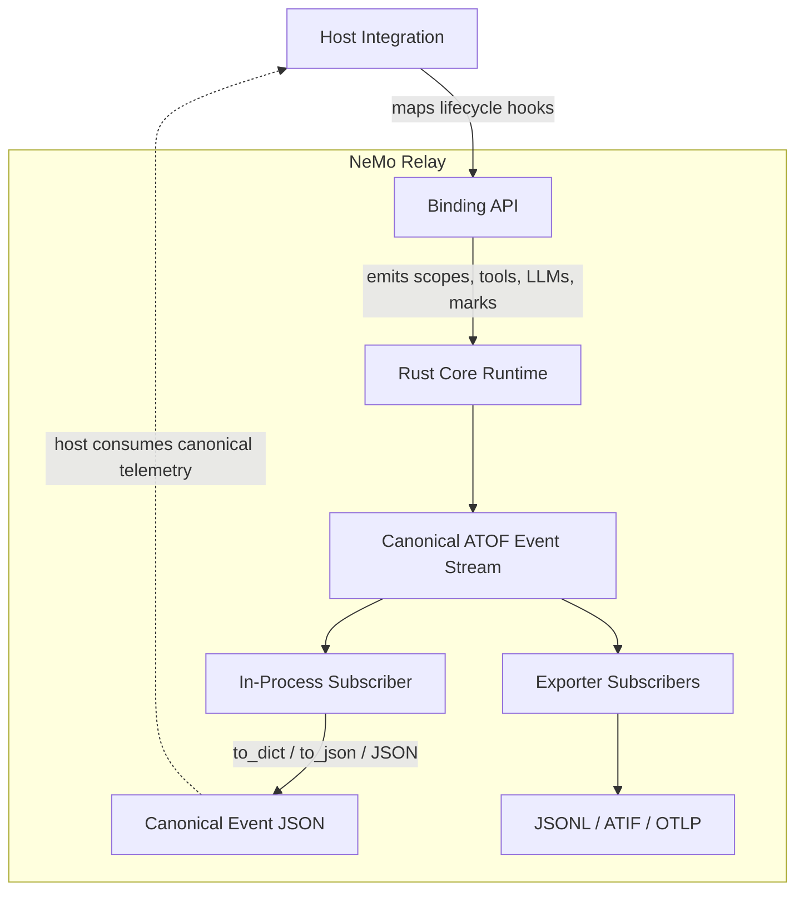

import { MermaidStyles } from "@/components/MermaidStyles";

{/* SPDX-FileCopyrightText: Copyright (c) 2026, NVIDIA CORPORATION & AFFILIATES. All rights reserved.
SPDX-License-Identifier: Apache-2.0 */}

This page explains how subscribers consume lifecycle events without changing runtime
execution.

## What Subscribers Are

Subscribers are consumers of the NeMo Relay event stream. They receive emitted
lifecycle events and use them for observation, forwarding, export, or analysis.

## How Subscribers Relate to Events

Events describe what happened. Subscribers are the components that watch those
events.

That separation matters:

- The runtime can emit one canonical event stream
- Many subscribers can consume that same stream
- Observability behavior stays downstream from execution semantics

## Registration Levels

Middleware and subscribers can be registered at different levels depending on their
lifetime and visibility.

### Global Subscribers

Global subscribers remain active process-wide until they are removed.

### Scope-Local Subscribers

Scope-local subscribers are owned by one active scope and disappear when that
scope closes.

Scope-local subscription handles remember the owning scope stack. This allows a
caller to close the handle from outside the original current-stack context, while
scope pop still remains the cleanup boundary for any open scope-local
registrations.

### Plugin-Installed Subscribers

Plugins can install subscribers as reusable, configuration-driven runtime
components.

## Subscription Handles and Named APIs

Rust applications can use closeable subscription handles for new code:
`subscribe(callback)` returns a global subscriber handle, and
`scope_subscribe(scope_uuid, callback)` returns a scope-local subscriber handle.
Calling `close()` removes the registration and is idempotent.

Rust also exposes `nemo_relay::api::subscriber::Subscriber`, a callback-backed
adapter that implements both `tracing::Subscriber` and
`tracing_subscriber::Layer`. Host applications can install it directly as a
tracing subscriber or compose it into an existing `tracing-subscriber` registry
alongside formatting, filtering, OpenTelemetry, or other host layers.

For Rust libraries that want to consume NeMo Relay events through tracing
subscriber mechanisms, the canonical path is
`nemo_relay::api::subscriber::tracing_layer(callback)`. The layer decodes NeMo
Relay tracing records back into canonical `Event` values and invokes the
callback. Libraries should return or document this layer for host applications
to compose; they should not call `tracing::subscriber::set_global_default`.

```rust
use std::sync::Arc;
use nemo_relay::api::subscriber;
use tracing_subscriber::prelude::*;

let nemo_events = subscriber::tracing_layer(Arc::new(|event| {
    // Consume the canonical NeMo Relay Event.
}));

let tracing_stack = tracing_subscriber::registry()
    .with(nemo_events);

// Application code owns installation of the tracing subscriber.
tracing::subscriber::set_global_default(tracing_stack)?;
```

Libraries that already implement their own `tracing_subscriber::Layer` can use
`subscriber::is_nemo_relay_event(metadata)` as a target filter and
`subscriber::event_from_tracing(event)` to decode the canonical event payload.
These helpers are the supported way to consume NeMo Relay tracing records
without depending on the raw tracing field layout.

The Rust named APIs remain available under their original names:
`register_subscriber(name, callback)`, `deregister_subscriber(name)`,
`scope_register_subscriber(scope_uuid, name, callback)`, and
`scope_deregister_subscriber(scope_uuid, name)`. Python, JavaScript, Go, and
WebAssembly keep their existing named APIs unchanged and also expose additive
closeable subscription handles for code that does not need a stable subscriber
name.

## What Subscribers Consume

Subscribers consume the canonical event stream. The Rust core runtime emits each
runtime event through a structured `tracing` record that carries the canonical
ATOF JSON payload, then delivers the original canonical `Event` directly to
registered callbacks.

This keeps plain subscribers, exporters, and Rust `tracing` integrations aligned
around one runtime source of truth.

## Rust `tracing` Base

The Rust core uses `tracing` and `tracing-subscriber` as the internal emission
substrate for lifecycle events. Library code does not install a global tracing
subscriber; Rust host applications remain responsible for configuring their own
`tracing-subscriber` layers, filters, and exporters.

For each emitted event, NeMo Relay's core runtime emits `nemo_relay.event`
records through the host's current tracing dispatcher when one is installed.
Scope spans remember the dispatcher that created them so child marks and scope
end events can stay attached to the original host span. Active NeMo subscriber
callbacks stored in the runtime registry receive the original canonical `Event`
directly, avoiding a JSON round trip on the compatibility callback path.

`Event`, ATOF JSON, binding callback delivery, and the built-in ATIF,
OpenTelemetry, OpenInference, and ATOF exporters remain NeMo-owned public
behavior. Missing host subscribers do not change runtime behavior.

## Common Subscriber Roles

Subscribers are commonly used for in-process observation, counters, debugging, and
exporter handoff.

### In-Process Observation

Some subscribers stay inside the process and power custom logging, analytics, or
debugging logic.

#### Host Integration Event JSON

For host integrations that need a serialized event payload, use the event
object's canonical JSON helpers instead of reconstructing payloads from native
attributes. Python subscribers can call `event.to_dict()` or `event.to_json()`
from the callback while still using the normal subscriber registration API.

This pattern is useful when an agent runtime, framework adapter, or plugin host
already has its own lifecycle hooks but wants NeMo Relay to be the shared
telemetry representation. The host integration maps those hooks into NeMo Relay
scopes, LLM calls, tool calls, or marks. NeMo Relay emits the canonical ATOF event
stream, and each subscriber chooses whether to consume the native event object,
the canonical JSON helper, or an exporter-specific translation.

<MermaidStyles />



The important boundary is that subscribers do not define the event schema. They
receive the runtime event and may serialize it through the binding helper when
they need a stable JSON payload. Exporter subscribers, such as the ATOF JSONL
exporter, consume the same event stream and serialize the same canonical event
shape for their target backend.

### Forwarding and Export

Some subscribers translate the event stream into external formats or transport
it to another system.

### Analytics and Diagnostics

Some subscribers derive measurements, trajectories, or diagnostics from the
event stream without affecting execution behavior.

## Built-In Subscriber Examples

These examples show how built-in subscriber patterns relate to custom subscribers and
exporters.

### Custom Subscribers

A plain custom subscriber is the right choice when you want in-process handling
of the canonical event stream.

### Agent Trajectory Interchange Format (ATIF) Exporter

The [Agent Trajectory Interchange Format (ATIF) exporter](/observability-plugin/atif)
collects lifecycle events and emits trajectory artifacts for offline analysis,
replay, or debugging.

### Agent Trajectory Observability Format (ATOF) JSONL Exporter

The [Agent Trajectory Observability Format (ATOF) JSONL exporter](/observability-plugin/atof)
writes the canonical event stream to a native filesystem path as one raw ATOF
event per line.

### OpenTelemetry Subscriber

The OpenTelemetry subscriber maps runtime events into OTLP traces for tracing
backends.

### OpenInference Subscriber

The OpenInference subscriber maps runtime events into OTLP traces using
OpenInference semantics for model-centric observability.

Detailed setup, configuration, and API shape for these subscribers belongs in
[Observability](/observability-plugin/about).
For configuration-driven setup, use the built-in
[`observability` plugin](/observability-plugin/configuration)
to install ATOF, ATIF, OpenTelemetry, and OpenInference subscribers from one
plugin component.

## Practical Guidance

Use these practices when applying the concept in application or integration code.

- Use a plain subscriber when you want in-process custom behavior.
- Use `event.to_dict()` or `event.to_json()` when a host runtime or exporter
  needs the canonical event JSON shape in-process.
- Use a scope-local subscriber when the observation should disappear with the
  owning scope.
- Use a plugin-installed subscriber when the behavior should be reusable and
  config-driven.
- Use an exporter-oriented subscriber when the event stream should leave the
  process.
