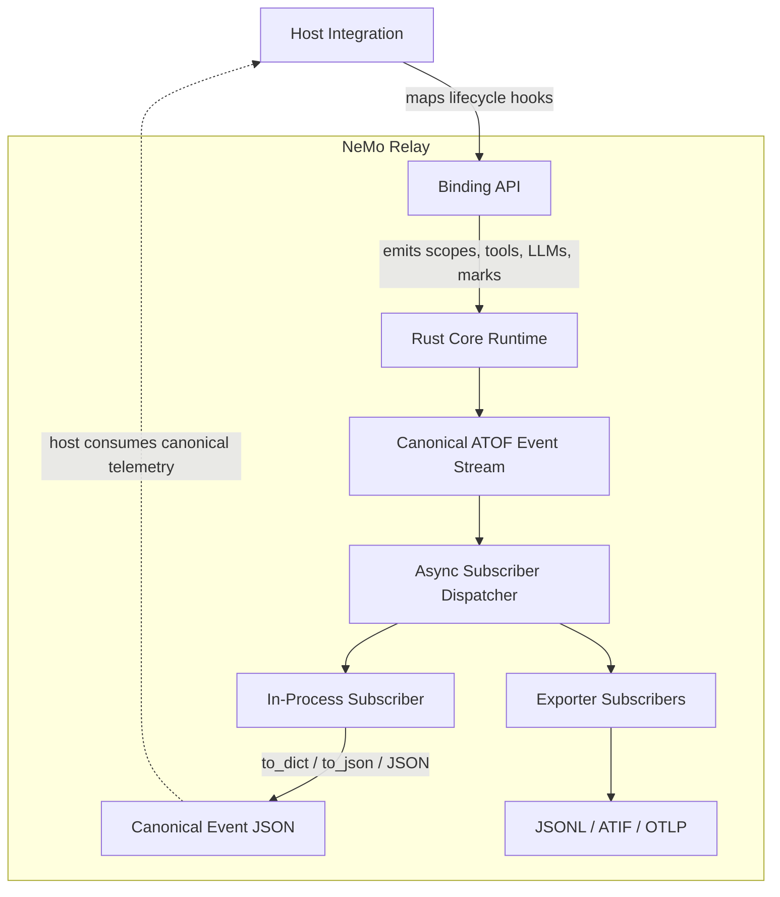

import { MermaidStyles } from "@/components/MermaidStyles";

{/* SPDX-FileCopyrightText: Copyright (c) 2026, NVIDIA CORPORATION & AFFILIATES. All rights reserved.
SPDX-License-Identifier: Apache-2.0 */}

This page explains how subscribers consume lifecycle events without changing runtime
execution.

## What Subscribers Are

Subscribers are consumers of the NeMo Relay event stream. They receive emitted
lifecycle events and use them for observation, forwarding, export, or analysis.
On native Rust, Python, Node.js, and FFI surfaces, event-producing calls enqueue
subscriber delivery on a process-wide background dispatcher and return without
waiting for subscriber callbacks or exporter work.

## How Subscribers Relate to Events

Events describe what happened. Subscribers are the components that watch those
events.

In this documentation, an event is **emitted** when the runtime submits it for
subscriber dispatch. An event is **delivered** to a subscriber when its callback
runs. An event is **exported** when an exporter completes the downstream work
defined by its API. On native targets, these are separate milestones.

That separation matters:

- The runtime can emit one canonical event stream
- Native event calls stay non-blocking for subscriber work
- Many subscribers can consume that same stream
- Observability behavior stays downstream from execution semantics

## Registration Levels

Middleware and subscribers can be registered at different levels depending on their
lifetime and visibility.

### Global Subscribers

Global subscribers remain active process-wide until they are removed.

### Scope-Local Subscribers

Scope-local subscribers are owned by one active scope and disappear when that
scope closes.

Deregistering a subscriber affects future emissions. Events that were already
emitted carry a subscriber snapshot, so queued callbacks from that snapshot can
still run after deregistration.

### Plugin-Installed Subscribers

Plugins can install subscribers as reusable, configuration-driven runtime
components.

## What Subscribers Consume

Subscribers consume the canonical event stream. They do not define the event
model. They react to it.

This lets plain subscribers, exporters, and tracing adapters share one runtime
source of truth.

## Common Subscriber Roles

Subscribers are commonly used for in-process observation, counters, debugging, and
exporter handoff.

### In-Process Observation

Some subscribers stay inside the process and power custom logging, analytics, or
debugging logic.

#### Host Integration Event JSON

For host integrations that need a serialized event payload, use the event
object's canonical JSON helpers instead of reconstructing payloads from native
attributes. Python subscribers can call `event.to_dict()` or `event.to_json()`
from the callback while still using the normal subscriber registration API.

This pattern is useful when an agent runtime, framework adapter, or plugin host
already has its own lifecycle hooks but wants NeMo Relay to be the shared
telemetry representation. The host integration maps those hooks into NeMo Relay
scopes, LLM calls, tool calls, or marks. NeMo Relay emits the canonical ATOF event
stream, and each subscriber chooses whether to consume the native event object,
the canonical JSON helper, or an exporter-specific translation.

<MermaidStyles />

The important boundary is that subscribers do not define the event schema. They
receive the runtime event and can serialize it through the binding helper when
they need a stable JSON payload. Exporter subscribers, such as the ATOF JSONL
exporter, consume the same event stream and serialize the same canonical event
shape for their target backend.

Native subscribers are invoked by one process-wide worker thread in FIFO event
order and subscriber snapshot order.

## Waiting for Delivery

An event-producing call returning is not a delivery barrier. These guarantees
apply when you call a barrier outside a native subscriber callback. Use the
following milestones to choose the barrier that matches the output you need to
observe:

| Milestone | What It Establishes | What It Does Not Establish |
|---|---|---|
| Event-producing call returns | The runtime call completed. On native targets, the runtime normally queues subscriber work for background dispatch. | Subscriber callbacks ran, exporter work completed, or output is visible or durable. |
| Subscriber flush returns | All native subscriber callbacks queued before the flush call have completed. | Exporter-owned workers drained or a remote backend accepted the data. |
| Exporter barrier returns | The runtime drained the shared subscriber queue, and the exporter completed its documented `force_flush()`, `export()`, or equivalent operation. | Exactly-once delivery, machine-crash durability, or success beyond the exporter's documented error and timeout behavior. |
| Plugin clear or exporter shutdown returns | NeMo Relay completed graceful terminal draining and cleanup, or reported an error. | Retention if the process terminates before teardown completes. |
| Process terminates before a barrier | You can observe only callback side effects and exporter work that completed before termination. | Retention of queued subscriber callbacks or pending exporter work. |

Use the subscriber flush API when application shutdown, tests, or examples must
observe side effects from callbacks that were already queued before the barrier:

- Rust: `nemo_relay::api::subscriber::flush_subscribers()?`
- Python: `nemo_relay.subscribers.flush()`
- Node.js: `flushSubscribers()`, then await an event-loop tick for JavaScript
  callback side effects
- FFI: `nemo_relay_flush_subscribers()`

Events emitted concurrently after the flush barrier are not covered by that
call. Exporters with their own workers or batch processors require the
exporter-specific flush, export, or shutdown operation described in
[Observability](/configure-plugins/observability/about).

<Warning>
Do not invoke a subscriber flush, an exporter barrier, or plugin clear from a
native subscriber callback. To avoid blocking its worker, the native dispatcher
returns a re-entrant subscriber flush without waiting. Callbacks later in the
active dispatch snapshot can still run after the barrier returns. Run those
operations after the callback returns.

If the process terminates before subscriber delivery and exporter teardown
complete, queued telemetry can be lost. Returning from the event-producing API
does not make that telemetry crash-safe.

</Warning>

### Forwarding and Export

Some subscribers translate the event stream into external formats or transport
it to another system.

### Analytics and Diagnostics

Some subscribers derive measurements, trajectories, or diagnostics from the
event stream without affecting execution behavior.

## Built-In Subscriber Examples

These examples show how built-in subscriber patterns relate to custom subscribers and
exporters.

### Custom Subscribers

A plain custom subscriber is the right choice when you want in-process handling
of the canonical event stream.

### Agent Trajectory Interchange Format (ATIF) Exporter

The [Agent Trajectory Interchange Format (ATIF) exporter](/configure-plugins/observability/atif)
collects lifecycle events and emits trajectory artifacts for offline analysis,
replay, or debugging.

### Agent Trajectory Observability Format (ATOF) JSONL Exporter

The [Agent Trajectory Observability Format (ATOF) JSONL exporter](/configure-plugins/observability/atof)
writes the canonical event stream to a native filesystem path as one raw ATOF
event per line.

### OpenTelemetry Subscriber

The OpenTelemetry subscriber maps runtime events into OTLP traces for tracing
backends.

### OpenInference Subscriber

The OpenInference subscriber maps runtime events into OTLP traces using
OpenInference semantics for model-centric observability.

Detailed setup, configuration, and API shape for these subscribers belongs in
[Observability](/configure-plugins/observability/about).
For configuration-driven setup, use the built-in
[`observability` plugin](/configure-plugins/observability/configuration)
to install ATOF, ATIF, OpenTelemetry, and OpenInference subscribers from one
plugin component.

## Practical Guidance

Use these practices when applying the concept in application or integration code.

- Use a plain subscriber when you want in-process custom behavior.
- Flush subscribers before inspecting printed output, captured lists, or other
  custom callback side effects.
- Use the exporter's documented barrier before inspecting exporter output.
- Clear plugin-managed exporters during graceful shutdown.
- Use `event.to_dict()` or `event.to_json()` when a host runtime or exporter
  needs the canonical event JSON shape in-process.
- Use a scope-local subscriber when the observation should disappear with the
  owning scope.
- Use a plugin-installed subscriber when the behavior should be reusable and
  config-driven.
- Use an exporter-oriented subscriber when the event stream should leave the
  process.
