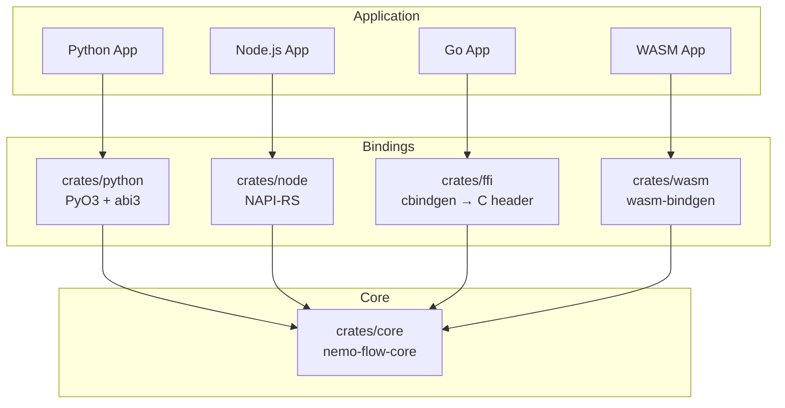
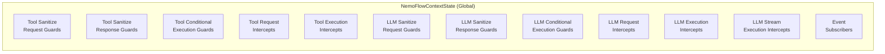
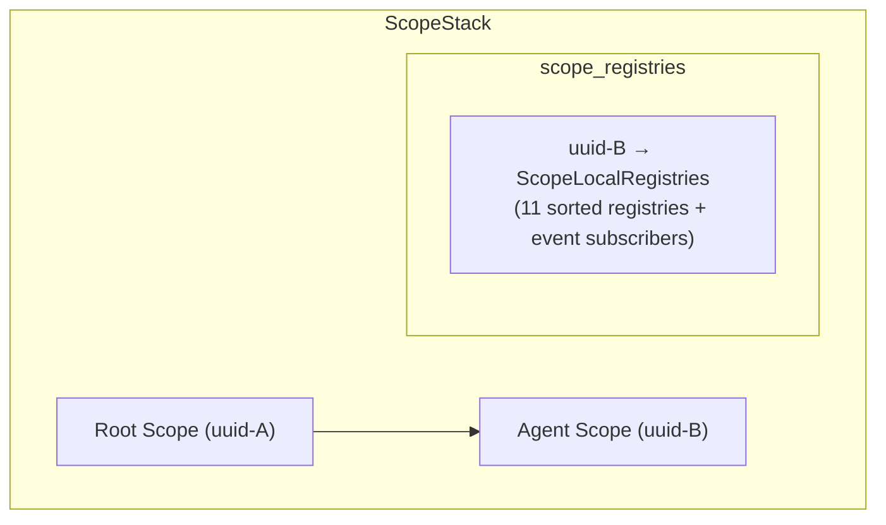
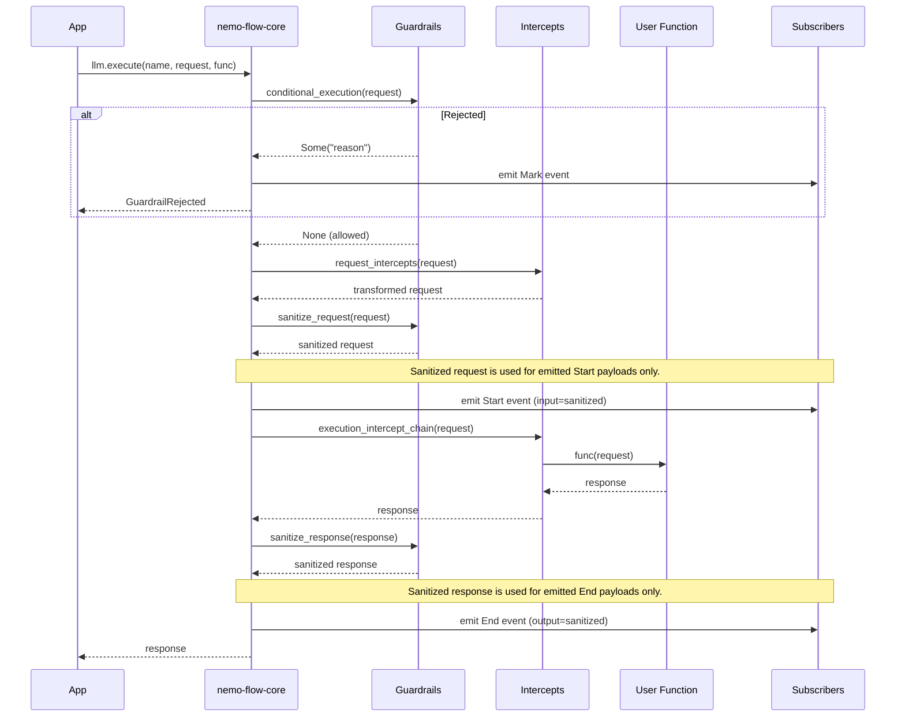

<!--
SPDX-FileCopyrightText: Copyright (c) 2026, NVIDIA CORPORATION & AFFILIATES. All rights reserved.
SPDX-License-Identifier: Apache-2.0
-->

# Architecture Overview

## System Design

NeMo Flow is a Rust-core runtime with bindings for Python, Node.js, Go, and WebAssembly. The core handles all middleware logic, event emission, and scope management. Each binding is a thin translation layer that marshals types between the host language and Rust.

```
┌────────────────────────────────────────────────────────────┐
│                     Application Code                       │
│            (Python / Node.js / Go / WASM)                  │
└──────┬──────────┬──────────┬─────────┬─────────────────────┘
       │          │          │         │
┌──────▼───┐  ┌───▼────┐ ┌───▼───┐ ┌───▼──────┐
│  PyO3    │  │  NAPI  │ │  FFI  │ │  wasm-   │
│  Python  │  │ Node.js│ │  C/Go │ │  bindgen │
└──────┬───┘  └───┬────┘ └───┬───┘ └───┬──────┘
       │          │          │         │
┌──────▼──────────▼──────────▼─────────▼──────┐
│              nemo-flow-core (Rust)            │
│                                             │
│  ┌──────────┐  ┌──────────┐  ┌───────────┐  │
│  │  Scopes  │  │  Tools   │  │    LLM    │  │
│  └──────────┘  └──────────┘  └───────────┘  │
│  ┌──────────┐  ┌──────────┐  ┌───────────┐  │
│  │Guardrails│  │Intercepts│  │Subscribers│  │
│  └──────────┘  └──────────┘  └───────────┘  │
│  ┌──────────────────────────────────────┐   │
│  │         Global Context State         │   │
│  │  (registries, scope stacks, events)  │   │
│  └──────────────────────────────────────┘   │
└─────────────────────────────────────────────┘
```

## Binding Layer Architecture



## Repository Structure

```
crates/
  core/           # Core runtime (Rust)
    src/
      lib.rs          # Public re-exports
      api.rs          # All API functions
      types.rs        # LLMRequest, handles, attributes, events
      context.rs      # Global state, scope stacks, callable type aliases
      codec/          # LLM codec system (request + response)
        mod.rs            # Re-exports all codec submodules
        traits.rs         # LlmCodec and LlmResponseCodec traits
        request.rs        # AnnotatedLLMRequest type hierarchy
        response.rs       # AnnotatedLLMResponse type hierarchy
        openai_chat.rs    # Built-in OpenAI Chat Completions codec
        openai_responses.rs # Built-in OpenAI Responses API codec
        anthropic.rs      # Built-in Anthropic Messages API codec
      registry.rs     # SortedRegistry<T> for priority-ordered middleware
      stream.rs       # LlmStreamWrapper for streaming LLM responses
      error.rs        # FlowError enum
      json.rs         # Json type alias, merge_json helper
      atif.rs         # ATIF trajectory exporter
    tests/
      codec_tests.rs
      context_isolation_tests.rs
      middleware_tests.rs
      pipeline_tests.rs
      scope_local_tests.rs
      stream_tests.rs

  optimizer/       # Dynamic optimizer runtime
  python/          # PyO3 bindings
  ffi/             # C FFI (used by Go via CGo)
  node/            # NAPI Node.js bindings
  wasm/            # wasm-bindgen WebAssembly bindings
  otel/            # OpenTelemetry trace subscriber
  openinference/   # OpenInference trace subscriber

python/            # Python wrapper package (nemo_flow/)
  nemo_flow/
    __init__.py        # Re-exports all submodules and types
    __init__.pyi       # Type stubs for the native C extension
    scope.py           # Scope operations
    tools.py           # Tool lifecycle
    llm.py             # LLM lifecycle
    guardrails.py      # Guardrail registration
    intercepts.py      # Intercept registration
    subscribers.py     # Event subscriber registration
    scope_local.py     # Scope-local middleware registration
    codecs.py          # LLM codec protocol definitions
    typed.py           # Codec-based typed wrappers
    optimizer.py       # Optimizer config helpers and runtime lifecycle

go/nemo_flow/        # Go CGo bindings
```

## Global Context

Middleware registrations exist at two levels: **global** (shared by all scope stacks) and **scope-local** (bound to a specific scope within a stack).

### Global Registries



Each registry is a `SortedRegistry<T>` that maintains entries by name with lazy priority-based sorting.

### Scope-Local Registries

Each `ScopeStack` can also hold per-scope middleware, stored in a `HashMap<Uuid, ScopeLocalRegistries>`:



- Lazily created on first `scope_register_*` call for a given scope
- Automatically removed when the scope is popped
- During pipeline execution, entries from global + all ancestor scope-local registries are merged by priority

See [Core Concepts: Scope-Local Middleware](concepts.md#scope-local-middleware) for usage details.

## Data Flow: LLM Execute


