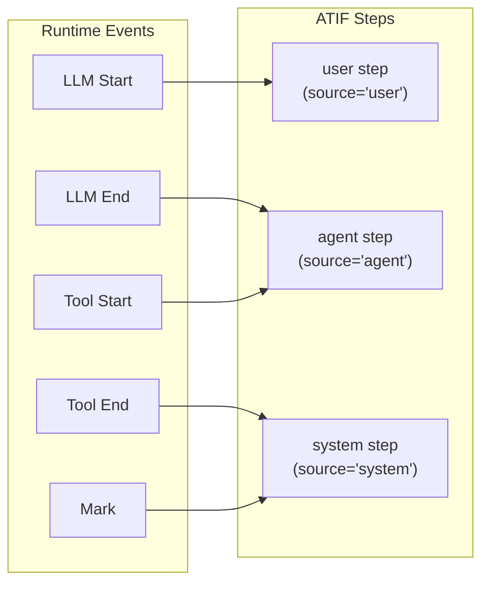

<!--
SPDX-FileCopyrightText: Copyright (c) 2026, NVIDIA CORPORATION & AFFILIATES. All rights reserved.
SPDX-License-Identifier: Apache-2.0
-->

# ATIF Export

Nexus exports agent execution trajectories in **ATIF v1.6** (Agent Trajectory Interchange Format), a standardized JSON schema for recording lifecycle events as structured steps.

## Overview

The `AtifExporter`:
1. Registers itself as an event subscriber
2. Collects all lifecycle events into a thread-safe buffer
3. Transforms events into ATIF steps on demand via `export()`
4. Supports filtering by `root_uuid` for concurrent agent isolation

## Quick Start

```python
from nat_nexus import AtifExporter, ScopeType

# Create and register
exporter = AtifExporter(
    session_id="session-001",
    agent_name="my_agent",
    agent_version="1.0",
    model_name="gpt-4",
)
exporter.register("atif_logger")

# Run operations
handle = nat_nexus.scope.push("agent", ScopeType.Agent)
response = await nat_nexus.llm.execute("gpt-4", request, llm_func)
result = await nat_nexus.tools.execute("search", {"q": "test"}, search_func)
nat_nexus.scope.pop(handle)

# Export trajectory
trajectory = exporter.export()       # Returns dict
trajectory_json = exporter.export_json()  # Returns JSON string

# Clean up
exporter.clear()
exporter.deregister("atif_logger")
```

## Event-to-Step Mapping

Events are transformed into ATIF steps based on scope type and event type:



| Event | ATIF Step | Source | Content |
|-------|-----------|--------|---------|
| LLM Start | User step | `"user"` | `message` = post-guardrail LLM request (`event.input`) |
| LLM End | Agent step | `"agent"` | `message` = post-guardrail LLM response (`event.output`) |
| Tool Start | Agent step | `"agent"` | `tool_calls` array with function name and arguments |
| Tool End | System step | `"system"` | `observation` with tool results |
| Mark | System step | `"system"` | `message` = event data |
| Scope Start/End | — | — | Skipped |

## Trajectory Schema

### Top Level

```json
{
    "schema_version": "ATIF-v1.6",
    "session_id": "session-001",
    "agent": {
        "name": "my_agent",
        "version": "1.0",
        "model_name": "gpt-4",
        "tool_definitions": [...],
        "extra": null
    },
    "steps": [...],
    "final_metrics": null,
    "extra": null
}
```

### Step Types

**User step** (from LLM Start):

```json
{
    "step_id": 1,
    "source": "user",
    "message": {"messages": [{"role": "user", "content": "Hello"}], "model": "gpt-4"},
    "timestamp": "2026-03-12T10:00:00Z",
    "model_name": "gpt-4"
}
```

**Agent step** (from LLM End):

```json
{
    "step_id": 2,
    "source": "agent",
    "message": {"choices": [{"message": {"content": "Hi there!"}}]},
    "timestamp": "2026-03-12T10:00:01Z",
    "model_name": "gpt-4"
}
```

**Agent step with tool_calls** (from Tool Start):

```json
{
    "step_id": 3,
    "source": "agent",
    "message": null,
    "timestamp": "2026-03-12T10:00:02Z",
    "tool_calls": [
        {
            "tool_call_id": "call_abc123",
            "function_name": "search",
            "arguments": {"query": "Nexus docs"}
        }
    ]
}
```

**System step with observation** (from Tool End):

```json
{
    "step_id": 4,
    "source": "system",
    "message": null,
    "timestamp": "2026-03-12T10:00:03Z",
    "observation": {
        "results": [
            {
                "source_call_id": "call_abc123",
                "content": {"items": ["result1", "result2"]}
            }
        ]
    }
}
```

### Tool Call Correlation

Tool Start events generate a `tool_call_id` (from the explicit `tool_call_id` parameter or the event UUID as fallback). Tool End events reference this ID via `observation.results[].source_call_id`, linking invocations to their results:

```
Tool Start (step 3)                    Tool End (step 4)
  tool_calls[0].tool_call_id ──────→  observation.results[0].source_call_id
       "call_abc123"                        "call_abc123"
```

### Metrics

Optional per-step and final aggregate metrics:

```json
{
    "prompt_tokens": 150,
    "completion_tokens": 50,
    "cached_tokens": 0,
    "cost_usd": 0.003,
    "extra": null
}
```

## Root UUID Filtering

In multi-agent scenarios, each agent's scope stack has a unique root UUID. Export with `root_uuid` to isolate:

```python
# Two agents running concurrently
stack_a = nat_nexus.create_scope_stack()
stack_b = nat_nexus.create_scope_stack()

# Get root UUIDs
root_a = stack_a.root_uuid
root_b = stack_b.root_uuid

# Export only Agent A's trajectory
trajectory_a = exporter.export(root_uuid=root_a)

# Export only Agent B's trajectory
trajectory_b = exporter.export(root_uuid=root_b)

# Export everything
trajectory_all = exporter.export(root_uuid=None)
```

Without filtering, all events from all agents appear in a single trajectory.

## Language Bindings

| Binding | Class | Key Methods |
|---------|-------|-------------|
| Python | `AtifExporter` | `register(name)`, `deregister(name)`, `export(root_uuid=None)`, `export_json(root_uuid=None)`, `clear()` |
| Node.js | `JsAtifExporter` | Same API surface |
| WASM | `WasmAtifExporter` | Same API surface |
| Go | `AtifExporter` | `Register(name)`, `Deregister(name)`, `Export(rootUUID)`, `Clear()` |
| FFI | `nat_nexus_atif_exporter_*` | C functions: `_create`, `_register`, `_export`, `_clear`, `_free` |

## Design Notes

- Events carry **post-guardrail** data in `input`/`output` fields — the trajectory reflects sanitized values
- Steps are ordered by timestamp
- `model_name` propagates from LLM call parameters to ATIF steps
- `clear()` removes all collected events, allowing exporter reuse across sessions
- Thread-safe: `Arc<Mutex<>>` protects the internal event buffer
