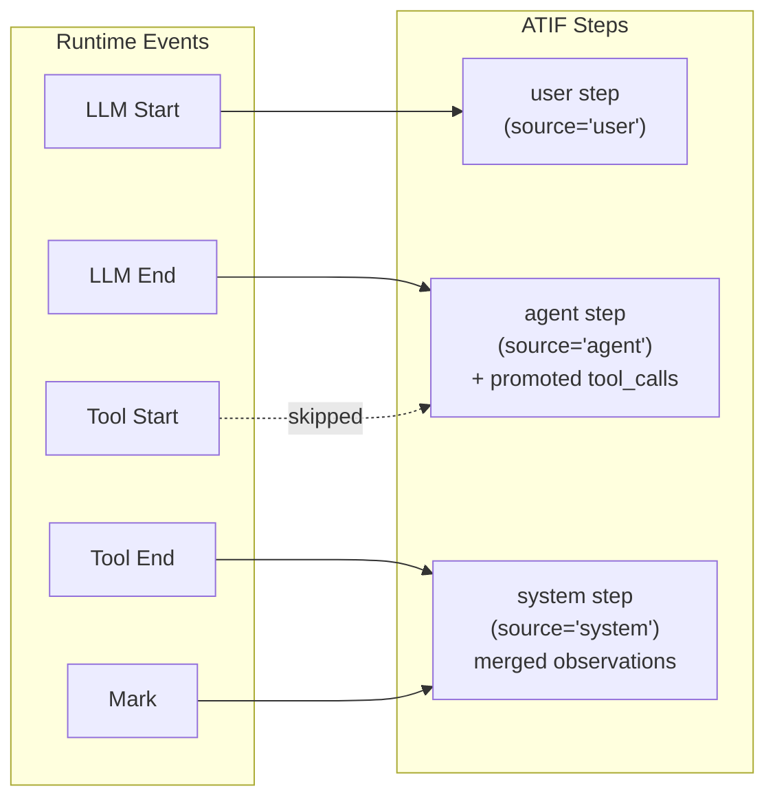

<!--
SPDX-FileCopyrightText: Copyright (c) 2026, NVIDIA CORPORATION & AFFILIATES. All rights reserved.
SPDX-License-Identifier: Apache-2.0
-->

# ATIF Export

Nexus exports agent execution trajectories in **ATIF v1.6** (Agent Trajectory Interchange Format), a standardized JSON schema for recording lifecycle events as structured steps.

## Overview

The `AtifExporter`:
1. Registers itself as an event subscriber
2. Collects all lifecycle events into a thread-safe buffer
3. Transforms events into ATIF steps on demand via `export()`
4. Exports the full collected trajectory buffer as a single ATIF document

## Quick Start

```python
import nat_nexus

# Replace with your actual tool and LLM functions
llm_func = lambda request: {**request.content, "response": "ok"}
search_func = lambda args: {"results": ["result1", "result2"]}

# Create and register
exporter = nat_nexus.AtifExporter(
    session_id="session-001",
    agent_name="my_agent",
    agent_version="1.0",
    model_name="gpt-4",
)
exporter.register("atif_logger")

# Run operations
with nat_nexus.scope.scope("agent", nat_nexus.ScopeType.Agent) as handle:
    request = nat_nexus.LLMRequest({}, {"messages": [{"role": "user", "content": "Hello"}]})
    response = await nat_nexus.llm.execute("gpt-4", request, llm_func)
    result = await nat_nexus.tools.execute("search", {"q": "test"}, search_func)

# Export trajectory
trajectory = exporter.export()       # Returns dict
trajectory_json = exporter.export_json()  # Returns JSON string

# Clean up
exporter.clear()
exporter.deregister("atif_logger")
```

## Event-to-Step Mapping

Events are transformed into ATIF steps based on scope type and event type:



| Event | ATIF Step | Source | Content |
|-------|-----------|--------|---------|
| LLM Start | User step | `"user"` | `message` = extracted messages array from LLM request (`event.input`), stripping model/max_tokens/etc. |
| LLM End | Agent step | `"agent"` | `message` = response content; `tool_calls` promoted from response; `metrics` extracted from token_usage |
| Tool Start | *(skipped)* | — | Tool calls come from the LLM End step's promoted `tool_calls` instead |
| Tool End | System step | `"system"` | `observation` with tool results; consecutive Tool End events are **merged** into a single step |
| Mark (with data) | System step | `"system"` | `message` = event data |
| Scope Start/End | — | — | Skipped |

### Key Design Decisions

- **Tool Start is skipped**: Tool calls are promoted from the LLM End response (which contains the `tool_calls` array from the model), avoiding duplicate entries.
- **Consecutive Tool End events merge**: When multiple tools run in sequence (e.g., parallel tool calls), their observations are combined into a single system step with multiple results.
- **Function-name correlation**: Tool End observations are correlated with the preceding LLM End's promoted `tool_calls` by matching `function_name` to derive `source_call_id`.

## Trajectory Schema

### Top Level

```json
{
    "schema_version": "ATIF-v1.6",
    "session_id": "session-001",
    "agent": {
        "name": "my_agent",
        "version": "1.0",
        "model_name": "gpt-4",
        "tool_definitions": [...],
        "extra": null
    },
    "steps": [...],
    "final_metrics": null,
    "extra": null
}
```

### Step Types

**User step** (from LLM Start):

```json
{
    "step_id": 1,
    "source": "user",
    "message": {"messages": [{"role": "user", "content": "Hello"}], "model": "gpt-4"},
    "timestamp": "2026-03-12T10:00:00Z",
    "model_name": "gpt-4"
}
```

**Agent step** (from LLM End):

```json
{
    "step_id": 2,
    "source": "agent",
    "message": {"choices": [{"message": {"content": "Hi there!"}}]},
    "timestamp": "2026-03-12T10:00:01Z",
    "model_name": "gpt-4"
}
```

**Agent step with tool_calls** (from LLM End — tool calls are promoted from the response):

```json
{
    "step_id": 2,
    "source": "agent",
    "message": {"content": "I'll search for that."},
    "timestamp": "2026-03-12T10:00:01Z",
    "model_name": "gpt-4",
    "tool_calls": [
        {
            "tool_call_id": "call_abc123",
            "function_name": "search",
            "arguments": {"query": "Nexus docs"}
        }
    ],
    "metrics": {
        "prompt_tokens": 150,
        "completion_tokens": 50
    }
}
```

**System step with observation** (from Tool End — consecutive tool ends are merged):

```json
{
    "step_id": 3,
    "source": "system",
    "message": null,
    "timestamp": "2026-03-12T10:00:03Z",
    "observation": {
        "results": [
            {
                "source_call_id": "call_abc123",
                "content": {"items": ["result1", "result2"]}
            },
            {
                "source_call_id": "call_def456",
                "content": {"summary": "Nexus is a runtime framework"}
            }
        ]
    }
}
```

### Tool Call Correlation

Tool calls promoted from the LLM End response carry `tool_call_id` values. Tool End observations are correlated with these promoted calls using two strategies:

1. **Explicit `tool_call_id`** — if the Tool End event has its own `tool_call_id`, that is used directly
2. **Function-name lookup** — otherwise, the tool's `name` is matched against the preceding LLM End's promoted `tool_calls` by `function_name`

```
LLM End (step 2)                       Tool End (step 3)
  tool_calls[0].tool_call_id ──────→  observation.results[0].source_call_id
       "call_abc123"                        "call_abc123"
  (function_name: "search")            (event.name: "search")
```

### Metrics

Optional per-step and final aggregate metrics:

```json
{
    "prompt_tokens": 150,
    "completion_tokens": 50,
    "cached_tokens": 0,
    "cost_usd": 0.003,
    "extra": null
}
```

## Export Semantics

`AtifExporter` always exports the full set of events it has collected so far.
If you need separate trajectories, register separate exporters or clear the
exporter between runs.

## Language Bindings

| Binding | Class | Key Methods |
|---------|-------|-------------|
| Python | `AtifExporter` | `register(name)`, `deregister(name)`, `export()`, `export_json()`, `clear()` |
| Node.js | `JsAtifExporter` | Same API surface |
| WASM | `WasmAtifExporter` | Same API surface |
| Go | `AtifExporter` | `Register(name)`, `Deregister(name)`, `ExportJSON()`, `Clear()` |
| FFI | `nat_nexus_atif_exporter_*` | C functions: `_create`, `_register`, `_export`, `_clear`, `_free` |

## Design Notes

- Events carry **post-guardrail** data in `input`/`output` fields — the trajectory reflects sanitized values
- Steps are ordered by timestamp
- `model_name` propagates from LLM call parameters to ATIF steps
- Tool calls are **promoted** from LLM End responses (not from Tool Start events), matching the OpenAI-style response format where the model emits `tool_calls` as part of its reply
- Consecutive Tool End observations are **merged** into a single system step, keeping the trajectory compact when parallel tools execute
- `clear()` removes all collected events, allowing exporter reuse across sessions
- Thread-safe: `Arc<Mutex<>>` protects the internal event buffer
