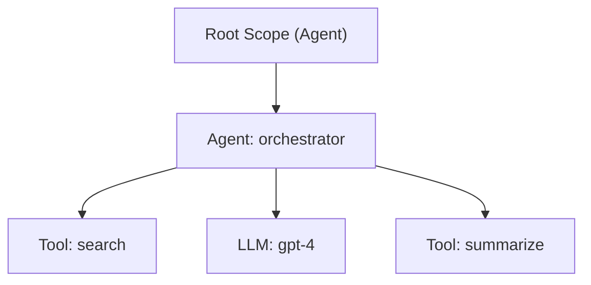

<!--
SPDX-FileCopyrightText: Copyright (c) 2026, NVIDIA CORPORATION & AFFILIATES. All rights reserved.
SPDX-License-Identifier: Apache-2.0
-->

# Core Concepts

## Scopes

Scopes form a hierarchical execution context. Every scope stack has an immutable root scope (type `Agent`) created automatically. Application code pushes and pops scopes to track the current execution context.



### Scope Types

| Type | Description |
|------|-------------|
| `Agent` | An autonomous agent |
| `Function` | A generic function call |
| `Tool` | A tool invocation |
| `Llm` | An LLM call |
| `Retriever` | A retrieval operation |
| `Embedder` | An embedding operation |
| `Reranker` | A reranking operation |
| `Guardrail` | A guardrail evaluation |
| `Evaluator` | An evaluation step |
| `Custom` | User-defined scope type |
| `Unknown` | Fallback |

### Scope Attributes (bitflags)

| Flag | Value | Description |
|------|-------|-------------|
| `PARALLEL` | `0b01` | Scope supports parallel execution |
| `RELOCATABLE` | `0b10` | Scope can be relocated between contexts |

## Handles

Handles are lightweight references returned when starting a lifecycle operation. They carry a UUID, name, and optional data/metadata.

### ScopeHandle

Returned by `scope.push()`. Must be passed to `scope.pop()` to close the scope.

### ToolHandle

Returned by `tools.call()`. Must be passed to `tools.call_end()`. Carries:
- `tool_call_id` — optional external correlation ID

### LLMHandle

Returned by `llm.call()`. Must be passed to `llm.call_end()`. Carries:
- `model_name` — optional model identifier (e.g., `"gpt-4"`)

### Tool Attributes (bitflags)

| Flag | Value | Description |
|------|-------|-------------|
| `LOCAL` | `0b01` | Tool executes locally |

### LLM Attributes (bitflags)

| Flag | Value | Description |
|------|-------|-------------|
| `STATELESS` | `0b01` | No conversation history |
| `STREAMING` | `0b10` | Uses Server-Sent Events |

## LLMRequest

All LLM middleware operates on structured request/response types:

```python
# LLMRequest carries both headers and content
request = LLMRequest(
    headers={"Authorization": "Bearer token", "X-Request-ID": "abc123"},
    content={"messages": [...], "model": "gpt-4", "temperature": 0.7},
)

# LLM responses are plain dicts/JSON
response = {"choices": [...]}
```

The `headers` field holds metadata (HTTP headers, SDK options, tracing context). The `content` field holds the actual payload sent to the LLM provider.

## Events

Every lifecycle operation emits events to registered subscribers. Events carry:

| Field | Description |
|-------|-------------|
| `uuid` | Unique event identifier |
| `parent_uuid` | Parent scope/handle UUID |
| `timestamp` | ISO 8601 UTC timestamp |
| `name` | Name of the entity |
| `event_type` | `Start`, `End`, or `Mark` |
| `scope_type` | Type of the entity |
| `attributes` | Handle attributes |
| `data` | Application data snapshot |
| `metadata` | Tracing metadata snapshot |
| `input` | Post-guardrail request (Start events) |
| `output` | Post-guardrail response (End events) |
| `model_name` | LLM model name (LLM events) |
| `tool_call_id` | External correlation ID (tool events) |
| `root_uuid` | Root scope UUID for concurrent isolation |

### Event Types

| Type | When Emitted |
|------|-------------|
| `Start` | Scope pushed, tool/LLM call begins |
| `End` | Scope popped, tool/LLM call ends |
| `Mark` | Standalone marker (e.g., guardrail rejection, user annotation) |

## Guardrails

Guardrails run inside the middleware pipeline and can **sanitize** or **gate** requests and responses. They are priority-ordered (ascending — lower numbers run first).

### Types

| Guardrail | Callback Signature | Purpose |
|-----------|--------------------|---------|
| **Sanitize Request** (Tool) | `(name, args) -> args` | Clean/redact tool arguments |
| **Sanitize Response** (Tool) | `(name, result) -> result` | Clean/redact tool results |
| **Conditional Execution** (Tool) | `(name, args) -> None \| reason` | Allow or block tool calls |
| **Sanitize Request** (LLM) | `(request) -> request` | Clean/redact LLM request |
| **Sanitize Response** (LLM) | `(response) -> response` | Clean/redact LLM response |
| **Conditional Execution** (LLM) | `(request) -> None \| reason` | Allow or block LLM calls |

Conditional guardrails return `None` to allow execution or a string reason to reject. On rejection, a `Mark` event is emitted and `GuardrailRejected` is raised.

## Intercepts

Intercepts transform requests, responses, or replace execution functions entirely. They are priority-ordered and registered by name.

### Types

| Intercept | Callback Signature | Purpose |
|-----------|--------------------|---------|
| **Request** (Tool) | `(name, args) -> args` | Transform tool arguments |
| **Response** (Tool) | `(name, result) -> result` | Transform tool results |
| **Execution** (Tool) | `(args, next) -> result` | Middleware chain — call `next` or short-circuit |
| **Request** (LLM) | `(request) -> request` | Transform LLM request |
| **Execution** (LLM) | `(request, next) -> result` | Middleware chain |
| **Stream Execution** (LLM) | `(request, next) -> stream` | Middleware chain for streaming |

Request and response intercepts support `break_chain` — when `true`, no lower-priority intercepts run after.

### Execution Intercept Chain

Execution intercepts follow the middleware pattern. Each receives a `next` function to call the next intercept (or the original function):

```python
async def logging_intercept(request, next):
    print(f"Request: {request}")
    result = await next(request)
    print(f"Response: {result}")
    return result

async def caching_intercept(request, next):
    cached = cache.get(request)
    if cached:
        return cached          # Short-circuit — skip remaining chain
    result = await next(request)
    cache.set(request, result)
    return result
```

The chain is built from innermost (lowest priority) to outermost (highest priority):

```
Call order: highest_priority → ... → lowest_priority → original_func
```

## Subscribers

Event subscribers observe all lifecycle events. They are registered by name and receive every event emitted by the runtime.

```python
def my_subscriber(event):
    print(f"{event.event_type}: {event.name} [{event.uuid}]")

nvmagic.subscribers.register("logger", my_subscriber)
# ... run operations ...
nvmagic.subscribers.deregister("logger")
```

## Error Types

| Error | When |
|-------|------|
| `AlreadyExists` | Duplicate registration (same name) |
| `NotFound` | Missing scope/handle |
| `ScopeStackEmpty` | Should never occur (root always present) |
| `GuardrailRejected` | Conditional guardrail blocked execution |
| `Internal` | Lock poisoning or other runtime failure |
