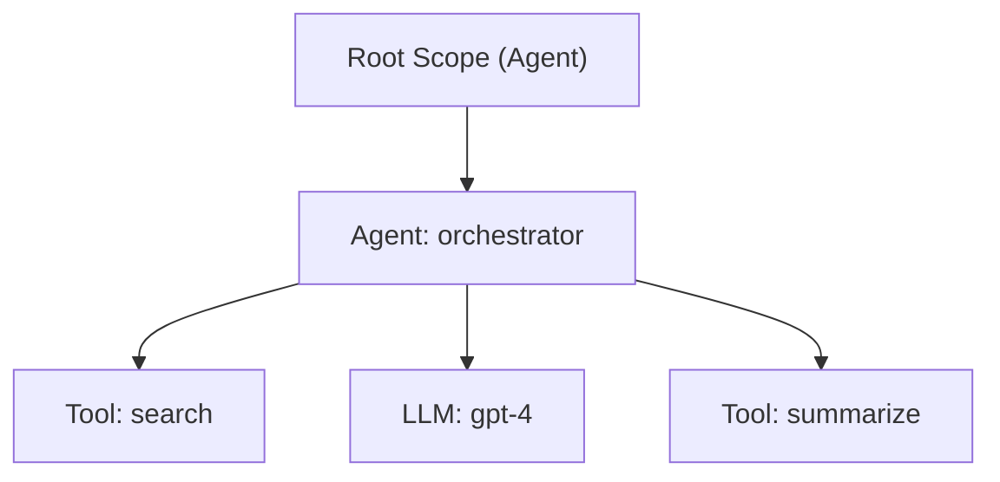

<!--
SPDX-FileCopyrightText: Copyright (c) 2026, NVIDIA CORPORATION & AFFILIATES. All rights reserved.
SPDX-License-Identifier: Apache-2.0
-->

# Core Concepts

## Scopes

Scopes form a hierarchical execution context. Every scope stack has an immutable root scope (type `Agent`) created automatically. Application code pushes and pops scopes to track the current execution context.



### Scope Types

| Type | Description |
|------|-------------|
| `Agent` | An autonomous agent |
| `Function` | A generic function call |
| `Tool` | A tool invocation |
| `Llm` | An LLM call |
| `Retriever` | A retrieval operation |
| `Embedder` | An embedding operation |
| `Reranker` | A reranking operation |
| `Guardrail` | A guardrail evaluation |
| `Evaluator` | An evaluation step |
| `Custom` | User-defined scope type |
| `Unknown` | Fallback |

### Scope Attributes (bitflags)

| Flag | Value | Description |
|------|-------|-------------|
| `PARALLEL` | `0b01` | Scope supports parallel execution |
| `RELOCATABLE` | `0b10` | Scope can be relocated between contexts |

## Handles

Handles are lightweight references returned when starting a lifecycle operation. They carry a UUID, name, and optional data/metadata.

### ScopeHandle

Returned by `scope.push()`. Must be passed to `scope.pop()` to close the scope.

### ToolHandle

Returned by `tools.call()`. Must be passed to `tools.call_end()`. Carries:
- `tool_call_id` — optional external correlation ID

### LLMHandle

Returned by `llm.call()`. Must be passed to `llm.call_end()`. Carries:
- `model_name` — optional model identifier (e.g., `"gpt-4"`)

### Tool Attributes (bitflags)

| Flag | Value | Description |
|------|-------|-------------|
| `LOCAL` | `0b01` | Tool executes locally |

### LLM Attributes (bitflags)

| Flag | Value | Description |
|------|-------|-------------|
| `STATELESS` | `0b01` | No conversation history |
| `STREAMING` | `0b10` | Uses Server-Sent Events |

## LLMRequest

All LLM middleware operates on structured request/response types:

```python
# LLMRequest carries both headers and content
request = LLMRequest(
    headers={"Authorization": "Bearer token", "X-Request-ID": "abc123"},
    content={"messages": [...], "model": "gpt-4", "temperature": 0.7},
)

# LLM responses are plain dicts/JSON
response = {"choices": [...]}
```

The `headers` field holds metadata (HTTP headers, SDK options, tracing context). The `content` field holds the actual payload sent to the LLM provider.

## LLM Codecs

Codecs provide structured, typed access to LLM request and response data
that would otherwise require manual JSON parsing. There are two codec
traits:

### Request Codecs (LlmCodec)

A request codec translates between opaque `LLMRequest.content` and a
structured `AnnotatedLLMRequest` with typed fields (messages, model,
params, tools, tool_choice). The pipeline decodes before request
intercepts and encodes back after, so intercepts can work with typed data
without knowing the underlying API format.

### Response Codecs (LlmResponseCodec)

A response codec parses raw JSON API responses into a normalized
`AnnotatedLLMResponse` with fields like `id`, `model`, `message`,
`tool_calls`, `finish_reason`, `usage`, and `api_specific`. Response
codecs are **decode-only** (introspection, not modification) and
**non-fatal** -- if decoding fails, the pipeline continues with
`annotated_response: None`.

### Built-In Codecs

Nexus ships three built-in codecs that implement both traits:

| Codec | API | Request Fields | Response Fields |
|-------|-----|---------------|-----------------|
| `OpenAIChatCodec` | Chat Completions | `messages`, `model`, `temperature`, `max_tokens`/`max_completion_tokens`, `top_p`, `stop`, `tools`, `tool_choice` | `choices[0].message`, `finish_reason`, `usage` with cached tokens |
| `OpenAIResponsesCodec` | Responses API | `input`/`instructions`, `model`, `temperature`, `max_output_tokens`, `top_p`, `tools`, `tool_choice` | `output` items, `status`-based finish reason, `usage` with input/output tokens |
| `AnthropicMessagesCodec` | Messages API | `system` (top-level), `messages`, `model`, `max_tokens`, `temperature`, `top_p`, `stop_sequences`, `tools`, `tool_choice` | `content` blocks, `stop_reason`, `usage` with cache tokens |

### Event Enrichment

When codecs are active, LLM lifecycle events carry structured data:

- `LLMStartEvent.annotated_request` -- the `AnnotatedLLMRequest` from
  the request codec
- `LLMEndEvent.annotated_response` -- the `AnnotatedLLMResponse` from
  the response codec

See [LLM Codecs](llm-codecs.md) for full documentation including
cross-language examples and custom codec authoring.

## Events

Every lifecycle operation emits events to registered subscribers. Events carry:

| Field | Description |
|-------|-------------|
| `uuid` | Unique event identifier |
| `parent_uuid` | Parent scope/handle UUID |
| `timestamp` | ISO 8601 UTC timestamp |
| `name` | Name of the entity |
| `kind` | Variant discriminator such as `ToolStart` or `LLMEnd` |
| `scope_type` | Scope category, present only on scope lifecycle events |
| `attributes` | Handle attributes |
| `data` | Application data snapshot |
| `metadata` | Tracing metadata snapshot |
| `input` | Post-guardrail request (Start events) |
| `output` | Post-guardrail response (End events) |
| `model_name` | LLM model name (LLM events) |
| `tool_call_id` | External correlation ID (tool events) |
| `annotated_request` | Structured request from codec (LLMStart events, when codec is active) |
| `annotated_response` | Structured response from response codec (LLMEnd events, when response codec is active) |

Subscriber callbacks run synchronously on the calling thread, but Nexus snapshots
the subscriber list and releases its runtime locks before invoking them. This
means subscribers can safely call back into Nexus APIs without deadlocking, but
they should still stay lightweight because they are on the request path.

### Event Types

| Type | When Emitted |
|------|-------------|
| `Start` | Scope pushed, tool/LLM call begins |
| `End` | Scope popped, tool/LLM call ends |
| `Mark` | Standalone marker (e.g., guardrail rejection, user annotation) |

For scopes specifically, `Start` is emitted after the new scope is on the
stack, and `End` is emitted after the scope has been removed. Subscribers that
call `get_handle()` therefore observe the post-mutation active scope.

### Callback Contracts

Nexus has two callback contracts:

| Surface | Contract | Notes |
|---------|----------|-------|
| Sanitize guardrails | Infallible | Return the sanitized value; handle failures inside the callback |
| Conditional execution guardrails | Fallible | Normal return still means allow/reject; raising/throwing fails the operation |
| Request intercepts | Fallible | Return transformed input; raising/throwing fails the operation |
| Execution intercepts | Fallible | `next(...)` chain remains fallible |
| Stream collector | Fallible | Failure aborts the stream |
| Stream finalizer | Infallible | Return aggregated response; handle failures inside the callback |
| Subscribers | Infallible | Return `None`; handle failures inside the callback |

This split is the contract itself, not an opt-in variant. Across bindings,
conditional guardrails and request/execution intercepts are the fallible
surfaces, while sanitize guardrails, stream finalizers, and subscribers remain
infallible.

## Guardrails

Guardrails run inside the middleware pipeline and can **sanitize** or **gate** requests and responses. They are priority-ordered (ascending — lower numbers run first).

### Types

| Guardrail | Callback Signature | Contract | Purpose |
|-----------|--------------------|----------|---------|
| **Sanitize Request** (Tool) | `(name, args) -> args` | Infallible | Clean/redact tool arguments |
| **Sanitize Response** (Tool) | `(name, result) -> result` | Infallible | Clean/redact tool results |
| **Conditional Execution** (Tool) | `(name, args) -> None \| reason` | Fallible | Allow or block tool calls |
| **Sanitize Request** (LLM) | `(request) -> request` | Infallible | Clean/redact LLM request |
| **Sanitize Response** (LLM) | `(response) -> response` | Infallible | Clean/redact LLM response |
| **Conditional Execution** (LLM) | `(request) -> None \| reason` | Fallible | Allow or block LLM calls |

Conditional guardrails return `None` to allow execution or a string reason to reject. On rejection, a `Mark` event is emitted and `GuardrailRejected` is raised.

## Intercepts

Intercepts transform requests, responses, or replace execution functions entirely. They are priority-ordered and registered by name.

### Types

| Intercept | Callback Signature | Contract | Purpose |
|-----------|--------------------|----------|---------|
| **Request** (Tool) | `(tool_name, args) -> args` | Fallible | Transform tool arguments |
| **Execution** (Tool) | `(tool_name, args, next) -> result` | Fallible | Middleware chain — call `next` or short-circuit |
| **Request** (LLM) | `(llm_name, request) -> request` | Fallible | Transform LLM request |
| **Execution** (LLM) | `(llm_name, request, next) -> result` | Fallible | Middleware chain |
| **Stream Execution** (LLM) | `(llm_name, request, next) -> stream` | Fallible | Middleware chain for streaming |

Request intercepts support `break_chain` — when `true`, no lower-priority intercepts run after.

### Execution Intercept Chain

Execution intercepts follow the middleware pattern. Each receives a `next` function to call the next intercept (or the original function):

```python
async def logging_intercept(name, request, next):
    print(f"[{name}] Request: {request}")
    result = await next(request)
    print(f"[{name}] Response: {result}")
    return result

async def caching_intercept(name, request, next):
    cached = cache.get(request)
    if cached:
        return cached          # Short-circuit — skip remaining chain
    result = await next(request)
    cache.set(request, result)
    return result
```

All execution intercepts receive the operation name (tool name or LLM name) as the first parameter, enabling name-aware transformations. The chain is built from innermost (lowest priority) to outermost (highest priority):

```
Call order: highest_priority → ... → lowest_priority → original_func
```

## Subscribers

Event subscribers observe all lifecycle events. They are registered by name and receive every event emitted by the runtime.

```python
def my_subscriber(event):
    print(f"{event.kind}: {event.name} [{event.uuid}]")

nat_nexus.subscribers.register("logger", my_subscriber)
# ... run operations ...
nat_nexus.subscribers.deregister("logger")
```

Subscribers are infallible callbacks. They still run on the request path, but
they do not have an error return channel.

## Scope-Local Middleware

Guardrails, intercepts, and event subscribers can be registered on a **specific scope** instead of globally. Scope-local middleware is tied to the scope's lifetime — it is automatically cleaned up when the scope is popped.

### How It Works

- **Registration** — Instead of calling `nat_nexus.guardrails.register_*()` (global), call `nat_nexus.scope_local.register_*()` with a `ScopeHandle` to bind the middleware to that scope.
- **Storage** — Scope-local entries are stored in the `ScopeStack`, keyed by scope UUID. The per-scope registry is lazily created on first registration.
- **Execution** — When the pipeline runs, global entries and scope-local entries from all ancestor scopes (root through current top) are merged into a single priority-sorted list.
- **Cleanup** — When a scope is popped, all its scope-local middleware is automatically removed. No manual `deregister_*` calls needed.
- **Name uniqueness** — Names are unique **per registry**. A global guardrail named `"pii_filter"` and a scope-local guardrail named `"pii_filter"` coexist without conflict.

### When to Use

| Use Case | Registration |
|----------|-------------|
| Process-wide policy (compliance, audit logging) | **Global** — always active, survives scope changes |
| Per-session guardrail (user-specific PII filter) | **Scope-local** on the session's agent scope |
| Per-request intercept (A/B test variant) | **Scope-local** on the request scope |
| Test-only middleware (assertions, mocks) | **Scope-local** on the test scope — auto-cleanup prevents leakage |

### Example

```python
import nat_nexus

# Global: always active
nat_nexus.guardrails.register_llm_conditional_execution(
    "compliance_gate", 1, compliance_check,
)

with nat_nexus.scope.scope("session_42", nat_nexus.ScopeType.Agent) as handle:
    # Scope-local: active only inside this scope
    nat_nexus.scope_local.register_tool_conditional_execution(
        handle, "block_dangerous", 10, lambda name, args: "blocked" if name == "rm" else None,
    )

    # Both compliance_gate (global, priority=1) and
    # block_dangerous (scope-local, priority=10) run during tool calls
    result = await nat_nexus.tools.execute("search", {"q": "test"}, search_func)

# handle is popped — block_dangerous is automatically removed
```

### Merge Behavior

During pipeline execution, the effective middleware list is built by merging:

1. All entries from the **global** registry
2. All entries from **scope-local** registries for every scope from root to the current top of the stack

The merged list is sorted by priority (ascending). If a global entry and a scope-local entry have the same priority, both run — ordering between them is stable but unspecified.

```
Global:        [compliance_gate(1), audit_log(100)]
Scope "root":  []
Scope "agent": [block_dangerous(10)]
Scope "tool":  [redact_args(5)]

Effective:     [compliance_gate(1), redact_args(5), block_dangerous(10), audit_log(100)]
```

## Error Types

| Error | When |
|-------|------|
| `AlreadyExists` | Duplicate registration (same name) |
| `NotFound` | Missing scope/handle |
| `InvalidArgument` | Precondition violation (e.g., popping a scope that is not at the top of the stack) |
| `ScopeStackEmpty` | Should never occur (root always present) |
| `GuardrailRejected` | Conditional guardrail blocked execution |
| `Internal` | Lock poisoning or other runtime failure |
