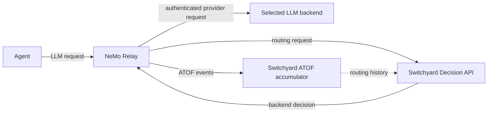

import { MermaidStyles } from "@/components/MermaidStyles";

{/* SPDX-FileCopyrightText: Copyright (c) 2026, NVIDIA CORPORATION & AFFILIATES. All rights reserved.
SPDX-License-Identifier: Apache-2.0 */}

> **Experimental:** The Switchyard integration is an early-access feature. It
> is not enabled in default Relay builds, its configuration and contracts can
> change, and the current deployment requires a separately running Switchyard
> Decision API service.

> **NeMo Relay 0.6.0 architecture:** This release uses the external Switchyard
> Decision API from the
> [`topic/nemo-relay-integration`](https://github.com/NVIDIA-NeMo/Switchyard/tree/topic/nemo-relay-integration)
> branch.

Switchyard is an LLM routing decision engine. The `nemo-relay-switchyard`
plugin asks Switchyard which configured target should handle an LLM request.
Relay validates the decision and performs the authenticated provider request.
For example, a routing profile can send a simple prompt to a lower-cost model
and a complex prompt to a more capable model.

## Architecture

The following diagram shows the NeMo Relay 0.6.0 service boundary:

<MermaidStyles />



The components divide responsibility as follows:

| Component | Responsibilities |
| --- | --- |
| Switchyard | Selects a backend and accumulates ATOF routing history for history-based profiles. |
| NeMo Relay | Owns provider credentials, target bindings, decision validation, protocol translation, dispatch, retries, trusted fallback, and observability. |

Relay does not start or supervise the Switchyard service. Start Switchyard
before Relay activates the plugin. Relay derives the service's root `/health`
URL from `decision_api_url` and fails activation unless the endpoint returns
`{"status":"ok"}`.

## Prerequisites

Install the following prerequisites before you start:

| Requirement | Version or Value |
| --- | --- |
| NeMo Relay | Tag `0.6.0` |
| Rust | `1.96.1` |
| Switchyard branch | `topic/nemo-relay-integration` |
| Switchyard commit | `8f9db9a6a47f848cdff1d262276ba25a8ae9cbc8` |
| Local commands | `git`, `python3`, and `curl` |

Keep the repositories in the following sibling layout. The validation script
uses this layout by default:

```text
<workspace>/
├── NeMo-Relay/
└── Switchyard-topic-nemo-relay-integration/
```

## Build and Run the Compatibility Test

Use the following procedure to clone and pin both repositories:

```bash
mkdir relay-switchyard-0.6
cd relay-switchyard-0.6

git clone --branch 0.6.0 \
  https://github.com/NVIDIA/NeMo-Relay.git \
  NeMo-Relay

git clone --branch topic/nemo-relay-integration \
  https://github.com/NVIDIA-NeMo/Switchyard.git \
  Switchyard-topic-nemo-relay-integration

git -C Switchyard-topic-nemo-relay-integration checkout --detach \
  8f9db9a6a47f848cdff1d262276ba25a8ae9cbc8

cd NeMo-Relay
```

The Switchyard plugin is excluded from default Relay CLI builds. Build the CLI
with the optional feature explicitly:

```bash
cargo build -p nemo-relay-cli --features switchyard
```

Run the real-service compatibility test from the NeMo Relay repository root:

```bash
examples/switchyard/run-real-e2e.sh
```

The script prints the verified Switchyard revision and ends with the following
line when routing succeeds:

```text
real Switchyard E2E passed: ['provider/weak', 'provider/strong', 'provider/strong']
```

The test starts these local processes:

| Process | Port | Readiness Check or Purpose |
| --- | --- | --- |
| Switchyard Decision API | `4000` | Serves `/health`, routing decisions, and ATOF ingestion. |
| NeMo Relay | `4041` | Serves `/healthz` and the OpenAI-compatible gateway. |
| Deterministic provider | `4101` | Records the model selected for each provider request. |

The first request has no accumulated ATOF history and routes to
`provider/weak`. The script then sends session and tool events to Relay. Relay
exports those events to Switchyard's ATOF accumulator, so the next buffered
request and the final streaming request route to `provider/strong`. The test
also validates the streamed response before reporting success.

## Configuration Walkthrough

The compatibility test uses
[`real-e2e-plugins.toml`](https://github.com/NVIDIA/NeMo-Relay/blob/release/0.6/examples/switchyard/real-e2e-plugins.toml)
and
[`real-e2e-profiles.yaml`](https://github.com/NVIDIA/NeMo-Relay/blob/release/0.6/examples/switchyard/real-e2e-profiles.yaml).
The following settings establish the routing boundary:

| Setting | Purpose |
| --- | --- |
| `decision_api_url` | Points Relay to the separately running Switchyard Decision API. |
| `decision_profile_id` | Selects the Switchyard routing profile. The profile maps its semantic targets to backend IDs. |
| `targets.<backend_id>` | Binds each returned backend ID to a Relay-owned model, protocol, endpoint, base URL, and credentials. |
| `mode = "enforce"` | Applies a valid Switchyard decision and dispatches to the selected target. |
| `mode = "observe_only"` | Records the hypothetical decision but dispatches once to the trusted same-protocol default. |
| `default_targets` | Defines trusted same-protocol fallbacks for unavailable or invalid decisions and provider failures. |
| `context_mode = "atof_required"` | Requires stable identity and accumulated ATOF history for the selected profile. |
| `atof_endpoint_name` | Selects exactly one named Relay ATOF HTTP stream sink that sends events to Switchyard. |

For history-based routing, a local ATOF JSONL file is not sufficient.
Switchyard must receive events through the named HTTP sink at
`/v1/atof/events` so its accumulator can provide the history used by the
routing profile. Relay rejects a missing, duplicate, disabled, or invalid
named sink during startup validation.

For the complete option reference, refer to
[Switchyard Configuration](./configuration.mdx).

## Troubleshooting

Use the following table to diagnose common compatibility-test failures:

| Symptom | Cause and Resolution |
| --- | --- |
| `Switchyard worktree not found: ...` | Place the Switchyard checkout next to `NeMo-Relay` as `Switchyard-topic-nemo-relay-integration`, or set `SWITCHYARD_ROOT` to its absolute path. |
| `Switchyard checkout mismatch: expected ..., found ...` | Check out commit `8f9db9a6a47f848cdff1d262276ba25a8ae9cbc8`. Override `SWITCHYARD_EXPECTED_COMMIT` only when deliberately testing a different contract. |
| A build uses Rust `1.96.0` or reports an unsupported toolchain | Run `rustc --version`, install Rust `1.96.1`, and allow the repository's `rust-toolchain.toml` to select it. |
| `timed out waiting for http://127.0.0.1:4000/health` | Review `switchyard.log`. Confirm the pinned checkout builds and port `4000` is free. |
| `timed out waiting for http://127.0.0.1:4041/healthz` or `process ... exited before http://127.0.0.1:4041/healthz became ready` | Review `relay.log`. Confirm the CLI was built with `--features switchyard`, the Switchyard health check passed, and port `4041` is free. |
| The provider cannot start or requests fail | Review `upstream.log` and confirm port `4101` is free. |
| `E2E logs preserved in ...` | The script preserves its temporary directory after a runtime failure and prints the exact path. Inspect `switchyard.log`, `relay.log`, `upstream.log`, and the captured request outputs there. Successful runs remove the directory. |

## Capabilities

The integration provides the following capabilities:

- `enforce` and `observe_only` routing modes.
- OpenAI Chat Completions, OpenAI Responses, and Anthropic Messages inbound
  profiles.
- Buffered and streaming protocol translation through Switchyard's
  `switchyard-translation` library.
- Exact Relay-owned backend bindings and per-protocol trusted fallbacks.
- Bounded retries before the first streaming item.
- Canonical routing marks and shared LLM optimization accounting.

## Pages

For more information, refer to the following pages:

- [Switchyard Configuration](./configuration.mdx)
  provides the complete option and deployment reference. Review its
  [experimental limitations](./configuration.mdx#experimental-limitations)
  before adopting the integration.
- [Switchyard integration examples](https://github.com/NVIDIA/NeMo-Relay/tree/release/0.6/examples/switchyard)
  contains the versioned configuration and validation scripts used by this
  guide.
