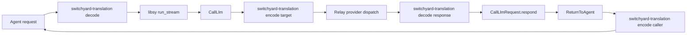

import { MermaidStyles } from "@/components/MermaidStyles";

{/* SPDX-FileCopyrightText: Copyright (c) 2026, NVIDIA CORPORATION & AFFILIATES. All rights reserved.
SPDX-License-Identifier: Apache-2.0 */}

> **Experimental:** The Switchyard component is compile-time optional and its
> library contract may change before the compatible Switchyard 0.2 crates are
> published.

The Switchyard component runs libsy's weighted random router or LLM classifier
inside NeMo Relay. Relay drives `Algorithm::run_stream`, performs every
provider call, and sends the real response or error back through
`CallLlmRequest::respond`.

There is no `switchyard-server`, Decision API, service health check, Switchyard
LLM client, or dedicated Switchyard ATOF receiver.

## Architecture

<MermaidStyles />


```mermaid
flowchart LR
    Agent["Agent request"] --> Decode["switchyard-translation decode"]
    Decode --> Libsy["libsy run_stream"]
    Libsy --> Call["CallLlm"]
    Call --> EncodeTarget["switchyard-translation encode target"]
    EncodeTarget --> Relay["Relay provider dispatch"]
    Relay --> DecodeResponse["switchyard-translation decode response"]
    DecodeResponse --> Respond["CallLlmRequest.respond"]
    Respond --> Final["ReturnToAgent"]
    Final --> EncodeCaller["switchyard-translation encode caller"]
    EncodeCaller --> Agent

    class Agent grey-lightest;
    class Relay green-lightest;
    class Libsy yellow-lightest;
    class Decode,EncodeTarget,DecodeResponse,EncodeCaller teal-lightest;
```

## Responsibility Boundary

| Owner | Responsibilities |
| --- | --- |
| libsy | Random selection or classifier consultation and tier selection, decision emission, algorithm lifecycle, and consuming each response supplied by Relay. |
| `switchyard-translation` | Decode and encode OpenAI Chat, OpenAI Responses, and Anthropic Messages requests, buffered responses, and stream events. |
| NeMo Relay | Provider bindings, credentials, URL and endpoint selection, physical dispatch, retries, trusted fallback, scopes, and observability. |

Translation also runs for same-protocol calls because the request and response
must pass through libsy's neutral types. Switchyard's in-memory preservation
replays same-protocol provider fields exactly. When the target protocol differs,
Switchyard translates only the common representable contract and rejects
configured loss.

## Try the No-Service Example

From a Relay source checkout:

```bash
examples/switchyard/run-real-e2e.sh
```

The example starts Relay and one fake provider, exercises deterministic routing
between two semantic targets, and validates buffered and streaming fidelity.

The classifier follows the same architecture but produces two provider-call
steps: a classifier consultation followed by the selected weak or strong
target. Both calls use Relay's configured target bindings and
`switchyard-translation`.

Continue with [Switchyard Configuration](./configuration.mdx) for the complete
version-2 schema.
