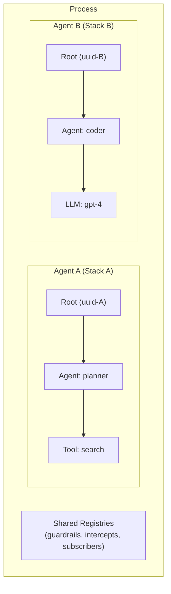

<!--
SPDX-FileCopyrightText: Copyright (c) 2026, NVIDIA CORPORATION & AFFILIATES. All rights reserved.
SPDX-License-Identifier: Apache-2.0
-->

# Context Isolation

NVMagic supports per-request and per-task context isolation through hierarchical scope stacks. Each scope stack has its own root UUID, enabling safe concurrent and multi-tenant agent execution in a single process.

## Scope Stack

A `ScopeStack` is a vector of `ScopeHandle`s with an immovable root scope at index 0:

```
┌──────────────────────────────────┐
│  ScopeStack                      │
│  ┌────────────────────────────┐  │
│  │ [0] Root (Agent, auto-UUID)│  │  ← never removed
│  │ [1] Agent: orchestrator    │  │
│  │ [2] Tool: search           │  │  ← current top
│  └────────────────────────────┘  │
└──────────────────────────────────┘
```

- Created via `create_scope_stack()` — each stack gets a fresh root with a unique UUID
- Can never be empty; root scope cannot be removed
- Thread-safe: wrapped in `Arc<RwLock<ScopeStack>>`

## Storage: Two-Tier Lookup

NVMagic uses a two-tier storage pattern for context isolation:

```
current_scope_stack()
  │
  ├── Try task-local (tokio::task_local!)
  │     └── Found? → return it
  │
  └── Fallback to thread-local (thread_local!)
        └── return default or explicitly-set stack
```

### Task-Local (Async)

Each tokio task can have its own scope stack via `TASK_SCOPE_STACK`:

```rust
let stack = create_scope_stack();
tokio::spawn(async move {
    TASK_SCOPE_STACK.scope(stack, async {
        // All scope operations use this stack
        task_scope_push(handle);
        tokio::task::yield_now().await;  // Yields without losing isolation
        task_scope_top()  // Still sees this stack
    }).await
});
```

### Thread-Local (Sync Fallback)

Each OS thread gets its own default scope stack automatically. Override with `set_thread_scope_stack()`:

```rust
let custom = create_scope_stack();
set_thread_scope_stack(custom);
// All sync scope operations now use custom stack
```

## API

### Core Functions

| Function | Purpose |
|----------|---------|
| `create_scope_stack()` | Create new isolated stack with fresh root |
| `current_scope_stack()` | Get current task/thread's stack |
| `set_thread_scope_stack(stack)` | Bind stack to current OS thread |

### Per-Language Patterns

**Python** — uses `contextvars.ContextVar` for async-safe isolation:

```python
import nvmagic

async def handle_request():
    # Each asyncio task inherits parent's ContextVar at fork time
    # Override to isolate:
    stack = nvmagic.create_scope_stack()
    nvmagic._scope_stack_var.set(stack)

    handle = nvmagic.scope.push("agent", nvmagic.ScopeType.Agent)
    # ... process request ...
    nvmagic.scope.pop(handle)
```

Lazy initialization: `get_scope_stack()` creates a new stack on first access in a task.

**Go** — uses `ScopeStack.Run()` which locks the goroutine to an OS thread:

```go
stack, _ := nvmagic.NewScopeStack()
defer stack.Close()

go func() {
    stack.Run(func() {
        // Goroutine is pinned to an OS thread
        // All scope operations use this stack
        scope.Push("agent", scope.TypeAgent)
    })
}()
```

**Node.js** — explicit stack management:

```javascript
const stack = createScopeStack();
setThreadScopeStack(stack);
pushScope("agent", ScopeType.Agent, null, null);
// ... operations use this stack ...
```

**WASM** — single-threaded; scope stacks are manually passed:

```javascript
const stack = createScopeStack();
setThreadScopeStack(stack);
```

## Multi-Tenant Isolation

The standard pattern for isolating concurrent agents:



Each agent gets its own scope stack with a unique root UUID. All middleware registrations (guardrails, intercepts, subscribers) are shared globally — they fire for all agents. Use `root_uuid` on events to filter per-agent in subscribers or ATIF export.

### Async Example (Python)

```python
async def handle_agent(agent_id: str):
    # Isolated stack for this agent
    stack = nvmagic.create_scope_stack()
    nvmagic._scope_stack_var.set(stack)

    handle = nvmagic.scope.push(f"agent-{agent_id}", nvmagic.ScopeType.Agent)
    response = await nvmagic.llm.execute("gpt-4", request, llm_func)
    nvmagic.scope.pop(handle)

# Concurrent agents — fully isolated
async def main():
    await asyncio.gather(
        handle_agent("alice"),
        handle_agent("bob"),
    )
```

### Sync Example (Go)

```go
var wg sync.WaitGroup

for _, agentID := range agents {
    wg.Add(1)
    go func(id string) {
        defer wg.Done()
        stack, _ := nvmagic.NewScopeStack()
        defer stack.Close()

        stack.Run(func() {
            scope.Push("agent-"+id, scope.TypeAgent)
            // Process agent — isolated from other goroutines
        })
    }(agentID)
}
wg.Wait()
```

## ATIF Export with Root UUID Filtering

When exporting trajectories, pass `root_uuid` to isolate a single agent's events:

```python
exporter = AtifExporter()
# ... agents run concurrently ...

# Export only Agent A's trajectory
trajectory_a = exporter.export(root_uuid=agent_a_root_uuid)

# Export everything
trajectory_all = exporter.export(root_uuid=None)
```

See [ATIF Export](atif-export.md) for details.
