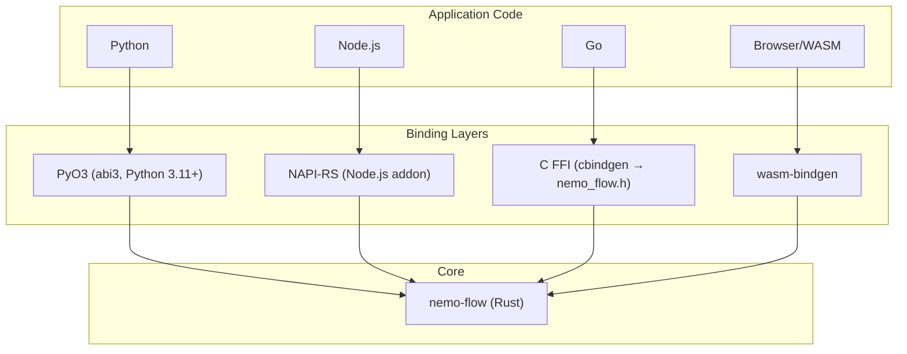

<!--
SPDX-FileCopyrightText: Copyright (c) 2026, NVIDIA CORPORATION & AFFILIATES. All rights reserved.
SPDX-License-Identifier: Apache-2.0
-->

# Language Bindings

NeMo Flow provides native bindings for Python, Node.js, Go, and WebAssembly. All bindings mirror the full API surface: scopes, tools, LLM, guardrails, intercepts, subscribers, and ATIF export.

Across all bindings, subscriber callbacks run synchronously on the calling
thread after NeMo Flow snapshots the subscriber list and releases its runtime
locks. They may call back into NeMo Flow APIs, but they should remain lightweight
because they still execute on the request path.

## Architecture



## Process Ownership

NeMo Flow expects a single native binding owner per OS process.

- Python, the Node.js native addon, and direct Rust `nemo-flow` usage
  claim a process-wide owner token on module init or first API use.
- The owner token records the binding kind, the NeMo Flow major version, and
  the current process ID.
- Reusing the same binding within the same major version is allowed.
- Loading a different native binding into the same process fails fast instead
  of creating a second independent runtime.

WebAssembly builds remain local to their own module instance and should be
treated as isolated runtimes.

## Naming Conventions

| Aspect | Python | Go | Node.js | WASM | FFI/C |
|--------|--------|----|---------|------|-------|
| Functions | `snake_case` | `PascalCase` | `camelCase` | `camelCase` | `nemo_flow_snake_case` |
| Types | `PascalCase` | `PascalCase` | `PascalCase` | `PascalCase` | `FfiPascalCase` |
| Enums | `ScopeType.Agent` | `ScopeTypeAgent` | `ScopeType.Agent` | `SCOPE_TYPE_AGENT` | `NemoFlowScopeTypeAgent` |
| Errors | `RuntimeError` | `error` | JS exception | JS exception | `NemoFlowStatus` + `nemo_flow_last_error()` |

## Rust Core Notes

Direct Rust users of `nemo-flow` should note that
`EventSubscriberFn` is an `Arc<dyn Fn(&Event) + Send + Sync>`. Register
subscribers with `Arc::new(...)`, not `Box::new(...)`.

If you want OTLP export without adding exporter logic to your own callback,
use `nemo_flow::observability::otel`. It turns NeMo Flow lifecycle
events into OpenTelemetry spans and exposes a normal `EventSubscriberFn`.
If you want OTLP export with OpenInference semantic conventions, use
`nemo_flow::observability::openinference` instead.

## OpenTelemetry

Every binding exposes an OpenTelemetry subscriber backed by the same Rust OTLP
exporter. The config shape follows each language's normal style:

- Rust: `OpenTelemetryConfig::{http_binary, grpc}(...)` builder-style config.
- Python: mutable `OpenTelemetryConfig()` object passed to `OpenTelemetrySubscriber(config)`.
- Node.js: plain `OpenTelemetryConfig` object passed to `new OpenTelemetrySubscriber(config)`.
- Go: `NewOpenTelemetryConfig()` returns a mutable config struct for `NewOpenTelemetrySubscriber(config)`.
- WASM: `defaultOpenTelemetryConfig()` returns a mutable JS object for `new OpenTelemetrySubscriber(config)`.

Use [Observability with OpenTelemetry](observability-with-opentelemetry.md) as
the canonical guide for event mapping, lifecycle, transport constraints, and
full per-language setup examples.

Minimal examples:

```python
import nemo_flow

config = nemo_flow.OpenTelemetryConfig()
config.endpoint = "http://localhost:4318/v1/traces"
config.service_name = "demo-agent"

subscriber = nemo_flow.OpenTelemetrySubscriber(config)
subscriber.register("otel")
```

```javascript
import { OpenTelemetrySubscriber } from "./index.js";

const config = {
  endpoint: "http://localhost:4318/v1/traces",
  serviceName: "demo-agent",
};

const subscriber = new OpenTelemetrySubscriber(config);
subscriber.register("otel");
```

```go
config := nemo_flow.NewOpenTelemetryConfig()
config.Endpoint = "http://localhost:4318/v1/traces"
config.ServiceName = "demo-agent"

subscriber, err := nemo_flow.NewOpenTelemetrySubscriber(config)
```

```javascript
import init, {
  defaultOpenTelemetryConfig,
  OpenTelemetrySubscriber,
} from "./pkg/nemo_flow_wasm.js";

await init();

const config = defaultOpenTelemetryConfig();
config.endpoint = "http://localhost:4318/v1/traces";
config.service_name = "demo-agent";

const subscriber = new OpenTelemetrySubscriber(config);
subscriber.register("otel");
```

## OpenInference

Every binding also exposes an OpenInference subscriber backed by the same OTLP
transport layer, but annotated with OpenInference semantic conventions for
backends such as Phoenix.

- Rust: `OpenInferenceConfig::new()` plus chained setters.
- Python: mutable `OpenInferenceConfig()` object passed to `OpenInferenceSubscriber(config)`.
- Node.js: plain `OpenInferenceConfig` object passed to `new OpenInferenceSubscriber(config)`.
- Go: `NewOpenInferenceConfig()` returns a mutable config struct for `NewOpenInferenceSubscriber(config)`.
- WASM: `defaultOpenInferenceConfig()` returns a mutable JS object for `new OpenInferenceSubscriber(config)`.

Use [Observability with OpenInference](observability-with-openinference.md) as
the canonical guide for semantic mapping, lifecycle, transport constraints, and
per-language setup examples.

Minimal examples:

```python
import nemo_flow

config = nemo_flow.OpenInferenceConfig()
config.endpoint = "http://localhost:4318/v1/traces"
config.service_name = "demo-agent"

subscriber = nemo_flow.OpenInferenceSubscriber(config)
subscriber.register("openinference")
```

```javascript
import { OpenInferenceSubscriber } from "./index.js";

const config = {
  endpoint: "http://localhost:4318/v1/traces",
  serviceName: "demo-agent",
};

const subscriber = new OpenInferenceSubscriber(config);
subscriber.register("openinference");
```

```go
config := nemo_flow.NewOpenInferenceConfig()
config.Endpoint = "http://localhost:4318/v1/traces"
config.ServiceName = "demo-agent"

subscriber, err := nemo_flow.NewOpenInferenceSubscriber(config)
```

```javascript
import init, {
  defaultOpenInferenceConfig,
  OpenInferenceSubscriber,
} from "./pkg/nemo_flow_wasm.js";

await init();

const config = defaultOpenInferenceConfig();
config.endpoint = "http://localhost:4318/v1/traces";
config.service_name = "demo-agent";

const subscriber = new OpenInferenceSubscriber(config);
subscriber.register("openinference");
```

## Callback Contracts

NeMo Flow intentionally distinguishes fallible callback surfaces from infallible
ones:

| Surface | Contract | Failure Behavior |
|--------|----------|------------------|
| Sanitize guardrails | Infallible | Handle failures inside the callback; there is no propagated error channel |
| Conditional execution guardrails | Fallible | Callback failure aborts the originating NeMo Flow call |
| Request intercepts | Fallible | Callback failure aborts the originating NeMo Flow call |
| Execution intercepts | Fallible | Callback failure aborts the originating NeMo Flow call |
| Stream collector | Fallible | Callback failure aborts the stream |
| Stream finalizer | Infallible | Handle failures inside the callback; there is no propagated error channel |
| Subscribers | Infallible | Handle failures inside the callback; there is no propagated error channel |

Language-specific error surfacing:

- Rust uses `Result<...>` for fallible conditionals, request intercepts,
  execution intercepts, and stream collectors.
- Python uses normal callback return types; raising an exception from a
  fallible callback propagates as `RuntimeError` from the originating NeMo Flow API
  call.
- Node.js and WASM use normal callback return types; throwing from a fallible
  callback propagates as the thrown JS exception from the originating NeMo Flow API
  call.
- Go follows the FFI callback surface, which remains the least expressive
  binding here; consult the Go API docs before assuming parity with the higher
  level bindings.

These contracts are canonical per surface. Bindings do not expose parallel
"fallible" and "infallible" variants for the same conditional guardrail or
request intercept shape; whether a callback is fallible depends on the surface
you register, not on which helper name you choose internally.

## Python

### Setup

```bash
uv sync        # Create venv, install deps, build native extension
uv run pytest  # Run tests
```

### Module Structure

```
python/nemo_flow/
  __init__.py       # Re-exports, ContextVar-based scope isolation
  scope.py          # Scope operations
  tools.py          # Tool lifecycle
  llm.py            # LLM lifecycle (execute/stream_execute with codec/response_codec params)
  guardrails.py     # Guardrail registration
  intercepts.py     # Intercept registration
  subscribers.py    # Event subscriber registration
  scope_local.py    # Scope-local middleware registration
  codecs.py         # LlmCodec/LlmResponseCodec protocols and built-in codec classes
  adaptive.py      # Adaptive config helpers
  typed.py          # Codec-based typed wrappers
```

Built-in codec classes live in `nemo_flow.codecs`:
`OpenAIChatCodec`, `OpenAIResponsesCodec`, `AnthropicMessagesCodec`.
Each implements both `LlmCodec` (request decode/encode) and
`LlmResponseCodec` (response decode).

The Python package wraps a PyO3 native extension (`_native`) built with the stable ABI (abi3), producing a single `.so` compatible with Python 3.11+.

### Adaptive Plugins

Python exposes adaptive config helpers in `nemo_flow.adaptive`, and uses
`nemo_flow.plugin` for validation, configuration, and custom plugin
registration:

```python
from nemo_flow import JsonObject, adaptive, plugin

class HeaderPlugin(plugin.Plugin):
    def validate(self, plugin_config: JsonObject) -> list[plugin.ConfigDiagnostic]:
        return []

    def register(
        self,
        plugin_config: JsonObject,
        context: plugin.PluginContext,
    ) -> None:
        priority = int(plugin_config.get("priority", 25))

        def inject_header(tool_name: str, args: JsonObject) -> JsonObject:
            return {**args, "x_plugin": "enabled", "tool": tool_name}

        context.register_tool_request_intercept("tool", priority, False, inject_header)


plugin.register("example.header_plugin", HeaderPlugin())

config = plugin.PluginConfig(
    components=[
        adaptive.ComponentSpec(
            adaptive.AdaptiveConfig(
                state=adaptive.StateConfig(
                    backend=adaptive.BackendSpec.in_memory()
                ),
                telemetry=adaptive.TelemetryConfig(
                    learners=["latency_sensitivity"]
                ),
                adaptive_hints=adaptive.AdaptiveHintsConfig(),
            )
        ),
        plugin.ComponentSpec(
            kind="example.header_plugin",
            config={"priority": 25},
        ),
    ]
)

report = plugin.validate(config)
await plugin.initialize(config)
```

`plugin.PluginContext` exposes:

- `register_subscriber(...)`
- `register_llm_request_intercept(...)`
- `register_llm_execution_intercept(...)`
- `register_llm_stream_execution_intercept(...)`
- `register_tool_request_intercept(...)`
- `register_tool_execution_intercept(...)`

### Usage

```python
import nemo_flow

# Guardrails
nemo_flow.guardrails.register_tool_conditional_execution(
    "block_dangerous", 1,
    lambda name, args: "blocked" if name == "rm" else None,
)

# Intercepts
nemo_flow.intercepts.register_tool_request(
    "add_context", 1, False,
    lambda name, args: {**args, "context": "injected"},
)

# Scope Context Management
with nemo_flow.scope.scope("my_agent", nemo_flow.ScopeType.Agent) as handle:
    # Inside this block, the scope "my_agent" is active
    ...

# Alternatively, manual scope push/pop:
handle = nemo_flow.scope.push("my_agent", nemo_flow.ScopeType.Agent)
nemo_flow.scope.pop(handle)

# The following examples assume you are inside an active scope context.
# Some require running inside of a coroutine (the ones that use an `await` expression).

# Tool execution
result = await nemo_flow.tools.execute("search", {"q": "test"}, search_func)

# LLM execution
request = nemo_flow.LLMRequest(
    headers={"Authorization": "Bearer ..."},
    content={"messages": [{"role": "user", "content": "Hello"}], "model": "gpt-4"},
)
response = await nemo_flow.llm.execute("gpt-4", request, llm_func)
```

### Scope-Local Middleware

```python
import nemo_flow

handle = nemo_flow.scope.push("session", nemo_flow.ScopeType.Agent)

# Register middleware bound to this scope
nemo_flow.scope_local.register_tool_conditional_execution(
    handle, "session_guard", 10,
    lambda name, args: "blocked" if name == "rm" else None,
)
nemo_flow.scope_local.register_subscriber(
    handle, "session_logger", lambda event: print(event.name),
)

# ... middleware is active while scope is on the stack ...

nemo_flow.scope.pop(handle)  # both registrations automatically removed
```

During the scope's `Start` callback, `get_handle()` sees `handle` as the active
scope. During its `End` callback, `get_handle()` sees the parent scope because
the pop has already completed.

### Context Isolation

Python uses `contextvars.ContextVar` for async-safe per-task isolation. Each `asyncio.Task` can have its own scope stack:

```python
async def handle_request():
    # get_scope_stack() lazily creates an isolated stack per task
    nemo_flow.get_scope_stack()
    # All scope operations now use this isolated stack
```

Check whether a scope stack is active, and propagate to worker threads:

```python
if nemo_flow.scope_stack_active():
    stack = nemo_flow.propagate_scope_to_thread()
    # Pass `stack` to worker, call nemo_flow.set_thread_scope_stack(stack) there
```

## Node.js

### Setup

```bash
cd crates/node
npm install
npm run build        # Build .node addon
npm test             # Build debug addon and run JS integration tests
```

### Usage

```javascript
import {
    pushScope, popScope, ScopeType,
    toolCallExecute, llmCallExecute,
    registerToolRequestIntercept,
} from './index.js';

// Replace with your actual tool and LLM functions
function searchFunc() {
    return { ok: true };
}

function llmFunc(n) {
    return { response: 'hello from llm' };
}

// Intercepts
registerToolRequestIntercept("add_ctx", 1, false, (name, args) => {
    console.log("Intercepted tool call: ", name, args);
    return { ...args, context: "injected" };
});

// Scopes
const handle = pushScope("my_agent", ScopeType.Agent, null, null);

// Tool execution
const result = await toolCallExecute(
    "search", { q: "test" }, searchFunc,
    null, null, null, null,
);

// LLM execution
const request = { headers: {}, content: { messages: [{"role": "user", "content": "Hello"}], model: "gpt-4" } };
const response = await llmCallExecute(
    "gpt-4", request, llmFunc,
    null, null, null, null, "gpt-4",
);

console.log("LLM response: ", response);

popScope(handle);
process.exit(0);
```

### Scope-Local Middleware

```javascript
import {
    pushScope, popScope, ScopeType,
    scopeRegisterToolConditionalExecutionGuardrail,
    scopeRegisterSubscriber,
} from './index.js';

const handle = pushScope("session", ScopeType.Agent, null, null);

// Register middleware bound to this scope
scopeRegisterToolConditionalExecutionGuardrail(
    handle.uuid, "session_guard", 10,
    (name, args) => name === "rm" ? "blocked" : null,
);
scopeRegisterSubscriber(
    handle.uuid, "session_logger",
    (event) => console.log(event.name),
);

// ... middleware is active while scope is on the stack ...

popScope(handle);  // both registrations automatically removed
```

For infallible callback shapes that do not have an error return channel
(for example sanitize guardrails, subscribers, and stream finalizers), the
Node binding records the most recent binding-side callback failure. Read it with
`getLastCallbackError()` and clear it with `clearLastCallbackError()`.

### Typed Wrappers

Node.js provides `typed.js` with `typedToolExecute`, `typedLlmExecute`, and `typedLlmStreamExecute`:

```javascript
import { typedToolExecute } from './typed.js';

const result = await typedToolExecute(
    "search", new SearchArgs("test"),
    searchFunc, argsCodec, resultCodec,
);
```

### Stream Bridge

Node.js uses a push-based stream bridge for LLM streaming. JavaScript drives async iteration and pushes chunks back to the native layer via `pushStreamChunk()` / `endStream()`.

### Adaptive Plugins

Node exposes adaptive config helpers through `adaptive.js` and activates them
through the core plugin host in `plugin.js`:

```javascript
import * as adaptive from "./adaptive.js";
import * as plugin from "./plugin.js";

plugin.register("example.header_plugin", {
  validate(pluginConfig) {
    return [];
  },
  register(pluginConfig, context) {
    context.registerToolRequestIntercept(
      "tool",
      25,
      false,
      (_name, args) => ({ ...args, nodePlugin: "enabled" }),
    );
  },
});

const config = plugin.defaultConfig();
config.components = [
  adaptive.ComponentSpec({
    version: 1,
    state: { backend: adaptive.inMemoryBackend() },
    telemetry: adaptive.telemetryConfig({
      learners: ["latency_sensitivity"],
    }),
    adaptive_hints: adaptive.adaptiveHintsConfig(),
  }),
  plugin.ComponentSpec("example.header_plugin", { priority: 25 }),
];

const validation = plugin.validate(config);
await plugin.initialize(config);
```

Node plugin contexts expose:

- `registerSubscriber(...)`
- `registerLlmRequestIntercept(...)`
- `registerLlmExecutionIntercept(...)`
- `registerLlmStreamExecutionIntercept(...)`
- `registerToolRequestIntercept(...)`
- `registerToolExecutionIntercept(...)`

Registration names are local to each component. The runtime namespaces them
internally, so users do not need to provide component instance ids.

## Go

### Setup

```bash
# Build the FFI shared library first
cargo build --release -p nemo-flow-ffi

# Run Go tests
cd go/nemo_flow
CGO_LDFLAGS="-L../../target/release" LD_LIBRARY_PATH="${LD_LIBRARY_PATH:+${LD_LIBRARY_PATH}:}../../target/release" go test -v ./...
```

On macOS, use `DYLD_LIBRARY_PATH` instead of `LD_LIBRARY_PATH`.

### Package Structure

```
go/nemo_flow/
  nemo_flow.go      # CGo declarations, core bindings
  types.go          # Type definitions (ScopeHandle, ToolHandle, etc.)
  stream.go         # LLM stream handling
  callbacks.go      # Go trampolines for Rust callbacks
  adaptive.go      # Adaptive config and plugin helpers
  plugin.go         # Plugin-host config and registration helpers
```

### Usage

```go
import (
    "encoding/json"
    "fmt"

    "github.com/NVIDIA/NeMo-Flow/go/nemo_flow"
)

func searchFunc(args json.RawMessage) (json.RawMessage, error) {
	var input map[string]interface{}
	json.Unmarshal(args, &input)
	result, _ := json.Marshal(map[string]interface{}{"results": []string{"result for: " + input["q"].(string)}})
	return result, nil
}

func llmFunc(request json.RawMessage) (json.RawMessage, error) {
	result, _ := json.Marshal(map[string]interface{}{"response": "hello from llm"})
	return result, nil
}

func main() {
    // Scopes
    handle, _ := nemo_flow.PushScope("my_agent", nemo_flow.ScopeTypeAgent)

    // Tool execution
    result, _ := nemo_flow.ToolCallExecute("search", json.RawMessage(`{"q": "test"}`), searchFunc)

    fmt.Println("tool result:", string(result))


    // LLM execution
    request := map[string]interface{}{
        "headers": map[string]interface{}{},
        "content": map[string]interface{}{
            "messages": []interface{}{map[string]interface{}{"role": "user", "content": "Hello"}},
            "model":    "gpt-4",
        },
    }
    response, _ := nemo_flow.LlmCallExecute("gpt-4", request, llmFunc, nemo_flow.WithLLMModelName("gpt-4"))
    fmt.Println("llm response:", string(response))

    nemo_flow.PopScope(handle)
}
```

### Scope-Local Middleware

```go
import (
    "github.com/NVIDIA/NeMo-Flow/go/nemo_flow"
)

handle, _ := nemo_flow.PushScope("session", nemo_flow.ScopeTypeAgent)
defer nemo_flow.PopScope(handle)

// Register middleware bound to this scope
nemo_flow.ScopeRegisterToolConditionalExecutionGuardrail(handle.UUID, "session_guard", 10,
    func(name string, args json.RawMessage) *string {
        if name == "rm" {
            reason := "blocked"
            return &reason
        }
        return nil
    },
)
nemo_flow.ScopeRegisterSubscriber(handle.UUID, "session_logger",
    func(event json.RawMessage) { fmt.Println("event:", string(event)) },
)

// ... middleware is active while scope is on the stack ...
```

### CGo Callback Pattern

Go uses trampolines — C-compatible function pointers that bridge Rust callbacks to Go functions:

```go
// callbacks.go defines trampolines
//export goToolSanitizeTrampoline
func goToolSanitizeTrampoline(userData unsafe.Pointer, name *C.char, args *C.char) *C.char { ... }
```

`ScopeStack`, `LlmStream`, `AtifExporter`, and observability subscribers expose
`Close()` methods. Scope, tool, and LLM handles are plain Go values and do not
require explicit freeing.

### Adaptive Plugins

Go exposes typed adaptive config builders directly from `nemo_flow` and
activates them through the core plugin host:

```go
import (
    nemo_flow "github.com/NVIDIA/NeMo-Flow/go/nemo_flow"
)

config := nemo_flow.NewAdaptiveConfig()
config.State = &nemo_flow.AdaptiveStateConfig{
    Backend: nemo_flow.NewInMemoryAdaptiveBackend(),
}
telemetry := nemo_flow.NewTelemetryConfig()
telemetry.Learners = []string{"latency_sensitivity"}
config.Telemetry = &telemetry

report, err := nemo_flow.InitializePlugins(nemo_flow.PluginConfig{
    Version: 1,
    Components: []nemo_flow.PluginComponentSpec{
        nemo_flow.NewAdaptiveComponentSpec(config).PluginComponent(),
    },
})
if err != nil {
    panic(err)
}
_ = report
```

### Plugins

The Go binding exposes custom plugin registration through the core plugin host.
Adaptive remains a separate top-level plugin component:

```go
import (
    "encoding/json"
    nemo_flow "github.com/NVIDIA/NeMo-Flow/go/nemo_flow"
)

pluginKind := "example.header_plugin"
err := nemo_flow.RegisterPlugin(pluginKind, nemo_flow.PluginFuncs{
    ValidateFunc: func(pluginConfig map[string]any) ([]nemo_flow.ConfigDiagnostic, error) {
        return nil, nil
    },
    RegisterFunc: func(pluginConfig map[string]any, ctx *nemo_flow.PluginContext) error {
        return ctx.RegisterToolRequestIntercept(
            "tool",
            25,
            false,
            func(name string, args json.RawMessage) json.RawMessage {
                var payload map[string]any
                _ = json.Unmarshal(args, &payload)
                payload["goPlugin"] = "enabled"
                payload["tool"] = name
                out, _ := json.Marshal(payload)
                return out
            },
        )
    },
})
if err != nil {
    panic(err)
}

config := nemo_flow.NewPluginConfig()
config.Components = []nemo_flow.PluginComponentSpec{
    nemo_flow.NewAdaptiveComponentSpec(nemo_flow.NewAdaptiveConfig()).PluginComponent(),
    {
        Kind:    pluginKind,
        Enabled: true,
        Config: map[string]any{
            "priority": 25,
        },
    },
}

_, err = nemo_flow.InitializePlugins(config)
if err != nil {
    panic(err)
}
```

`PluginContext` exposes:

- `RegisterSubscriber(...)`
- `RegisterLlmRequestIntercept(...)`
- `RegisterLlmExecutionIntercept(...)`
- `RegisterLlmStreamExecutionIntercept(...)`
- `RegisterToolRequestIntercept(...)`
- `RegisterToolExecutionIntercept(...)`

Registration names are local to each component. The runtime namespaces them
internally, so users do not need to provide component instance ids.

### Context Isolation

Go goroutines use `ScopeStack.Run()` which pins the goroutine to an OS thread:

```go
stack, _ := nemo_flow.NewScopeStack()
defer stack.Close()

go func() {
    stack.Run(func() {
        // All scope operations use this stack
        handle, _ := nemo_flow.PushScope("agent", nemo_flow.ScopeTypeAgent)
        defer nemo_flow.PopScope(handle)

        // Check if a scope stack is explicitly bound
        if nemo_flow.ScopeStackActive() {
            // ...
        }
    })
}()
```

## WebAssembly

### Setup

```bash
wasm-pack build crates/wasm --scope nvidia # Produces pkg/ with .wasm, .js, .d.ts

# Unit tests
cargo test -p nemo-flow-wasm

# Integration tests
wasm-pack test --node crates/wasm
```

The Cargo package remains `nemo-flow-wasm`, while the compiled WASM library
target and generated npm package are NVIDIA-branded (`nemo_flow_wasm`
and `@nvidia/nemo-flow-wasm`).

### Build Targets

`wasm-pack` supports several output targets depending on your runtime
environment:

```bash
# Bundler (webpack, Vite, Rollup, etc.) — default
wasm-pack build crates/wasm --scope nvidia --target bundler

# Standalone web (loads via <script type="module">, no bundler needed)
wasm-pack build crates/wasm --scope nvidia --target web

# Node.js (CommonJS, for server-side or CLI usage)
wasm-pack build crates/wasm --scope nvidia --target nodejs
```

| Target | Output | Use Case |
|--------|--------|----------|
| `bundler` | ES module with `.wasm` sidecar | Bundled web apps (webpack, Vite) |
| `web` | ES module with manual `init()` | Standalone `<script type="module">` |
| `nodejs` | CommonJS with Node.js WASM loader | Server-side, CLI, or testing |

When using `--target web`, you must call the default-exported `init()` function
before invoking any other API:

```javascript
import init, { pushScope, popScope } from './pkg/nemo_flow_wasm.js';

await init();  // loads and instantiates the .wasm binary
// Now the API is ready
```

### Usage

The following example demonstrates the full lifecycle: initializing the module,
pushing a scope, registering a tool, executing the tool through the middleware
pipeline, registering a guardrail, and popping the scope.

```javascript
import init, {
    pushScope, popScope,
    toolCallExecute,
    registerToolConditionalExecutionGuardrail,
    SCOPE_TYPE_AGENT,
} from './pkg/nemo_flow_wasm.js';

// Required for --target web; no-op when using bundler or nodejs targets
await init();

// 1. Push a scope
const handle = pushScope("my_agent", SCOPE_TYPE_AGENT, null, null, null, null);

// 2. Register a guardrail that blocks dangerous tools
registerToolConditionalExecutionGuardrail(
    "block_dangerous", 1,
    (name, args) => name === "rm" ? "blocked: dangerous tool" : null,
);

// 3. Define a tool function
async function searchFunc(args) {
    return { results: [`result for: ${args.q}`] };
}

// 4. Execute a tool through the full middleware pipeline
const result = await toolCallExecute(
    "search",
    { q: "test" },
    searchFunc,
    null,  // parent (uses current scope)
    null,  // attributes
    null,  // data
    null,  // metadata
);
console.log("Tool result:", result);

// 5. Pop the scope
popScope(handle);
```

For infallible callback shapes that do not have an error return channel
(for example sanitize guardrails, subscribers, and stream finalizers), the
WASM binding also records the most recent binding-side callback failure. Read it
with `getLastCallbackError()` and clear it with `clearLastCallbackError()`.

### Scope-Local Middleware

```javascript
import {
    pushScope, popScope,
    scopeRegisterToolConditionalExecutionGuardrail,
    scopeRegisterSubscriber,
    SCOPE_TYPE_AGENT,
} from './pkg/nemo_flow_wasm.js';

const handle = pushScope("session", SCOPE_TYPE_AGENT, null, null, null, null);

scopeRegisterToolConditionalExecutionGuardrail(
    handle.uuid, "session_guard", 10,
    (name, args) => name === "rm" ? "blocked" : null,
);
scopeRegisterSubscriber(
    handle.uuid, "session_logger",
    (event) => console.log(event),
);

// ... operations ...

popScope(handle);  // auto-cleanup
```

### Adaptive Plugins

The WASM binding uses `adaptive.js` for adaptive config helpers and
`plugin.js` for the core plugin host:

```javascript
import init from "./pkg/nemo_flow_wasm.js";
import * as adaptive from "./adaptive.js";
import * as plugin from "./plugin.js";

await init();

plugin.register("example.header_plugin", {
  validate() {
    return [];
  },
  register(pluginConfig, context) {
    context.registerToolRequestIntercept(
      "tool",
      25,
      false,
      (_name, args) => ({ ...args, wasmPlugin: "enabled" }),
    );
  },
});

const config = {
  version: 1,
  components: [
    adaptive.ComponentSpec({
      version: 1,
      state: { backend: adaptive.inMemoryBackend() },
      adaptive_hints: adaptive.adaptiveHintsConfig(),
    }),
    plugin.ComponentSpec("example.header_plugin", { priority: 25 }),
  ],
};

console.log(plugin.validate(config));
await plugin.initialize(config);
```

WASM plugin contexts expose:

- `registerSubscriber(...)`
- `registerLlmRequestIntercept(...)`
- `registerLlmExecutionIntercept(...)`
- `registerLlmStreamExecutionIntercept(...)`
- `registerToolRequestIntercept(...)`
- `registerToolExecutionIntercept(...)`

Registration names are local to each component. The runtime namespaces them
internally, so users do not need to provide component instance ids.

WASM stream execution note:

- `registerLlmStreamExecutionIntercept(...)` in the WASM binding produces a
  single-item stream result directly and does not delegate to downstream stream
  handlers. WASM plugins therefore cannot chain stream execution
  intercepts the same way the Rust, Python, Go, and Node.js bindings can.

### Streaming LLM Example

The WASM binding supports streaming LLM responses through a collector/finalizer
pattern. The `llmStreamCallExecute` function returns a `WasmLlmStream` object
whose `next()` method yields `{ value, done }` chunks, compatible with the
JavaScript async iterator protocol.

```javascript
import init, {
    pushScope, popScope,
    llmStreamCallExecute,
    SCOPE_TYPE_AGENT,
} from './pkg/nemo_flow_wasm.js';

await init();

const handle = pushScope("llm_agent", SCOPE_TYPE_AGENT, null, null, null, null);

// Collector: accumulates chunks as they arrive
const chunks = [];
function collector(chunk) {
    chunks.push(chunk);
}

// Finalizer: called once when the stream ends; returns the aggregated response
function finalizer() {
    return { full_response: chunks.map(c => c.text || "").join("") };
}

// LLM function that returns a streaming response (simulated here)
async function llmFunc(request) {
    return { response: "streamed content" };
}

const request = {
    headers: { "Authorization": "Bearer ..." },
    content: { messages: [{ role: "user", content: "Hello" }], model: "gpt-4" },
};

// Execute the streaming call
const stream = await llmStreamCallExecute(
    "gpt-4",
    request,
    llmFunc,
    collector,    // optional: receives each chunk
    finalizer,    // optional: produces aggregated response on stream end
    null,         // parent
    null,         // attributes
    null,         // data
    null,         // metadata
    "gpt-4",     // model_name
);

// Consume the stream
while (true) {
    const { value, done } = await stream.next();
    if (done) break;
    console.log("Chunk:", value);
}

popScope(handle);
```

### Promise-Aware `withScope`

The `withScope` helper pushes a scope, runs a callback, and automatically pops
the scope when the callback completes. If the callback returns a `Promise`,
the scope remains active until the Promise settles (resolves or rejects),
making it safe for async workflows:

```javascript
import { withScope, toolCallExecute, SCOPE_TYPE_AGENT } from './pkg/nemo_flow_wasm.js';

// Synchronous callback — scope is popped immediately on return
const syncResult = withScope("sync_op", SCOPE_TYPE_AGENT, (handle) => {
    return { status: "done" };
});

// Async callback — scope stays active until the Promise resolves
const asyncResult = await withScope("async_op", SCOPE_TYPE_AGENT, async (handle) => {
    const result = await toolCallExecute("search", { q: "test" }, searchFunc, null, null, null, null);
    return result;
});
// Scope is automatically popped here, even if the Promise rejects
```

`withScope` also accepts optional `parent`, `attributes`, `data`, and
`metadata` arguments after the callback, mirroring `pushScope`.

### Browser CORS Requirements

When deploying WASM modules in a browser, `SharedArrayBuffer` (required by
some multi-threaded WASM configurations) is only available in
[cross-origin-isolated](https://developer.mozilla.org/en-US/docs/Web/API/crossOriginIsolated)
contexts. Your server must send the following HTTP headers:

```
Cross-Origin-Opener-Policy: same-origin
Cross-Origin-Embedder-Policy: require-corp
```

Without these headers, browsers will block `SharedArrayBuffer` usage and
the WASM module may fail to initialize. Note that NeMo Flow WASM is
single-threaded by default, so `SharedArrayBuffer` is only required if you
opt into threaded builds (e.g., with `wasm-bindgen-rayon`).

### Differences from Node.js

- Functions use camelCase JS names (via `#[wasm_bindgen(js_name = "...")]`)
- Single-threaded (no worker thread isolation)
- Uses `wasm_bindgen_futures::spawn_local()` for async execution
- Stream objects expose an async `next()` method returning `{ value, done }`
- Scope type constants are exported as integer values (`SCOPE_TYPE_AGENT = 0`,
  `SCOPE_TYPE_FUNCTION = 1`, etc.) rather than an enum object

## Comparison Table

| Feature | Python | Go | Node.js | WASM |
|---------|--------|----|---------|------|
| Build tool | uv / PyO3 | CGo | napi-build | wasm-pack |
| Output | `.so` (abi3) | CGo packages | `.node` addon | `.wasm` + `.js` |
| Async | asyncio | goroutines | event loop | spawn_local |
| Context isolation | `contextvars` + `scope_stack_active()` | `ScopeStack.Run()` + `ScopeStackActive()` | `setThreadScopeStack()` + `scopeStackActive()` | `setThreadScopeStack()` + `scopeStackActive()` |
| Callback pattern | `PyAny` → closure | C trampolines | `ThreadsafeFunction` | `js_sys::Function` |
| Stream support | AsyncIterator | Channel-based | Push-based bridge | Async iterator |
| Typed wrappers | `nemo_flow.typed` | — | `typed.js` | — |
| Built-in codecs | `nemo_flow.codecs.OpenAIChatCodec`, `nemo_flow.codecs.OpenAIResponsesCodec`, `nemo_flow.codecs.AnthropicMessagesCodec` | `NewOpenAIChatCodec()`, `NewOpenAIResponsesCodec()`, `NewAnthropicMessagesCodec()` | `OpenAIChatCodec`, `OpenAIResponsesCodec`, `AnthropicMessagesCodec` | `WasmOpenAIChatCodec`, `WasmOpenAIResponsesCodec`, `WasmAnthropicMessagesCodec` |
| Response codec param | `response_codec=` on execute/stream_execute | `WithLLMResponseCodec(codec)` | `responseCodecDecode` param | `response_codec_decode` param |
| Memory management | GC | `Close()` on scope stacks, streams, exporters, and subscribers | GC | GC |

## Error Handling

All bindings map core `FlowError` variants to language-appropriate errors:

| Error | Python | Go | Node.js / WASM |
|-------|--------|----|-----------------|
| `AlreadyExists` | `RuntimeError` | `error` | thrown exception |
| `NotFound` | `RuntimeError` | `error` | thrown exception |
| `GuardrailRejected` | `RuntimeError` | `error` | thrown exception |
| `ScopeStackEmpty` | `RuntimeError` | `error` | thrown exception |
| `Internal` | `RuntimeError` | `error` | thrown exception |

Go additionally provides the FFI pattern of `NemoFlowStatus` return codes with `nemo_flow_last_error()` for the error message string.
