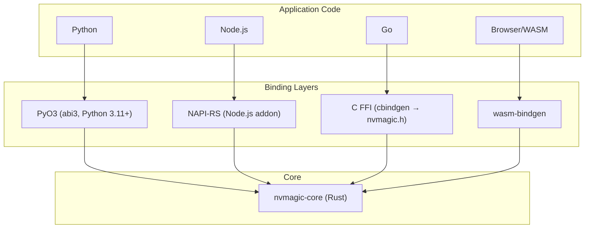

<!--
SPDX-FileCopyrightText: Copyright (c) 2026, NVIDIA CORPORATION & AFFILIATES. All rights reserved.
SPDX-License-Identifier: Apache-2.0
-->

# Language Bindings

NVMagic provides native bindings for Python, Node.js, Go, and WebAssembly. All bindings mirror the full API surface: scopes, tools, LLM, guardrails, intercepts, subscribers, and ATIF export.

## Architecture



## Naming Conventions

| Aspect | Python | Go | Node.js | WASM | FFI/C |
|--------|--------|----|---------|------|-------|
| Functions | `snake_case` | `PascalCase` | `camelCase` | `camelCase` | `nvmagic_snake_case` |
| Types | `PascalCase` | `PascalCase` | `PascalCase` | `PascalCase` | `FfiPascalCase` |
| Enums | `ScopeType.Agent` | `ScopeTypeAgent` | `ScopeType.Agent` | `ScopeType.Agent` | `NvMagicScopeTypeAgent` |
| Errors | `RuntimeError` | `error` | JS exception | JS exception | `NvMagicStatus` + `nvmagic_last_error()` |

## Python

### Setup

```bash
uv sync        # Create venv, install deps, build native extension
uv run pytest  # Run tests
```

### Module Structure

```
python/nvmagic/
  __init__.py       # Re-exports, ContextVar-based scope isolation
  scope.py          # Scope operations
  tools.py          # Tool lifecycle
  llm.py            # LLM lifecycle
  guardrails.py     # Guardrail registration
  intercepts.py     # Intercept registration
  subscribers.py    # Event subscriber registration
  typed.py          # Codec-based typed wrappers
```

The Python package wraps a PyO3 native extension (`_native`) built with the stable ABI (abi3), producing a single `.so` compatible with Python 3.11+.

### Usage

```python
import nvmagic
from nvmagic import LLMRequest, ScopeType

# Scopes
handle = nvmagic.scope.push("my_agent", ScopeType.Agent)
nvmagic.scope.pop(handle)

# Tool execution
result = await nvmagic.tools.execute("search", {"q": "test"}, search_func)

# LLM execution
request = LLMRequest(
    headers={"Authorization": "Bearer ..."},
    content={"messages": [{"role": "user", "content": "Hello"}], "model": "gpt-4"},
)
response = await nvmagic.llm.execute("gpt-4", request, llm_func)

# Guardrails
nvmagic.guardrails.register_tool_conditional_execution(
    "block_dangerous", 1,
    lambda name, args: "blocked" if name == "rm" else None,
)

# Intercepts
nvmagic.intercepts.register_tool_request(
    "add_context", 1, False,
    lambda name, args: {**args, "context": "injected"},
)
```

### Context Isolation

Python uses `contextvars.ContextVar` for async-safe per-task isolation. Each `asyncio.Task` can have its own scope stack:

```python
async def handle_request():
    stack = nvmagic.create_scope_stack()
    nvmagic._scope_stack_var.set(stack)
    # All scope operations now use this isolated stack
```

## Node.js

### Setup

```bash
cd crates/node
npm install
npm run build        # Build .node addon
node --test tests/*.mjs  # Run tests
```

### Usage

```javascript
import {
    pushScope, popScope, ScopeType,
    toolCallExecute, llmCallExecute,
    registerToolRequestIntercept,
} from './index.node';

// Scopes
const handle = pushScope("my_agent", ScopeType.Agent, null, null);
popScope(handle);

// Tool execution
const result = await toolCallExecute(
    "search", { q: "test" }, searchFunc,
    null, null, null, null,
);

// LLM execution
const request = { headers: {}, content: { messages: [...], model: "gpt-4" } };
const response = await llmCallExecute(
    "gpt-4", request, llmFunc,
    null, null, null, null, "gpt-4",
);

// Intercepts
registerToolRequestIntercept("add_ctx", 1, false, (name, args) => {
    return { ...args, context: "injected" };
});
```

### Typed Wrappers

Node.js provides `typed.js` with `typedToolExecute`, `typedLlmExecute`, and `typedLlmStreamExecute`:

```javascript
import { typedToolExecute } from './typed.js';

const result = await typedToolExecute(
    "search", new SearchArgs("test"),
    searchFunc, argsCodec, resultCodec,
);
```

### Stream Bridge

Node.js uses a push-based stream bridge for LLM streaming. JavaScript drives async iteration and pushes chunks back to the native layer via `pushStreamChunk()` / `endStream()`.

## Go

### Setup

```bash
# Build the FFI shared library first
cargo build --release -p nvmagic-ffi

# Run Go tests
cd go/nvmagic
CGO_LDFLAGS="-L../../target/release" go test -v ./...
```

### Package Structure

```
go/nvmagic/
  nvmagic.go        # CGo declarations, core bindings
  types.go          # Type definitions (ScopeHandle, ToolHandle, etc.)
  stream.go         # LLM stream handling
  callbacks.go      # Go trampolines for Rust callbacks
  scope/            # Convenience package
  tools/            # Convenience package
  llm/              # Convenience package
  guardrails/       # Convenience package
  intercepts/       # Convenience package
  subscribers/      # Convenience package
```

### Usage

```go
import (
    "github.com/nvidia/nvmagic/go/nvmagic"
    "github.com/nvidia/nvmagic/go/nvmagic/scope"
    "github.com/nvidia/nvmagic/go/nvmagic/tools"
    "github.com/nvidia/nvmagic/go/nvmagic/llm"
)

// Scopes
handle, _ := scope.Push("my_agent", scope.TypeAgent)
scope.Pop(handle)

// Tool execution
result, _ := tools.Execute("search", map[string]interface{}{"q": "test"}, searchFunc)

// LLM execution
request := map[string]interface{}{
    "headers": map[string]interface{}{},
    "content": map[string]interface{}{
        "messages": []interface{}{...},
        "model":    "gpt-4",
    },
}
response, _ := llm.Execute("gpt-4", request, llmFunc, "gpt-4")
```

### CGo Callback Pattern

Go uses trampolines — C-compatible function pointers that bridge Rust callbacks to Go functions:

```go
// callbacks.go defines trampolines
//export goToolSanitizeTrampoline
func goToolSanitizeTrampoline(userData unsafe.Pointer, name *C.char, args *C.char) *C.char { ... }
```

Memory management requires explicit `Free()` calls on handles and scope stacks.

### Context Isolation

Go goroutines use `ScopeStack.Run()` which pins the goroutine to an OS thread:

```go
stack, _ := nvmagic.NewScopeStack()
defer stack.Close()

go func() {
    stack.Run(func() {
        // All scope operations use this stack
        scope.Push("agent", scope.TypeAgent)
    })
}()
```

## WebAssembly

### Setup

```bash
wasm-pack build crates/wasm    # Produces pkg/ with .wasm, .js, .d.ts

# Unit tests
cargo test -p nvmagic-wasm

# Integration tests
wasm-pack test --node crates/wasm
```

### Usage

```javascript
import init, {
    pushScope, popScope, ScopeType,
    nvmagicToolCallExecute, nvmagicLlmCallExecute,
} from './pkg/nvmagic.js';

await init();  // Initialize WASM module

const handle = pushScope("agent", ScopeType.Agent, null, null);
// ... operations ...
popScope(handle);
```

### Differences from Node.js

- Functions are prefixed with `nvmagic` in some cases (via `#[wasm_bindgen(js_name = "...")]`)
- Single-threaded (no worker thread isolation)
- Uses `wasm_bindgen_futures::spawn_local()` for async execution
- Stream objects expose an async `next()` method

## Comparison Table

| Feature | Python | Go | Node.js | WASM |
|---------|--------|----|---------|------|
| Build tool | uv / PyO3 | CGo | napi-build | wasm-pack |
| Output | `.so` (abi3) | CGo packages | `.node` addon | `.wasm` + `.js` |
| Async | asyncio | goroutines | event loop | spawn_local |
| Context isolation | `contextvars` | `ScopeStack.Run()` | `setThreadScopeStack()` | manual |
| Callback pattern | `PyAny` → closure | C trampolines | `ThreadsafeFunction` | `js_sys::Function` |
| Stream support | AsyncIterator | Channel-based | Push-based bridge | Async iterator |
| Typed wrappers | `nvmagic.typed` | — | `typed.js` | — |
| Memory management | GC | Manual (`Free`/`Close`) | GC | GC |

## Error Handling

All bindings map core `MagicError` variants to language-appropriate errors:

| Error | Python | Go | Node.js / WASM |
|-------|--------|----|-----------------|
| `AlreadyExists` | `RuntimeError` | `error` | thrown exception |
| `NotFound` | `RuntimeError` | `error` | thrown exception |
| `GuardrailRejected` | `RuntimeError` | `error` | thrown exception |
| `ScopeStackEmpty` | `RuntimeError` | `error` | thrown exception |
| `Internal` | `RuntimeError` | `error` | thrown exception |

Go additionally provides the FFI pattern of `NvMagicStatus` return codes with `nvmagic_last_error()` for the error message string.
