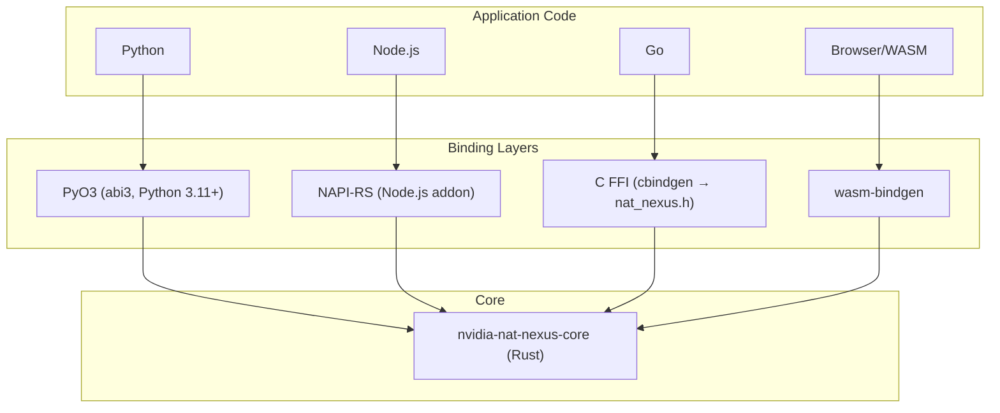

<!--
SPDX-FileCopyrightText: Copyright (c) 2026, NVIDIA CORPORATION & AFFILIATES. All rights reserved.
SPDX-License-Identifier: Apache-2.0
-->

# Language Bindings

Nexus provides native bindings for Python, Node.js, Go, and WebAssembly. All bindings mirror the full API surface: scopes, tools, LLM, guardrails, intercepts, subscribers, and ATIF export.

Across all bindings, subscriber callbacks run synchronously on the calling
thread after Nexus snapshots the subscriber list and releases its runtime
locks. They may call back into Nexus APIs, but they should remain lightweight
because they still execute on the request path.

## Architecture



## Naming Conventions

| Aspect | Python | Go | Node.js | WASM | FFI/C |
|--------|--------|----|---------|------|-------|
| Functions | `snake_case` | `PascalCase` | `camelCase` | `camelCase` | `nat_nexus_snake_case` |
| Types | `PascalCase` | `PascalCase` | `PascalCase` | `PascalCase` | `FfiPascalCase` |
| Enums | `ScopeType.Agent` | `ScopeTypeAgent` | `ScopeType.Agent` | `ScopeType.Agent` | `NatNexusScopeTypeAgent` |
| Errors | `RuntimeError` | `error` | JS exception | JS exception | `NatNexusStatus` + `nat_nexus_last_error()` |

## Rust Core Notes

Direct Rust users of `nvidia-nat-nexus-core` should note that
`EventSubscriberFn` is an `Arc<dyn Fn(&Event) + Send + Sync>`. Register
subscribers with `Arc::new(...)`, not `Box::new(...)`.

## Python

### Setup

```bash
uv sync        # Create venv, install deps, build native extension
uv run pytest  # Run tests
```

### Module Structure

```
python/nat_nexus/
  __init__.py       # Re-exports, ContextVar-based scope isolation
  scope.py          # Scope operations
  tools.py          # Tool lifecycle
  llm.py            # LLM lifecycle
  guardrails.py     # Guardrail registration
  intercepts.py     # Intercept registration
  subscribers.py    # Event subscriber registration
  scope_local.py    # Scope-local middleware registration
  typed.py          # Codec-based typed wrappers
```

The Python package wraps a PyO3 native extension (`_native`) built with the stable ABI (abi3), producing a single `.so` compatible with Python 3.11+.

### Usage

```python
import nat_nexus

# Guardrails
nat_nexus.guardrails.register_tool_conditional_execution(
    "block_dangerous", 1,
    lambda name, args: "blocked" if name == "rm" else None,
)

# Intercepts
nat_nexus.intercepts.register_tool_request(
    "add_context", 1, False,
    lambda name, args: {**args, "context": "injected"},
)

# Scope Context Management
with nat_nexus.scope.scope("my_agent", nat_nexus.ScopeType.Agent) as handle:
    # Inside this block, the scope "my_agent" is active
    ...

# Alternatively, manual scope push/pop:
handle = nat_nexus.scope.push("my_agent", nat_nexus.ScopeType.Agent)
nat_nexus.scope.pop(handle)

# The following examples assume you are inside an active scope context.
# Some require running inside of a coroutine (the ones that use an `await` expression).

# Tool execution
result = await nat_nexus.tools.execute("search", {"q": "test"}, search_func)

# LLM execution
request = nat_nexus.LLMRequest(
    headers={"Authorization": "Bearer ..."},
    content={"messages": [{"role": "user", "content": "Hello"}], "model": "gpt-4"},
)
response = await nat_nexus.llm.execute("gpt-4", request, llm_func)
```

### Scope-Local Middleware

```python
import nat_nexus

handle = nat_nexus.scope.push("session", nat_nexus.ScopeType.Agent)

# Register middleware bound to this scope
nat_nexus.scope_local.register_tool_conditional_execution(
    handle, "session_guard", 10,
    lambda name, args: "blocked" if name == "rm" else None,
)
nat_nexus.scope_local.register_subscriber(
    handle, "session_logger", lambda event: print(event.name),
)

# ... middleware is active while scope is on the stack ...

nat_nexus.scope.pop(handle)  # both registrations automatically removed
```

During the scope's `Start` callback, `get_handle()` sees `handle` as the active
scope. During its `End` callback, `get_handle()` sees the parent scope because
the pop has already completed.

### Context Isolation

Python uses `contextvars.ContextVar` for async-safe per-task isolation. Each `asyncio.Task` can have its own scope stack:

```python
async def handle_request():
    # get_scope_stack() lazily creates an isolated stack per task
    nat_nexus.get_scope_stack()
    # All scope operations now use this isolated stack
```

Check whether a scope stack is active, and propagate to worker threads:

```python
if nat_nexus.scope_stack_active():
    stack = nat_nexus.propagate_scope_to_thread()
    # Pass `stack` to worker, call nat_nexus.set_thread_scope_stack(stack) there
```

## Node.js

### Setup

```bash
cd crates/node
npm install
npm run build        # Build .node addon
npm test             # Build debug addon and run JS integration tests
```

### Usage

```javascript
import {
    pushScope, popScope, ScopeType,
    toolCallExecute, llmCallExecute,
    registerToolRequestIntercept,
} from './index.js';

// Replace with your actual tool and LLM functions
function searchFunc() {
    return { ok: true };
}

function llmFunc(n) {
    return { response: 'hello from llm' };
}

// Intercepts
registerToolRequestIntercept("add_ctx", 1, false, (name, args) => {
    console.log("Intercepted tool call: ", name, args);
    return { ...args, context: "injected" };
});

// Scopes
const handle = pushScope("my_agent", ScopeType.Agent, null, null);

// Tool execution
const result = await toolCallExecute(
    "search", { q: "test" }, searchFunc,
    null, null, null, null,
);

// LLM execution
const request = { headers: {}, content: { messages: [{"role": "user", "content": "Hello"}], model: "gpt-4" } };
const response = await llmCallExecute(
    "gpt-4", request, llmFunc,
    null, null, null, null, "gpt-4",
);

console.log("LLM response: ", response);

popScope(handle);
process.exit(0);
```

### Scope-Local Middleware

```javascript
import {
    pushScope, popScope, ScopeType,
    scopeRegisterToolConditionalExecution,
    scopeRegisterSubscriber,
} from './index.js';

const handle = pushScope("session", ScopeType.Agent, null, null);

// Register middleware bound to this scope
scopeRegisterToolConditionalExecution(
    handle, "session_guard", 10,
    (name, args) => name === "rm" ? "blocked" : null,
);
scopeRegisterSubscriber(
    handle, "session_logger",
    (event) => console.log(event.name),
);

// ... middleware is active while scope is on the stack ...

popScope(handle);  // both registrations automatically removed
```

### Typed Wrappers

Node.js provides `typed.js` with `typedToolExecute`, `typedLlmExecute`, and `typedLlmStreamExecute`:

```javascript
import { typedToolExecute } from './typed.js';

const result = await typedToolExecute(
    "search", new SearchArgs("test"),
    searchFunc, argsCodec, resultCodec,
);
```

### Stream Bridge

Node.js uses a push-based stream bridge for LLM streaming. JavaScript drives async iteration and pushes chunks back to the native layer via `pushStreamChunk()` / `endStream()`.

## Go

### Setup

```bash
# Build the FFI shared library first
cargo build --release -p nvidia-nat-nexus-ffi

# Run Go tests
cd go/nat_nexus
CGO_LDFLAGS="-L../../target/release" LD_LIBRARY_PATH="${LD_LIBRARY_PATH:+${LD_LIBRARY_PATH}:}../../target/release" go test -v ./...
```

### Package Structure

```
go/nat_nexus/
  nat_nexus.go        # CGo declarations, core bindings
  types.go          # Type definitions (ScopeHandle, ToolHandle, etc.)
  stream.go         # LLM stream handling
  callbacks.go      # Go trampolines for Rust callbacks
  scope/            # Convenience package
  tools/            # Convenience package
  llm/              # Convenience package
  guardrails/       # Convenience package
  intercepts/       # Convenience package
  subscribers/      # Convenience package
```

### Usage

```go
import (
    "encoding/json"
    "fmt"

    "gitlab-master.nvidia.com/nemo-agent-toolkit/dev/Project-NAT-Nexus/go/nat_nexus"
)

func searchFunc(args json.RawMessage) (json.RawMessage, error) {
	var input map[string]interface{}
	json.Unmarshal(args, &input)
	result, _ := json.Marshal(map[string]interface{}{"results": []string{"result for: " + input["q"].(string)}})
	return result, nil
}

func llmFunc(request json.RawMessage) (json.RawMessage, error) {
	result, _ := json.Marshal(map[string]interface{}{"response": "hello from llm"})
	return result, nil
}

func main() {
    // Scopes
    handle, _ := nat_nexus.PushScope("my_agent", nat_nexus.ScopeTypeAgent)

    // Tool execution
    result, _ := nat_nexus.ToolCallExecute("search", json.RawMessage(`{"q": "test"}`), searchFunc)

    fmt.Println("tool result:", string(result))


    // LLM execution
    request := map[string]interface{}{
        "headers": map[string]interface{}{},
        "content": map[string]interface{}{
            "messages": []interface{}{map[string]interface{}{"role": "user", "content": "Hello"}},
            "model":    "gpt-4",
        },
    }
    response, _ := nat_nexus.LlmCallExecute("gpt-4", request, llmFunc, nat_nexus.WithLLMModelName("gpt-4"))
    fmt.Println("llm response:", string(response))

    nat_nexus.PopScope(handle)
}
```

### Scope-Local Middleware

```go
import (
    "gitlab-master.nvidia.com/nemo-agent-toolkit/dev/Project-NAT-Nexus/go/nat_nexus"
    "gitlab-master.nvidia.com/nemo-agent-toolkit/dev/Project-NAT-Nexus/go/nat_nexus/scope"
)

handle, _ := scope.Push("session", nat_nexus.ScopeTypeAgent, 0, nil)

// Register middleware bound to this scope
nat_nexus.ScopeRegisterToolConditionalExecution(handle, "session_guard", 10,
    func(name string, args json.RawMessage) *string {
        if name == "rm" {
            reason := "blocked"
            return &reason
        }
        return nil
    },
)
nat_nexus.ScopeRegisterSubscriber(handle, "session_logger",
    func(event json.RawMessage) { fmt.Println("event:", string(event)) },
)

// ... middleware is active while scope is on the stack ...

scope.Pop(handle)  // both registrations automatically removed
```

### CGo Callback Pattern

Go uses trampolines — C-compatible function pointers that bridge Rust callbacks to Go functions:

```go
// callbacks.go defines trampolines
//export goToolSanitizeTrampoline
func goToolSanitizeTrampoline(userData unsafe.Pointer, name *C.char, args *C.char) *C.char { ... }
```

Memory management requires explicit `Free()` calls on handles and scope stacks.

### Context Isolation

Go goroutines use `ScopeStack.Run()` which pins the goroutine to an OS thread:

```go
stack, _ := nat_nexus.NewScopeStack()
defer stack.Close()

go func() {
    stack.Run(func() {
        // All scope operations use this stack
        scope.Push("agent", scope.TypeAgent)

        // Check if a scope stack is explicitly bound
        if nat_nexus.ScopeStackActive() {
            // ...
        }
    })
}()
```

## WebAssembly

### Setup

```bash
wasm-pack build crates/wasm --scope nvidia # Produces pkg/ with .wasm, .js, .d.ts

# Unit tests
cargo test -p nat-nexus-wasm

# Integration tests
wasm-pack test --node crates/wasm
```

The Cargo package remains `nat-nexus-wasm`, while the compiled WASM library
target and generated npm package are NVIDIA-branded (`nvidia_nat_nexus_wasm`
and `@nvidia/nat-nexus-wasm`).

### Build Targets

`wasm-pack` supports several output targets depending on your runtime
environment:

```bash
# Bundler (webpack, Vite, Rollup, etc.) — default
wasm-pack build crates/wasm --scope nvidia --target bundler

# Standalone web (loads via <script type="module">, no bundler needed)
wasm-pack build crates/wasm --scope nvidia --target web

# Node.js (CommonJS, for server-side or CLI usage)
wasm-pack build crates/wasm --scope nvidia --target nodejs
```

| Target | Output | Use Case |
|--------|--------|----------|
| `bundler` | ES module with `.wasm` sidecar | Bundled web apps (webpack, Vite) |
| `web` | ES module with manual `init()` | Standalone `<script type="module">` |
| `nodejs` | CommonJS with Node.js WASM loader | Server-side, CLI, or testing |

When using `--target web`, you must call the default-exported `init()` function
before invoking any other API:

```javascript
import init, { pushScope, popScope } from './pkg/nvidia_nat_nexus_wasm.js';

await init();  // loads and instantiates the .wasm binary
// Now the API is ready
```

### Usage

The following example demonstrates the full lifecycle: initializing the module,
pushing a scope, registering a tool, executing the tool through the middleware
pipeline, registering a guardrail, and popping the scope.

```javascript
import init, {
    pushScope, popScope,
    toolCallExecute,
    registerToolConditionalExecutionGuardrail,
    SCOPE_TYPE_AGENT,
} from './pkg/nvidia_nat_nexus_wasm.js';

// Required for --target web; no-op when using bundler or nodejs targets
await init();

// 1. Push a scope
const handle = pushScope("my_agent", SCOPE_TYPE_AGENT, null, null, null, null);

// 2. Register a guardrail that blocks dangerous tools
registerToolConditionalExecutionGuardrail(
    "block_dangerous", 1,
    (name, args) => name === "rm" ? "blocked: dangerous tool" : null,
);

// 3. Define a tool function
async function searchFunc(args) {
    return { results: [`result for: ${args.q}`] };
}

// 4. Execute a tool through the full middleware pipeline
const result = await toolCallExecute(
    "search",
    { q: "test" },
    searchFunc,
    null,  // parent (uses current scope)
    null,  // attributes
    null,  // data
    null,  // metadata
);
console.log("Tool result:", result);

// 5. Pop the scope
popScope(handle);
```

### Scope-Local Middleware

```javascript
import {
    pushScope, popScope,
    scope_register_tool_conditional_execution,
    scope_register_subscriber,
} from './pkg/nvidia_nat_nexus_wasm.js';

const handle = pushScope("session", 0 /* SCOPE_TYPE_AGENT */, null, null);

scope_register_tool_conditional_execution(
    handle, "session_guard", 10,
    (name, args) => name === "rm" ? "blocked" : null,
);
scope_register_subscriber(
    handle, "session_logger",
    (event) => console.log(event),
);

// ... operations ...

popScope(handle);  // auto-cleanup
```

### Streaming LLM Example

The WASM binding supports streaming LLM responses through a collector/finalizer
pattern. The `llmStreamCallExecute` function returns a `WasmLlmStream` object
whose `next()` method yields `{ value, done }` chunks, compatible with the
JavaScript async iterator protocol.

```javascript
import init, {
    pushScope, popScope,
    llmStreamCallExecute,
    SCOPE_TYPE_AGENT,
} from './pkg/nvidia_nat_nexus_wasm.js';

await init();

const handle = pushScope("llm_agent", SCOPE_TYPE_AGENT, null, null, null, null);

// Collector: accumulates chunks as they arrive
const chunks = [];
function collector(chunk) {
    chunks.push(chunk);
}

// Finalizer: called once when the stream ends; returns the aggregated response
function finalizer() {
    return { full_response: chunks.map(c => c.text || "").join("") };
}

// LLM function that returns a streaming response (simulated here)
async function llmFunc(request) {
    return { response: "streamed content" };
}

const request = {
    headers: { "Authorization": "Bearer ..." },
    content: { messages: [{ role: "user", content: "Hello" }], model: "gpt-4" },
};

// Execute the streaming call
const stream = await llmStreamCallExecute(
    "gpt-4",
    request,
    llmFunc,
    collector,    // optional: receives each chunk
    finalizer,    // optional: produces aggregated response on stream end
    null,         // parent
    null,         // attributes
    null,         // data
    null,         // metadata
    "gpt-4",     // model_name
);

// Consume the stream
while (true) {
    const { value, done } = await stream.next();
    if (done) break;
    console.log("Chunk:", value);
}

popScope(handle);
```

### Promise-Aware `withScope`

The `withScope` helper pushes a scope, runs a callback, and automatically pops
the scope when the callback completes. If the callback returns a `Promise`,
the scope remains active until the Promise settles (resolves or rejects),
making it safe for async workflows:

```javascript
import { withScope, toolCallExecute, SCOPE_TYPE_AGENT } from './pkg/nvidia_nat_nexus_wasm.js';

// Synchronous callback — scope is popped immediately on return
const syncResult = withScope("sync_op", SCOPE_TYPE_AGENT, (handle) => {
    return { status: "done" };
});

// Async callback — scope stays active until the Promise resolves
const asyncResult = await withScope("async_op", SCOPE_TYPE_AGENT, async (handle) => {
    const result = await toolCallExecute("search", { q: "test" }, searchFunc, null, null, null, null);
    return result;
});
// Scope is automatically popped here, even if the Promise rejects
```

`withScope` also accepts optional `parent`, `attributes`, `data`, and
`metadata` arguments after the callback, mirroring `pushScope`.

### Browser CORS Requirements

When deploying WASM modules in a browser, `SharedArrayBuffer` (required by
some multi-threaded WASM configurations) is only available in
[cross-origin-isolated](https://developer.mozilla.org/en-US/docs/Web/API/crossOriginIsolated)
contexts. Your server must send the following HTTP headers:

```
Cross-Origin-Opener-Policy: same-origin
Cross-Origin-Embedder-Policy: require-corp
```

Without these headers, browsers will block `SharedArrayBuffer` usage and
the WASM module may fail to initialize. Note that Nexus WASM is
single-threaded by default, so `SharedArrayBuffer` is only required if you
opt into threaded builds (e.g., with `wasm-bindgen-rayon`).

### Differences from Node.js

- Functions use camelCase JS names (via `#[wasm_bindgen(js_name = "...")]`)
- Single-threaded (no worker thread isolation)
- Uses `wasm_bindgen_futures::spawn_local()` for async execution
- Stream objects expose an async `next()` method returning `{ value, done }`
- Scope type constants are exported as integer values (`SCOPE_TYPE_AGENT = 0`,
  `SCOPE_TYPE_FUNCTION = 1`, etc.) rather than an enum object

## Comparison Table

| Feature | Python | Go | Node.js | WASM |
|---------|--------|----|---------|------|
| Build tool | uv / PyO3 | CGo | napi-build | wasm-pack |
| Output | `.so` (abi3) | CGo packages | `.node` addon | `.wasm` + `.js` |
| Async | asyncio | goroutines | event loop | spawn_local |
| Context isolation | `contextvars` + `scope_stack_active()` | `ScopeStack.Run()` + `ScopeStackActive()` | `setThreadScopeStack()` + `scopeStackActive()` | `setThreadScopeStack()` + `scopeStackActive()` |
| Callback pattern | `PyAny` → closure | C trampolines | `ThreadsafeFunction` | `js_sys::Function` |
| Stream support | AsyncIterator | Channel-based | Push-based bridge | Async iterator |
| Typed wrappers | `nat_nexus.typed` | — | `typed.js` | — |
| Memory management | GC | Manual (`Free`/`Close`) | GC | GC |

## Error Handling

All bindings map core `NexusError` variants to language-appropriate errors:

| Error | Python | Go | Node.js / WASM |
|-------|--------|----|-----------------|
| `AlreadyExists` | `RuntimeError` | `error` | thrown exception |
| `NotFound` | `RuntimeError` | `error` | thrown exception |
| `GuardrailRejected` | `RuntimeError` | `error` | thrown exception |
| `ScopeStackEmpty` | `RuntimeError` | `error` | thrown exception |
| `Internal` | `RuntimeError` | `error` | thrown exception |

Go additionally provides the FFI pattern of `NatNexusStatus` return codes with `nat_nexus_last_error()` for the error message string.
