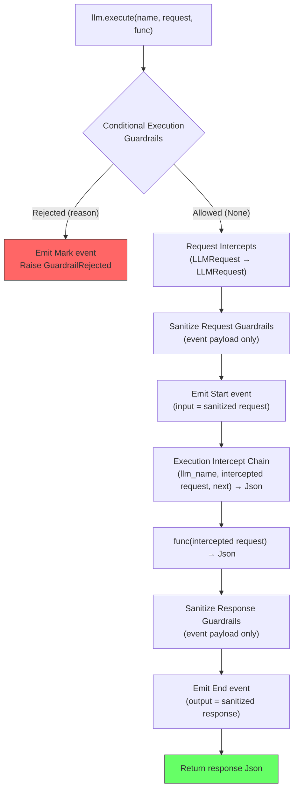

<!--
SPDX-FileCopyrightText: Copyright (c) 2026, NVIDIA CORPORATION & AFFILIATES. All rights reserved.
SPDX-License-Identifier: Apache-2.0
-->

# Middleware Pipeline

This document describes the exact ordering of middleware stages for tool and LLM calls.

Important: sanitize guardrails are currently **observability-oriented** in the
managed `execute` / `stream_execute` APIs. They affect the payload recorded on
lifecycle events (`Start.input`, `End.output`) but do **not** rewrite the value
passed into `func(...)` or the value returned to the caller. If you need to
modify execution inputs, use request intercepts. If you need to wrap or replace
execution, use execution intercepts.

## Tool Execute Pipeline

`tools.execute(name, args, func)` runs the following stages in order:

```mermaid
flowchart TD
    A["tools.execute(name, args, func)"] --> B{Conditional Execution<br/>Guardrails}
    B -->|"Rejected (reason)"| C["Emit Mark event<br/>Raise GuardrailRejected"]
    B -->|"Allowed (None)"| D[Request Intercepts<br/>priority order, optional break_chain]
    D --> E[Sanitize Request Guardrails<br/>(event payload only)]
    E --> F["Emit Start event<br/>(input = sanitized args)"]
    F --> G["Execution Intercept Chain<br/>(tool_name, intercepted args, next)"]
    G --> H["func(intercepted args)"]
    H --> J[Sanitize Response Guardrails<br/>(event payload only)]
    J --> K["Emit End event<br/>(output = sanitized result)"]
    K --> L[Return result]

    style C fill:#f66,stroke:#333
    style L fill:#6f6,stroke:#333
```

### Stage Details

| # | Stage | Operates On | Can Reject? | Can Transform? |
|---|-------|-------------|-------------|----------------|
| 1 | Conditional Execution Guards | Raw args (unmodified) | Yes | No |
| 2 | Request Intercepts | Args (piped through chain) | No | Yes |
| 3 | Sanitize Request Guards | Intercepted args recorded on the Start event | No | Yes, for observability |
| 4 | Start Event | — | — | — |
| 5 | Execution Intercepts | Args + `next` function | Yes (skip `next`) | Yes |
| 6 | User Function | Intercepted args | — | — |
| 7 | Sanitize Response Guards | Result recorded on the End event | No | Yes, for observability |
| 8 | End Event | — | — | — |

**Key design choice**: Conditional guardrails run *before* request intercepts so they gate on the original, unmodified input.

## LLM Execute Pipeline

`llm.execute(name, request, func)` runs the following stages:



### Type Flow

```
LLMRequest  ──→  Conditional Guards  ──→  Request Intercepts  ──→  Sanitize Request
    │                                                                      │
    │                                                   Start event input only
    │                                                                      │
    │                          Execution Intercept Chain  ←────────────────┘
    │                                      │
    │                        func(intercepted LLMRequest) → Json
    │                                      │
    │                     Sanitize Response (End event output only)
    │                                      │
    └──────────────────────────────── Return raw execution Json
```

Note: request intercepts and sanitize request guardrails all operate on
`LLMRequest`, but only request intercepts affect what the execution function
receives. Sanitize request/response guardrails currently affect the values
recorded on lifecycle events, while execution functions still receive the
intercepted request and callers still receive the raw execution response.

## LLM Stream Execute Pipeline

`llm.stream_execute(name, request, func, collector, finalizer)` differs from the non-streaming path after the execution stage:

```mermaid
flowchart TD
    A["llm.stream_execute(...)"] --> B{Conditional Execution<br/>Guardrails}
    B -->|Rejected| C[Mark event + error]
    B -->|Allowed| D[Request Intercepts]
    D --> E[Sanitize Request Guardrails<br/>(Start event payload only)]
    E --> F[Emit Start event]
    F --> G[Execution Intercept Chain]
    G --> H["func(request) → AsyncIterator"]
    H --> I["LlmStreamWrapper wraps stream"]
    I --> J[Return LlmStream to caller]

    J --> K{Caller iterates}
    K -->|Each chunk| L["collector(chunk)"]
    L --> M[Yield chunk to caller]
    K -->|Stream exhausted| N["finalizer() → aggregated Json"]
    N --> O["aggregated Json"]
    O --> P[Sanitize Response Guardrails<br/>(End event payload only)]
    P --> Q[Emit End event]

    style C fill:#f66,stroke:#333
    style M fill:#6f6,stroke:#333
    style Q fill:#6f6,stroke:#333
```

### Collector/Finalizer Pattern

The **collector** is called with each JSON chunk as it arrives, allowing accumulation:

```python
chunks = []
def collector(chunk):
    chunks.append(chunk)

def finalizer():
    return {"full_response": "".join(c["token"] for c in chunks)}
```

The **finalizer** runs once when the stream is exhausted and returns the
aggregated response that is then sanitized for the emitted `End` event.

## Priority Ordering

All registries use **ascending** priority — lower numbers run first:

```
priority=1  →  runs first
priority=5  →  runs second
priority=10 →  runs third
```

### Global + Scope-Local Merge

When scope-local middleware is registered (see [Core Concepts: Scope-Local Middleware](concepts.md#scope-local-middleware)), the pipeline merges entries from **all sources** before executing each stage:

1. All entries from the **global** registry
2. All entries from **scope-local** registries for every scope from root to the current top of the stack

The merged list is sorted by priority (ascending). Both global and scope-local entries participate equally in the same priority ordering:

```
Global registry:          [compliance_check(1), audit_logger(100)]
Scope-local "agent" scope: [pii_redactor(5)]
Scope-local "tool" scope:  [request_logger(50)]

Effective pipeline order:  compliance_check(1) → pii_redactor(5) → request_logger(50) → audit_logger(100)
```

This merge applies to every middleware stage: conditional execution guardrails, sanitize request/response guardrails, request intercepts, execution intercepts, and event subscribers.

### Break Chain

Request intercepts support `break_chain=True`. When set, no lower-priority intercepts in that stage run after:

```
Intercept A (priority=1, break_chain=False)  ← runs
Intercept B (priority=5, break_chain=True)   ← runs, then stops
Intercept C (priority=10)                     ← skipped
```

## Execution Intercept Chain Building

Execution intercepts are composed into a nested chain. Every execution intercept receives the operation name (tool name or LLM name) as its first parameter, enabling name-aware transformations. The **lowest** priority intercept wraps closest to the original function:

```
Registered: [intercept_A(priority=1), intercept_B(priority=5)]

Built chain:
  intercept_A(name, args, next=intercept_B(name, args, next=original_func))

Execution order:
  1. intercept_A receives name, args and next
  2. intercept_A calls next(args)
  3. intercept_B receives name, args and next
  4. intercept_B calls next(args)
  5. original_func(args) executes
  6. Results propagate back up the chain
```

Any intercept can short-circuit by returning a result without calling `next`.

## Registration Uniqueness

All registrations are keyed by name. Attempting to register a duplicate name **within the same registry** raises `AlreadyExists`. To replace a registration, deregister first, then register again.

Global and scope-local registries have **independent namespaces**. A global guardrail named `"pii_filter"` and a scope-local guardrail named `"pii_filter"` coexist without conflict — both will run during pipeline execution, ordered by their respective priorities.
