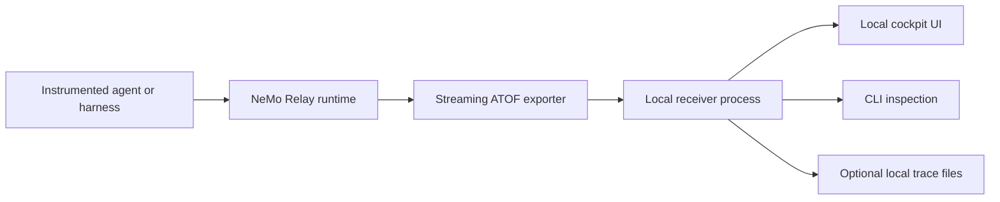

{/* SPDX-FileCopyrightText: Copyright (c) 2026, NVIDIA CORPORATION & AFFILIATES. All rights reserved.
SPDX-License-Identifier: Apache-2.0 */}

This page proposes a local cockpit viewer for NeMo Relay observability data.
The viewer is a consumer of Relay events, not a second tracing system. Relay
continues to own capture, lifecycle events, ATOF, ATIF, exporter contracts,
sanitization hooks, and missing-field semantics. The cockpit owns local
developer UX on top of those contracts.

## Problem

Coding agents can run across shells, editors, providers, plugins, tools, and
subagents. Developers often need to answer practical questions while a run is
still warm:

- What session or prompt is active?
- Which model, tool, file, skill, memory, or subagent drove the result?
- Which token or cost fields are observed, and which are unavailable?
- Which hook or provider limitation explains missing trace detail?
- What can be safely shared, replayed, or resumed?

File export alone is useful for post-run analysis, but local agent work also
needs a live read-only surface. The goal is to make traces inspectable without
turning NeMo Relay into an opinionated dashboard product.

## Product Boundary

Relay should provide the generic substrate that every downstream consumer can
reuse:

- Runtime capture and lifecycle events.
- ATOF as the Relay-native event stream.
- ATIF and other exporter formats for trajectory and trace consumers.
- Streaming export from the instrumented process to a separate local process.
- Token, cost, and capture-quality fields when they are broadly useful.
- Sanitizer and redaction extension points before data leaves the developer
  machine or process boundary.
- Stable examples and fixtures that show how a viewer consumes Relay output.

The cockpit should provide the developer-facing experience:

- Session list, prompt timeline, event tree, file impact, tool calls, skills,
  memory, subagents, and usage panels.
- Linked selection between timeline, event details, context, files, and usage.
- Clear provenance labels such as `observed`, `inferred`, `unavailable`, or
  `unsupported`.
- Local-only read mode by default.
- Optional packaging outside Relay if the UX grows into a separate application.

This separation lets Relay stay the source of truth for events while still
supporting polished local UIs.

## Proposed Shape

The first useful contribution can be small:

1. Keep the streaming ATOF exporter as a low-level Relay capability.
2. Add a documented local viewer contract for consumers of the ATOF stream.
3. Add one tiny example receiver that reads ATOF JSONL from the streaming
   exporter and exposes it to a browser or CLI.
4. Keep the full cockpit implementation outside the runtime unless maintainers
   decide that a reference viewer belongs in this repository.

The important design constraint is process separation. An agent process should
emit events to a local receiver over a socket or HTTP-style boundary. The viewer
process should own UI state, filtering, fan-out, and browser transport. That
keeps the agent runtime lean and lets the receiver restart or evolve without
replacing Relay capture.

## Event Contract

The viewer should treat ATOF as the live event source and ATIF as a trajectory
or replay artifact. ATOF is the right stream for timeline and live state because
it preserves lifecycle order. ATIF is the right shape for post-run trajectory
analysis, evaluation, and interchange.

Viewer consumers need field provenance. A field should not silently appear more
complete than the capture layer can prove. Suggested provenance values:

| Provenance | Meaning |
|---|---|
| `observed` | Relay captured the field directly from runtime, provider, or wrapper data. |
| `derived` | Relay derived the field from other observed Relay data. |
| `inferred` | A viewer inferred the field from local files, names, timestamps, or heuristics. |
| `unavailable` | Relay knows the field exists conceptually but did not capture it. |
| `unsupported` | The current provider, hook, or integration cannot expose the field. |

Examples:

- Token counts should be `observed` only when Relay receives real usage fields.
- Cost can be `derived` only from observed token counts plus a declared pricing
  source. It should not claim invoice truth.
- Missing Codex hooks should be visible as `unsupported` or `unavailable`
  instead of being papered over by UI guesses.
- Local file-touch summaries can be `inferred` if they come from local history
  rather than Relay events.

## Capture Quality Signals

Relay should expose generic capture-quality signals when they help every
consumer:

- Provider supported or unsupported.
- Hook present or missing.
- LLM span unavailable.
- Tool call input or output redacted.
- Token usage unavailable.
- Cost unavailable or derived from local policy.
- Subagent hierarchy unavailable.
- Event dropped due to backpressure.
- Exporter disconnected or receiver unavailable.

These signals are more useful than blank panels because they tell the developer
whether the system is quiet, incomplete, or unsupported.

## Local Viewer UX

A good local cockpit should help developers answer questions quickly:

- A left rail lists runs and sessions by human-readable title, provider, age,
  state, and workspace.
- A center timeline shows prompt, scope, tool, LLM, file, and subagent events.
- A detail pane explains the selected event with exact field provenance.
- A usage panel shows per-session token and cost evidence, not only totals.
- A file-impact view groups touched files by path and highlights hot areas.
- A compare mode shows two runs side by side when debugging regressions.

The viewer should avoid pretending to be complete. Empty panels should say why
the data is missing and which integration or hook would make it available.

## Packaging Options

There are three reasonable packaging paths:

| Option | What ships in Relay | What ships outside Relay |
|---|---|---|
| Example viewer | Minimal receiver and browser example | Full product cockpit |
| Companion package | Viewer package maintained beside Relay APIs | Enterprise installers and branding |
| External app | Only exporter contract, fixtures, and docs | Entire cockpit implementation |

The proposed default is example viewer first. It validates the Relay contract
without committing Relay maintainers to own a full UI product. If the example
becomes broadly useful, it can graduate to a companion package.

## Redaction And Sharing

Local-first does not remove the need for sanitization. Before traces are shared
outside the developer machine, the pipeline should support:

- Provider payload redaction.
- File path and workspace redaction.
- Secret pattern redaction.
- Prompt and response redaction.
- Clear marking of redacted fields in the viewer.
- Export policies that separate local inspection from shareable artifacts.

The viewer should display redaction status explicitly so reviewers know whether
they are looking at raw local evidence or a share-safe trace.

## Non-Goals

The first design should not:

- Replace ATIF, OpenTelemetry, or OpenInference.
- Define a new tracing schema parallel to Relay events.
- Require Relay to own a large frontend application.
- Claim real billing cost without observed usage and an explicit pricing source.
- Infer missing provider data without provenance.

## Milestones

### M0: Alignment

- Agree that the cockpit is a Relay event consumer.
- Agree that Relay owns generic event/exporter/schema pieces.
- Decide whether the first viewer artifact should be an example, companion
  package, or separate application.

### M1: Streaming ATOF

- Provide a streaming ATOF exporter from the instrumented process to a local
  receiver process.
- Document backpressure, disconnect, shutdown, and dropped-event behavior.
- Add socket-based tests that model a separate receiver process.

### M2: Viewer Contract

- Document the event fields and provenance states the viewer can rely on.
- Add a fixture trace that includes prompt, scope, tool, LLM, token, missing
  field, and redaction examples.
- Provide a minimal receiver that proves live consumption.

### M3: Local Cockpit Prototype

- Render a session list, event timeline, selected-event inspector, and per-run
  usage evidence.
- Label unavailable fields instead of filling them with guesses.
- Keep the prototype local-only and read-only by default.

### M4: Product Decision

- Decide whether the UI remains a separate project, becomes a Relay companion
  package, or stays as a reference example.
- Promote only generic contracts and reusable utilities into Relay.

## Open Questions

1. Should Relay ship only a minimal example viewer, or should it own a companion
   viewer package?
2. Should live viewers consume ATOF directly, or should Relay add a receiver
   process that transforms ATOF into browser-friendly Server-Sent Events or
   WebSocket messages?
3. Which token and cost fields should be first-class Relay fields versus
   viewer-local derived values?
4. What is the preferred sanitizer API for share-safe local traces?
5. Which Codex, Claude Code, Cursor, or harness hooks should emit explicit
   capture-quality signals when data is missing?
6. Should cockpit examples live in `examples/`, `integrations/`, or the docs
   site?
