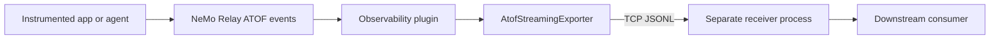

{/* SPDX-FileCopyrightText: Copyright (c) 2026, NVIDIA CORPORATION & AFFILIATES. All rights reserved.
SPDX-License-Identifier: Apache-2.0 */}

This design covers streaming Agent Trajectory Observability Format (ATOF)
events from an instrumented process to a separate receiver process.

It is intentionally limited to the NeMo Relay substrate: capture, plugin
configuration, raw ATOF emission, delivery behavior, validation, and shutdown.
Viewer UI, dashboards, browser surfaces, and product-specific applications are
downstream consumers of this stream and are not part of this design.

## Problem

The filesystem ATOF exporter writes useful canonical JSONL, but a local
receiver cannot inspect events until it can read the file. Tooling that wants a
live view of agent scopes, marks, tool calls, LLM calls, and lifecycle events
needs a process-separated stream without embedding a UI server or viewer inside
the instrumented runtime.

## Goals

- Emit canonical ATOF JSON objects as JSONL over a TCP connection.
- Keep the receiver in a separate process from the instrumented agent runtime.
- Expose the stream through the Observability plugin config shape.
- Keep event production off the hot path with bounded buffering.
- Preserve the existing ATOF event contract and sanitizer behavior.
- Surface configuration and delivery failures explicitly.

## Non-Goals

- No browser UI, local dashboard, or product-specific viewer implementation.
- No HTTP, Server-Sent Events, WebSocket, or multi-client fan-out server.
- No replacement for ATIF, OpenTelemetry, or OpenInference exporters.
- No durable replay, backfill, or local database.
- No new PII redaction policy in this change.

## Plugin Configuration

The Observability plugin gets a dedicated `atof_stream` section:

```toml
[components.config.atof_stream]
enabled = true
address = "127.0.0.1:43199"
```

The receiver must already be listening at `address` before plugin
initialization. Missing or blank `address` is a validation error when
`enabled = true`.

## Architecture



The Observability plugin owns registration and teardown. The stream subscriber
is registered under:

```text
__nemo_relay_plugin__observability__atof_stream
```

## Runtime Behavior

`AtofStreamingExporter` connects to one TCP receiver and writes one JSON object
per line. It uses a bounded per-exporter queue so event producers do not block
on receiver I/O. If the receiver cannot keep up and the queue is full, the
newest event is dropped and `stats().events_dropped` records the overflow.

Connection failures during initialization fail plugin registration. Write or
flush failures are recorded as exporter errors and surfaced during flush or
shutdown. Shutdown flushes queued events, closes the stream, and lets the
receiver observe EOF.

## Failure Semantics

| Condition | Behavior |
|---|---|
| `atof_stream.enabled = true` without `address` | Validation error. |
| Receiver is not listening | Plugin initialization fails. |
| Receiver disconnects mid-run | Exporter records the stream error; flush/shutdown surfaces it. |
| Bounded queue is full | Newest event is dropped; dropped count is available through exporter stats. |
| Plugin clear/shutdown | Subscriber is deregistered, queued events are flushed, stream closes. |

## Validation Plan

- Unit test plugin schema/editor support for `atof_stream`.
- Unit test validation for missing stream address.
- Unit test plugin initialization registers `atof_stream` under the expected
  subscriber name.
- Unit test a separate TCP receiver gets `scope`, `mark`, and `scope` records
  and observes clean shutdown.
- Binding helper tests cover Python, Go, and Node.js config helper shapes.

## Open Questions

- Should future stream receivers support authenticated local sockets or Unix
  domain sockets?
- Should delivery stats become a generic exporter health surface?
- Should redaction hooks become configurable before an event reaches every
  exporter?
