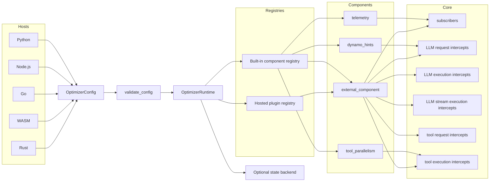

<!--
SPDX-FileCopyrightText: Copyright (c) 2026, NVIDIA CORPORATION & AFFILIATES. All rights reserved.
SPDX-License-Identifier: Apache-2.0
-->

# Optimizer Layer

The optimizer layer is a config-driven runtime. Callers build an
`OptimizerConfig`, optionally attach shared state, select built-in or hosted
components, validate the document, and then manage lifecycle through
`OptimizerRuntime`.

## Public Model

The stable public boundary is:

- `OptimizerConfig`
- `StateConfig`
- `BackendSpec`
- `ComponentSpec`
- `ConfigPolicy`
- `ConfigReport`
- `OptimizerRuntime`
- hosted plugin registration functions in each supported language

Built-in typed helpers are convenience layers over the same dynamic config:

- `TelemetryComponent` / `TelemetryComponentConfig`
- `DynamoHintsComponent` / `DynamoHintsComponentConfig`
- `ToolParallelismComponent` / `ToolParallelismComponentConfig`
- `ExternalComponent` / `ExternalComponentConfig`

## Architecture



## Built-In Components

The initial built-in component set is:

- `telemetry`
  Registers the event subscriber and drives the learning/drain pipeline.
- `dynamo_hints`
  Registers the LLM request intercept that injects `AgentHints`.
- `tool_parallelism`
  Registers the tool execution intercept for built-in scheduling paths.
- `external_component`
  Activates a previously registered hosted plugin handler.

Components are selected dynamically by `kind`. Unsupported component kinds or
unknown fields yield diagnostics according to `ConfigPolicy`.

## Runtime Lifecycle By Language

### Python

```python
from nat_nexus.optimizer import (
    BackendSpec,
    DynamoHintsComponent,
    OptimizerConfig,
    OptimizerRuntime,
    StateConfig,
    TelemetryComponent,
    ToolParallelismComponent,
)

runtime = OptimizerRuntime(
    OptimizerConfig(
        state=StateConfig(backend=BackendSpec.in_memory()),
        components=[
            TelemetryComponent(learners=["latency_sensitivity"]),
            DynamoHintsComponent(),
            ToolParallelismComponent(),
        ],
    )
)

report = runtime.report()
await runtime.register()
runtime.deregister()
await runtime.shutdown()
```

### Node.js

```javascript
import {
  Runtime,
  defaultConfig,
  inMemoryBackend,
  telemetryComponent,
  dynamoHintsComponent,
  toolParallelismComponent,
} from "./optimizer.js";

const config = defaultConfig();
config.state = { backend: inMemoryBackend() };
config.components = [
  telemetryComponent({ learners: ["latency_sensitivity"] }),
  dynamoHintsComponent(),
  toolParallelismComponent(),
];

const runtime = new Runtime(config);
const report = await runtime.report();
await runtime.register();
await runtime.deregister();
await runtime.shutdown();
```

### Go

```go
import optimizer "gitlab-master.nvidia.com/nemo-agent-toolkit/dev/Project-NAT-Nexus/go/nat_nexus/optimizer"

config := optimizer.NewConfig()
config.State = &optimizer.StateConfig{
    Backend: optimizer.NewInMemoryBackend(),
}
config.Components = []optimizer.ComponentSpec{
    optimizer.TelemetryComponent(optimizer.TelemetryComponentConfig{
        Learners: []string{"latency_sensitivity"},
    }),
    optimizer.DynamoHintsComponent(optimizer.NewDynamoHintsComponentConfig()),
    optimizer.ToolParallelismComponent(optimizer.NewToolParallelismComponentConfig()),
}

runtime, err := optimizer.NewRuntime(config)
if err != nil {
    panic(err)
}
defer runtime.Close()

report, err := runtime.Report()
if err != nil {
    panic(err)
}
_ = report

if err := runtime.Register(); err != nil {
    panic(err)
}
if err := runtime.Deregister(); err != nil {
    panic(err)
}
if err := runtime.Shutdown(); err != nil {
    panic(err)
}
```

### WebAssembly

```javascript
import init from "./pkg/nvidia_nat_nexus_wasm.js";
import {
  Runtime,
  validateConfig,
} from "./optimizer.js";

await init();

const config = {
  version: 1,
  state: {
    backend: { kind: "in_memory", config: {} },
  },
  components: [
    { kind: "telemetry", enabled: true, config: { learners: ["latency_sensitivity"] } },
    { kind: "dynamo_hints", enabled: true, config: {} },
    { kind: "tool_parallelism", enabled: true, config: {} },
  ],
};

const report = validateConfig(config);
const runtime = new Runtime(config);
await runtime.register();
runtime.deregister();
await runtime.shutdown();
```

### Rust

```rust
use nvidia_nat_nexus_optimizer::{
    BackendSpec, DynamoHintsComponentConfig, OptimizerConfig, OptimizerRuntime, StateConfig,
    TelemetryComponentConfig, ToolParallelismComponentConfig,
};

let mut runtime = OptimizerRuntime::new(OptimizerConfig {
    state: Some(StateConfig {
        backend: BackendSpec::in_memory(),
    }),
    components: vec![
        TelemetryComponentConfig {
            subscriber_name: None,
            learners: vec!["latency_sensitivity".into()],
        }
        .into(),
        DynamoHintsComponentConfig::default().into(),
        ToolParallelismComponentConfig::default().into(),
    ],
    ..OptimizerConfig::default()
})
.await?;

let report = runtime.report().clone();
runtime.register().await?;
runtime.deregister()?;
runtime.shutdown().await?;
```

## Hosted Plugins By Language

Hosted plugins are intentionally narrow. They can register:

- event subscribers
- LLM request intercepts
- LLM execution intercepts
- LLM stream execution intercepts
- tool request intercepts
- tool execution intercepts

They do not receive direct access to optimizer internals such as persistence
backends or hot-cache state.

### Python

```python
from nat_nexus.optimizer import (
    ExternalComponent,
    OptimizerConfig,
    OptimizerRuntime,
    register_optimizer_plugin,
)

class HeaderPlugin:
    def validate(self, instance_id, plugin_config):
        return []

    def register(self, instance_id, plugin_config, context):
        def intercept(tool_name, args):
            return {**args, "x_plugin": instance_id, "tool": tool_name}

        context.register_tool_request_intercept(
            f"{instance_id}.tool",
            25,
            False,
            intercept,
        )

register_optimizer_plugin("example.header_plugin", HeaderPlugin())

runtime = OptimizerRuntime(
    OptimizerConfig(
        components=[
            ExternalComponent(
                plugin_kind="example.header_plugin",
                instance_id="plugin-1",
            )
        ]
    )
)
```

### Node.js

```javascript
import {
  Runtime,
  defaultConfig,
  externalComponent,
  registerPlugin,
} from "./optimizer.js";

registerPlugin("example.header_plugin", {
  validate(instanceId, pluginConfig) {
    return [];
  },
  register(instanceId, pluginConfig, context) {
    context.registerToolRequestIntercept(
      `${instanceId}.tool`,
      25,
      false,
      (_name, args) => ({ ...args, nodePlugin: instanceId }),
    );
  },
});

const config = defaultConfig();
config.components = [externalComponent("example.header_plugin", "plugin-1", {})];
const runtime = new Runtime(config);
```

### Go

```go
import (
    "encoding/json"

    optimizer "gitlab-master.nvidia.com/nemo-agent-toolkit/dev/Project-NAT-Nexus/go/nat_nexus/optimizer"
)

pluginKind := "example.header_plugin"
err := optimizer.RegisterPlugin(pluginKind, optimizer.PluginHandlerFuncs{
    ValidateFunc: func(instanceID string, pluginConfig map[string]any) ([]optimizer.ConfigDiagnostic, error) {
        return nil, nil
    },
    RegisterFunc: func(instanceID string, pluginConfig map[string]any, ctx *optimizer.PluginContext) error {
        return ctx.RegisterToolRequestIntercept(
            instanceID+".tool",
            25,
            false,
            func(name string, args json.RawMessage) json.RawMessage {
                var payload map[string]any
                _ = json.Unmarshal(args, &payload)
                payload["goPlugin"] = instanceID
                payload["tool"] = name
                out, _ := json.Marshal(payload)
                return out
            },
        )
    },
})
if err != nil {
    panic(err)
}

config := optimizer.NewConfig()
config.Components = []optimizer.ComponentSpec{
    optimizer.ExternalComponent(optimizer.ExternalComponentConfig{
        PluginKind: pluginKind,
        InstanceID: "plugin-1",
    }),
}
```

### WebAssembly

```javascript
import init from "./pkg/nvidia_nat_nexus_wasm.js";
import {
  Runtime,
  registerPlugin,
} from "./optimizer.js";

await init();

registerPlugin("example.header_plugin", {
  validate(instanceId, pluginConfig) {
    return [];
  },
  register(instanceId, pluginConfig, context) {
    context.registerToolRequestIntercept(
      `${instanceId}.tool`,
      25,
      false,
      (_name, args) => ({ ...args, wasmPlugin: instanceId }),
    );
  },
});

const runtime = new Runtime({
  version: 1,
  components: [
    {
      kind: "external_component",
      enabled: true,
      config: {
        plugin_kind: "example.header_plugin",
        instance_id: "plugin-1",
      },
    },
  ],
});
```

### Rust

```rust
use std::sync::Arc;

use nvidia_nat_nexus_optimizer::{
    register_hosted_plugin_handler, ConfigDiagnostic, HostedPluginHandler,
    HostedRegistrationContext, Result,
};
use serde_json::{Map, Value as Json};

struct HeaderPlugin;

impl HostedPluginHandler for HeaderPlugin {
    fn plugin_kind(&self) -> &str {
        "example.header_plugin"
    }

    fn validate(&self, _instance_id: &str, _plugin_config: &Map<String, Json>) -> Vec<ConfigDiagnostic> {
        vec![]
    }

    fn register(
        &self,
        instance_id: &str,
        _plugin_config: &Map<String, Json>,
        ctx: &mut HostedRegistrationContext,
    ) -> Result<()> {
        let name = format!("{instance_id}.header");
        ctx.register_llm_request_intercept(
            &name,
            25,
            false,
            Arc::new(|_name, request, annotated| Box::pin(async move { Ok((request, annotated)) })),
        )
    }
}

register_hosted_plugin_handler(Arc::new(HeaderPlugin))?;
```

## Validation By Language

Use validation before registration when you want compatibility warnings without
constructing a running optimizer:

- Python: `validate_optimizer_config(config)`
- Node.js: `validateConfig(config)` from `optimizer.js`
- Go: `optimizer.ValidateConfig(config)`
- WebAssembly: `validateConfig(config)` from `optimizer.js`
- Rust: `OptimizerRuntime::validate_config(&config)`

Unknown component kinds and unknown fields are expected to remain forward
compatible. They should usually warn rather than break callers, unless the
selected policy makes them strict.
